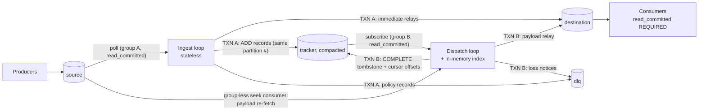
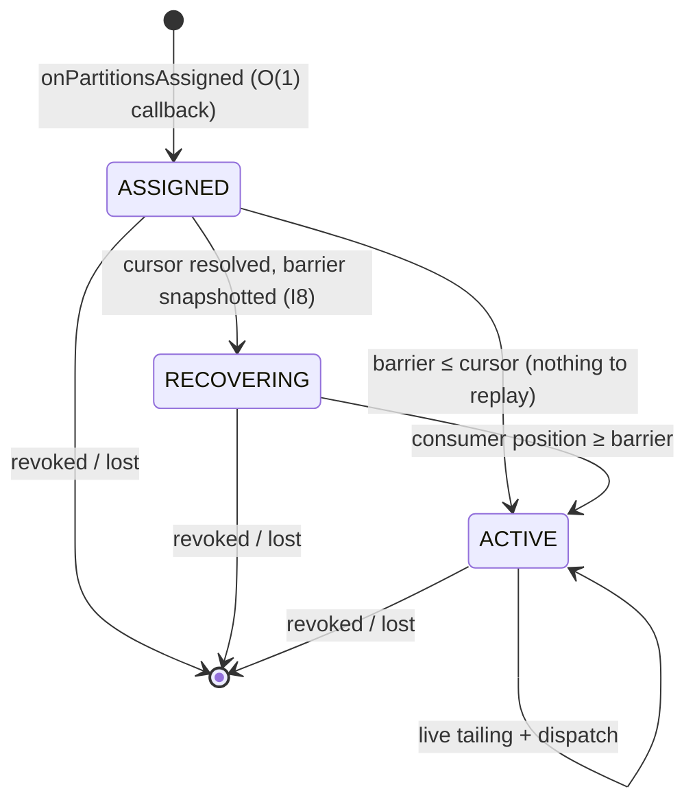

# Architecture

*Audience: an engineer evaluating cesium-kafka or onboarding to the codebase.* This document is the
guided tour: the topology, why it is built from two Kafka consumer groups, the per-partition shard
state machine, the committed-cursor recovery model, the in-memory index, and the threading model.
It **extracts and refines** the implementation-ready design — for the deepest reference (proofs,
decision log, failure matrix) see [`design.md`](design.md); for the correctness contract see
[`delivery-semantics.md`](delivery-semantics.md); for implementing a store see
[`store-spi.md`](store-spi.md); for measured numbers see [`performance.md`](performance.md).

---

## 1. What it does, in one paragraph

cesium-kafka consumes a **source** topic, inspects each record's `cesium-delay-ms` /
`cesium-deliver-at` header, and produces the record to a **destination** topic at the requested
time — with **exactly-once delivery as observed by `read_committed` consumers of the destination**.
Records without a delay header (or already due) relay immediately. Payloads are never copied: while
a message waits, cesium stores only a `(sourcePartition, sourceOffset, dispatchAtMs)` pointer
(~40 B/entry measured) and re-fetches the payload from the source topic at dispatch time. Scheduler
state is made durable in an internal compacted **tracker** topic, so a restart or rebalance replays
only a bounded window, never the whole history.

The design goals that shape everything below: **millions of pending entries in a modest heap; zero
per-entry allocation in the steady-state hot path; no busy-polling; bounded replay on
restart/rebalance; rebalance callbacks never do heavy work; no silent terminal states** — every
fault path ends in retry, park-and-degrade with an alert, or fail-fast with a runbook entry.

---

## 2. Topology



Two read-process-write transactions, one per loop:

```
INGEST  (group A on source):  TXN A { immediate relays → destination
                                      + ADDs → tracker (same partition #)
                                      + policy records → dlq
                                      + sendOffsetsToTransaction(group-A metadata,
                                        offsets carry the identity blob) }

DISPATCH (group B subscribes tracker): tails tracker to build the in-memory index;
        when due: fetch payloads via the group-less seek consumer (outside the txn,
        under byte/time budgets), then
                              TXN B { payloads → destination
                                      + COMPLETE tombstones → tracker
                                      + sendOffsetsToTransaction(group-B metadata,
                                        offsets = per-partition cursor v2:
                                        position-tracking offset + pinned-entry sidecar) }
```

| Topic | Owner | Role |
|---|---|---|
| `source` | user | Records to relay; cesium treats key/value as opaque `byte[]`. Must not be compacted (offsets must stay fetchable). |
| `destination` | user | Relay target. **Consumers MUST use `isolation.level=read_committed`** to observe exactly-once (§ [delivery-semantics](delivery-semantics.md)). |
| `tracker` | cesium | Internal compacted topic, default `cesium.<applicationId>.tracker`. Partition count **must equal** the source's; a tracker record for source partition *p* always lands on tracker partition *p*. Writable only by the cesium principal (a forged ADD is a duplicate-injection primitive; a forged tombstone is a data-loss primitive). |
| `dlq` | cesium/user | Default-on. Receives malformed-header, over-max-delay, and payload-expired loss notices. |

- **Group A** (`cesium.<applicationId>.ingest`) subscribes to `source`. The ingest loop is
  **stateless** — it never touches the in-memory index. Locked client config: `read_committed`,
  `auto.offset.reset=none`, auto-commit off.
- **Group B** (`cesium.<applicationId>.dispatch`) **subscribes** (does not `assign`) to `tracker`.
  Tracker-partition ownership *is* ownership of the in-memory index shard for that partition. Its
  committed offsets carry the replay cursor. Same locked client config.
- **Seek consumers** are group-less (`assign()` + `seek()`), `read_committed`, used only to re-fetch
  payloads. They commit nothing and need no fencing.

There is **no shared mutable state between ingest and dispatch.** The dispatch loop learns about new
pending entries only by consuming the tracker topic — including its own COMPLETE echoes (no-ops on
replay). The recovery path and the live-tailing path are *the same code* (`onTrackerRecord`), so
recovery correctness is exercised continuously, not only after a crash.

---

## 3. Why two consumer groups

The whole architecture turns on a single Kafka 4.x fact: the only way to commit consumer offsets
inside a transaction is
`sendOffsetsToTransaction(Map<TopicPartition,OffsetAndMetadata>, ConsumerGroupMetadata)`, where the
metadata comes from a **live, subscribed** consumer via `consumer.groupMetadata()`. That metadata
carries the group generation / member epoch — the KIP-447 fencing token. Two subscribed groups give
both loops native fencing and broker-arbitrated, exclusive shard ownership; ingest and dispatch then
scale independently, and group B's committed offset doubles as the bounded-replay cursor.

| Alternative | Verdict |
|---|---|
| **Two groups (chosen)** | Both loops get KIP-447 group-metadata fencing natively; `subscribe()` on the tracker gives broker-arbitrated, exclusive index-shard ownership; ingest and dispatch scale on separate fleets (`roles` config); a rebalance of one loop never stalls the other; group B's committed offset is the bounded-replay cursor. |
| Single group + per-partition `transactional.id` (pre-KIP-447) | One producer per partition (buffer/socket/coordinator-state explosion); `initTransactions()` storms on rebalance; the tracker consumer must be `assign()`ed, and under manual assignment `groupMetadata()` carries no valid generation — transactional offset commits lose group fencing (the original PoC's structural flaw). Kafka 4.0 removed the `sendOffsetsToTransaction(Map, String)` overload precisely because KIP-447 obsoleted this pattern. |
| One group subscribed to both source and tracker | Couples ingest/dispatch scaling and liveness; a dispatch backlog stalls ingest's `max.poll.interval.ms`; no co-location benefit. |
| Kafka Streams + RocksDB state store | Changelog-backed stores duplicate payloads (violates the pointer-only mandate) or still need the re-seek machinery; no control over memory layout (~40 B/entry is unreachable through RocksDB/JNI); punctuation semantics fight wall-clock scheduling. |

The single-group / per-partition-id approach and the Streams approach are both rejected in the
design's [decision log](design.md#decision-log) (D7) and in
[ADR-0001](adr/0001-two-consumer-group-architecture.md).

---

## 4. The shard state machine

A **shard** is the in-memory index for one tracker partition, owned by exactly one dispatch thread.
Ownership follows group B membership. Each shard moves through a small, protocol-agnostic state
machine — identical under classic-eager, classic-cooperative, and KIP-848 incremental rebalancing:



1. **ASSIGNED.** `onPartitionsAssigned` does O(1) work only — record the partition and the assignment
   epoch. **No network calls in the rebalance callback** (it runs inside `poll()` on the dispatch
   thread; by invariant I3 no transaction is open).
2. **Resolve the cursor, then snapshot the barrier (strictly in that order — invariant I8).** On the
   dispatch loop, fetch the committed cursor (`consumer.committed`/`position`, which under
   `read_committed` waits out `UNSTABLE_OFFSET_COMMIT` until every pending transactional offset
   commit for the partition resolves), validate its identity blob, decode the sidecar, then snapshot
   `barrier(p)` = the partition **high watermark** via `Admin.listOffsets(latest, READ_UNCOMMITTED)`
   — *not* the consumer's `endOffsets`, which returns the LSO under `read_committed`. If
   `barrier ≤ cursor`, the shard is immediately ACTIVE.
3. **RECOVERING.** Seed the index from the sidecar, then replay tracker records in
   `[cursor, barrier)` applying the [replay rules](delivery-semantics.md). The shard is **not
   dispatch-eligible** (I4); entries that come due during replay wait. Backpressure never pauses a
   RECOVERING shard — replay must reach the barrier.
4. **ACTIVE.** When the consumer position reaches the barrier, the shard goes ACTIVE and dispatches
   live. The *same* consumer keeps tailing; live records flow through the same `onTrackerRecord`
   path as replay.
5. **REVOKED / LOST.** `onPartitionsRevoked` (cooperative) or `onPartitionsLost` (fenced) drops the
   shard in O(1) and cancels its barrier future — pending entries are durable in the tracker topic;
   the in-memory index is a cache. A revoked owner **never** writes.

Why this ordering matters — the LSO hazard and the I8 snapshot-ordering scenario — is proved in
[delivery-semantics § the replay barrier](delivery-semantics.md#5-the-replay-barrier-hw-not-lso).

The state is surfaced operationally, **without coupling it to readiness** (a healthily replaying
instance is *ready*): the `/health/ready` detail body carries a per-shard
`ShardRecovery{partition, state, recordsRemaining, etaMillis}` snapshot, and `cesium_shard_paused`
exposes backpressure pause state. See [`design.md` §9](design.md#9-observability) for the full
metric inventory.

---

## 5. Cursor v2 + sidecar recovery model

Group B's committed `(offset, metadata)` per tracker partition is the **replay cursor**, and its
shape is what keeps replay bounded.

The naive cursor — commit the minimum still-pending ADD offset — makes replay cost scale with
*completion throughput × pin age*: a single legitimate long-delay entry pins the cursor for the
whole delay, and because the tombstone-retention floor keeps every tombstone above the cursor alive,
replay would re-read billions of completion tombstones. (This was the critical R1 finding in review.)

**Cursor v2** decouples replay cost from pin age:

- **`position(p)`** — the next tracker offset the dispatch consumer will apply (it tails to the LSO
  continuously).
- **The sidecar** — a versioned, Base64'd blob carried in the offset *metadata*, encoding the oldest
  pending entries (their `dispatchAtMs`, `sourceOffset`, and original `trackerAddOffset`) plus an
  identity header `{clusterId, sourceTopicId, trackerTopicId}`. Bounded by
  `dispatch.cursor.sidecar-max-bytes` (default 3 KiB ≈ 200–300 entries), validated against the
  broker's `offset.metadata.max.bytes` at startup.
- **Greedy cursor computation:** encode the pending set oldest-first into the sidecar until the
  budget is exhausted. If everything fits, the committed offset is `position(p)` (it tracks the live
  read position). On overflow, the committed offset falls back to the `trackerAddOffset` of the
  first non-encoded pending entry — the classic min-pending watermark, now only an overflow fallback.

**Recovery** then decodes the sidecar, **seeds** the index with its pinned entries (in their original
arrival order, preserving ring sortedness), and replays `[cursor, barrier)`. In the common case
replay ≈ *traffic since the last successful commit* (plus downtime traffic), **independent of how
long any single entry has been pending.** Because the cursor tracks position, standard
consumer-lag tooling reads group B approximately correctly in steady state; only overflow mode
inflates lag.

The full model — invariant I5, the overflow residual cost formula, and how the cursor commits
atomically with the dispatch transaction — is in
[delivery-semantics § the committed cursor](delivery-semantics.md#6-the-committed-cursor-and-i5)
and [`design.md` §3.5](design.md#35-the-committed-cursor-v2-position-watermark--pinned-entry-sidecar).

---

## 6. The in-memory index

Module `cesium-kafka-store-kafka`, package `com.jucius.cesium.kafka.store.tracker.index`. **Each tracker
partition's state is owned by exactly one dispatch thread and touched by no other thread, ever** —
even on a combined ingest+dispatch instance, ADDs reach the index only via the tracker topic and the
dispatch thread's own `poll()`. Zero locks, zero CAS on the hot path.

Per-partition (`PartitionShard`), so revocation is an O(1) drop, heaps stay small and cache-resident,
and cursors are natural. The structures are **fastutil**-backed primitive collections (post-approval
revision 1 — the original design specified hand-rolled chunked `long[]`/`int[]` arrays; the
behaviour-preserving fastutil swap traded the last bytes/entry for maintainability and familiar
Collection interfaces):

| Structure | Class | Backing | Purpose |
|---|---|---|---|
| **Entry pool** | `EntryPool` | parallel `LongBigArrayBigList` for `dispatchAtMs` / `sourceOffset` / `trackerAddOffset`, + `IntArrayList` free-slot stack | The 24 bytes of real per-entry state, indexed by a slot id. A freed slot returns to the free-list stack. |
| **Min-heap on `dispatchAtMs`** | `DispatchHeap` (extends `IntHeapPriorityQueue`) | heap of slot ids + a `BitSet` of lazily-deleted slots | Drives `pollDue` / `nextDeadlineMs`. **Lazy deletion** (no reverse index — saves 4 B/entry): a completed slot is flagged and discarded on pop; rebuilt in O(n) past a threshold. |
| **Arrival log** | `ArrivalLog` | append-only `IntBigArrayBigList` of slot ids + head pointer, + `BitSet` completed bits | Slot ids in **tracker-arrival order**. Because ingest appends ADDs in source-offset order and there is a unique committed ADD per offset (§3.1), the log is *simultaneously sorted by tracker offset and source offset.* |

This dual-sortedness is load-bearing:

- **Cursor inputs in O(1) amortized** — the oldest pending entries are read straight off the log head
  (skipping completed bits), which is exactly the greedy sidecar-encoding order.
- **Completion lookup with no hash map** — a COMPLETE (key = source offset) resolves by **binary
  search over the arrival log**: O(log n), zero per-entry map overhead. A naive `long→int` map would
  cost ~24 B/entry *transient* during a 10 M-entry replay (240 MB); the log search costs nothing.
- **Anomalous duplicate ADD** — found by the same binary search; `dispatchAtMs` is updated in place
  but the original `trackerAddOffset` is **kept** (increasing it could carry the cursor past other
  pending entries — invariant I5).

**Slot lifecycle:** `FREE → PENDING (heap + log) → IN_FLIGHT (popped into a txn batch; still in log)
→ COMPLETED (bit set; still in log) → FREE (only when it leaves the log)`. The critical invariant is
that **a slot is freed only when it leaves the arrival log, not when it is dispatched** — reusing a
still-log-resident slot would corrupt source-offset ordering and silently break the binary search.

**Backpressure** applies to ACTIVE shards only: a per-shard `dispatch.max-pending-per-partition`
high-water pauses the tracker consumer (the backlog accumulates durably in the tracker topic — never
OOM), and a heap-derived global cap pauses ACTIVE shards when the total index exceeds it. A
RECOVERING shard is never paused; `validate()` refuses startup if the worst-case footprint
(`assigned-partitions × per-partition-max × planning-bytes`) would breach the heap budget.

### Memory

Per pending entry, the irreducible primitive floor is `dispatchAtMs 8 + sourceOffset 8 +
trackerAddOffset 8 + heap slot 4 + log slot 4 + completed bit 0.125 ≈ 32 B`. fastutil big-lists grow
by power-of-two doubling, so live arrays carry up to ~2× slack at an arbitrary fill — capacity
planning therefore uses **64 B/entry typical, 80 B worst**, while the measured JOL footprint is
**40.54 B/entry @ 1 M and 45.96 B/entry @ 10 M** (`ShardFootprintTest`; the JOL gate is ≤ 56 B/entry).
The gap is not a contradiction: JOL measures *actual retained* bytes at one fill, 64 is the
conservative constant that must hold at *any* fill (including just after a doubling). **Plan with
64/80; expect ~40 in practice.**

| Pending entries | Index (~40 B measured) | Planning budget (64 B) | Recommended heap | GC |
|---|---|---|---|---|
| 1 M | ~40 MB | 64 MB | 512 MB – 1 GB | G1 (default) |
| 10 M | ~400 MB | 640 MB | 2 – 3 GB | G1 |
| 100 M | ~4 GB | 6.4 GB | 8 – 12 GB | ZGC generational |

Full memory math, the non-index heap consumers (producer buffers, fetch budgets), and GC guidance
are in [`performance.md`](performance.md) and [`design.md` §5.4](design.md#54-complexity-and-memory-math).

---

## 7. Threading model

Kafka clients are not thread-safe, so **every client is owned by exactly one thread for its whole
life.**

| Thread | Owns | Loop |
|---|---|---|
| `cesium-ingest-{n}` (default 1) | source consumer (group A) + ingest transactional producer | Poll → one transaction per non-empty batch (immediate relays + ADDs + DLQ + offsets). Stateless; degradation path is pause-all + heartbeat-poll + capped backoff. |
| `cesium-dispatch-{n}` (default 1; useful up to the tracker partition count, fleet-wide) | tracker consumer (group B) + dispatch transactional producer + seek consumer + the shards it owns | The event loop below. Each dispatch worker gets its own clients and disjoint shards. |
| `cesium-admin` | `AdminClient`: startup + periodic validation (partition parity, retention, compaction, topic-ID identity, offsets-retention), barrier `listOffsets` futures, empirical retention probes | Low duty. |
| observability | metrics/health HTTP server, gauge sampling, heartbeat freshness | — |

`roles: [ingest, dispatch]` (default both) selects which loops start, so the halves can scale on
separate fleets.

### The dispatch event loop

The single `poll()` is simultaneously the *sleep*, the *wakeup channel*, the *intake*, and the
*liveness heartbeat*. The drain phase is **time-sliced** and **interleaves polls between
transactions** so group membership survives arbitrarily deep due-storms:

```java
while (running) {
    long timeout = clamp(store.nextDeadlineMs() - clock.millis(), 0, 30_000);
    var records = trackerConsumer.poll(Duration.ofMillis(timeout));   // sleep + intake + heartbeat
    applyToStore(records);                    // R1/R2; may lower nextDeadline
    resolveNewAssignments();                  // I8: committed → integrity/identity → barrier snapshot
    promoteRecoveredPartitions();             // RECOVERING → ACTIVE when position ≥ barrier

    long sliceDeadline = clock.millis() + drainSlice;       // drainSlice ≤ max.poll.interval.ms / 3
    while (clock.millis() < sliceDeadline
           && (batch = store.pollDue(clock.millis(), maxBatch)).size() > 0) {
        fetchAndDispatchTransactionally(batch);             // poll() NEVER inside a txn (I3)
        applyToStore(trackerConsumer.poll(Duration.ZERO));  // liveness between txns; safe per I3
    }
    maybeCommitIdleCursors();                 // rate-limited records-free txns; not while RECOVERING
    store.maintenance();                      // amortized heap rebuild / log sweep
}
```

- **No missed wakeups, no busy-polling.** An earlier-deadline ADD can only arrive via `poll()`, which
  returns immediately on new records; `nextDeadlineMs()` sets the timeout otherwise. No timers, no
  condition variables, no fixed-interval spin.
- **Rebalance callbacks do O(1) bookkeeping only** — they run inside `poll()` on this thread, and by
  I3 no transaction is open. `onPartitionsAssigned` marks shards ASSIGNED with an epoch;
  `onPartitionsRevoked` drops shards and cancels barrier futures; `onPartitionsLost` drops everything
  and aborts producer state. **No network round-trips, no replay, no barrier snapshots in callbacks**
  — the barrier work happens on the loop body (I8). Already-ACTIVE shards keep dispatching while new
  ones recover.
- **Bounded poll gap.** Back-to-back transactions are each separated by a `poll(Duration.ZERO)`, so
  the maximum gap between group-B polls is one transaction — observable as
  `cesium_dispatch_poll_gap_seconds`, alerted well below `max.poll.interval.ms`.
- **Graceful shutdown:** readiness flips false → ingest finishes/aborts its open txn at a batch
  boundary and stops → dispatch likewise → producers closed (clean commit/abort then close) →
  consumers closed → bounded by `shutdown.timeout`, then hard abort (always safe by construction).

Error handling follows the [§3.8 three-way taxonomy](delivery-semantics.md#7-in-doubt-commits-and-the-error-taxonomy)
verbatim: definitively-abortable → abort/restore/retry; fatal → close clients, fail the loop, exit
non-zero; in-doubt commit → never restore the batch (I9); retry exhaustion → park-and-degrade.

---

## 8. Module map (for orientation)

| Module | Contents | Surface |
|---|---|---|
| `cesium-kafka-api` | The store SPI (§ [store-spi](store-spi.md)), header constants, `ScheduledRef`/`DueBatch`/`TrackerCursor`/`ConfigView` | **Published, semver-stable from 1.0** |
| `cesium-kafka-core` | The engine: ingest & dispatch loops, transaction manager + error taxonomy, cursor/barrier orchestration, policies, header codec, penalty box, admin validation, shard state machine | Internal-until-1.x (programmatic API) |
| `cesium-kafka-store-kafka` | `KafkaTrackerStore`: tracker wire format, sidecar codec, the fastutil packed index (§6) | Published store impl |
| `cesium-kafka-store-testkit` | The SPI contract kit + fixtures (`TrackerBackedStoreContract`, `FakeStoreContext`, `MutableClock`, `TrackerEventScript`) | **Published** for store implementers |
| `cesium-kafka-app` | `main()`, YAML config, lifecycle, health/metrics HTTP, distribution archives, Dockerfile | **The supported v1 product surface** |
| `cesium-kafka-it` | Testcontainers integration suite (separate-JVM kill tests, EOS/fencing/LSO/barrier-ordering scenarios, soak, macro perf) | Tests |
| `cesium-kafka-benchmarks` | JMH micro-benchmarks + JOL footprint tests | Tests |

The SPI boundary is real: the flagship `KafkaTrackerStore` lives in its own module and is proven
through the *same* published contract kit a third party would use. The **runnable app** is the
supported v1 product; the **store SPI + testkit** are the stable surface for store implementers.

---

## See also

- [`delivery-semantics.md`](delivery-semantics.md) — the correctness contract: invariants I1–I9, the
  barrier proof, in-doubt commits, the conditional nature of the guarantee.
- [`store-spi.md`](store-spi.md) — implementing a scheduler store against the stable SPI.
- [`design.md`](design.md) — the full implementation-ready design, decision log, and failure matrix.
- [`performance.md`](performance.md) — measured benchmarks, the replay-cost formula, sizing & tuning.
- [`failure-matrix-coverage.md`](failure-matrix-coverage.md) — which test covers each failure-matrix row.
