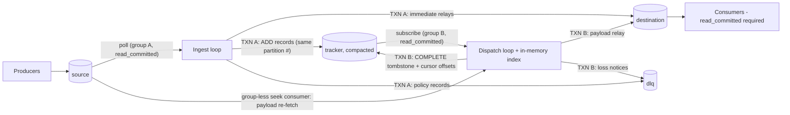

# cesium-kafka — Final Implementation Design (v1)

A ground-up, enterprise-grade rewrite of the Kafka delayed-message relay. Java 21+, kafka-clients 4.x, exactly-once via Kafka transactions (KIP-447/KIP-890 era), pointer-only payload re-seek, one production scheduler store (in-memory index durably backed by a Kafka tracker topic) behind a pluggable SPI. This document is the implementation-ready specification, hardened by two rounds of adversarial review.

> **Post-approval revisions (2026-06-05, project-owner decisions):**
> 1. **Index backing — fastutil, not hand-rolled chunked arrays.** §5's structures are implemented
>    with fastutil primitive collections (`fastutil-core`, store-kafka module only): parallel
>    `LongBigArrayBigList`s for the entry pool with an `IntArrayList` free-slot stack;
>    `IntHeapPriorityQueue` with an indirect comparator plus a thin lazy-deletion/rebuild wrapper;
>    an append-only `IntBigArrayBigList` arrival log with a head pointer (no ring wraparound) plus
>    `java.util.BitSet` completed bits. All semantics and invariants of §5 are unchanged (lazy
>    deletion, slot-lifetime == log residency, log binary search instead of a hash map per D6,
>    O(1)-drop revocation). Memory consequence: doubling growth replaces the bounded chunk slack —
>    capacity planning moves to **64 B/entry typical, 80 B worst**; the §11.4 JOL gate relaxes to
>    **≤ 56 B/entry**. Rationale: maintainability and familiar Collection interfaces over the last
>    bytes/entry; the chunked design remains a contained, behavior-preserving swap if measurements
>    at 10M+ scale miss targets.
> 2. **Broker floor: Kafka 4.0+** (no 3.x lane). **Publishing: repo-only in v1.0** (no Maven
>    Central / GHCR; §13's release workflow publishes a GitHub Release with distribution archives).
>    **The runnable app is the v1 product surface**; the engine's programmatic API is
>    internal-until-1.x (the store SPI module remains stable for implementers).
> 3. **§8 config-schema naming reconciled to the authoritative `CesiumConfig` sketch** (M1 review):
>    transaction settings live at `kafka.transactions.{timeout,commit-retry}` (producer-level
>    concerns; the sketch has no top-level `transactions` component), relay fidelity at
>    `route.relay.{timestamp,partitioning}` (per the sketch's `RouteConfig`), and per-client
>    passthrough overlays are kebab-case (`kafka.tracker-consumer.properties`, matching every other
>    key). `dispatch.max-pending-total` has no writable `AUTO` literal — leaving the key unset (or
>    `0`) selects the heap-derived default. The §8 table below is updated accordingly; the loader
>    suggests the relocated paths for the legacy top-level spellings.

## Design revisions

This revision changes the design in response to adversarial review. Every critical and major finding produced a design change; every minor finding was either adopted (all were cheap) or partially adopted with rationale.

| # | Finding (severity) | Revision |
|---|---|---|
| R1 | Replay cost scaled with completion-rate × watermark-pin age, not pending count — the tombstone-retention floor guarantees tombstones above a min-pending watermark are never compacted, so one 7-day entry on a 5k/s route forced multi-billion-record replays (critical) | **Committed cursor v2** (D16, §3.5): group B commits a *position-tracking* offset plus a **pinned-entry sidecar** in the offset metadata encoding the oldest pending entries; replay starts near the live position and is decoupled from pin age in the common case. Min-pending semantics survive only as the overflow fallback. Honest residual-cost formula, replay-ETA gauge, heterogeneous-delay test added. |
| R2 | Dispatch drain loop ran back-to-back transactions without polling — `max.poll.interval.ms` eviction livelock under due-storms, contradicting its own failure matrix (critical + minor duplicate) | §6 loop rewritten: **time-sliced drain** (slice ≤ `max.poll.interval/3`) with `poll(Duration.ZERO)` interleaved between transactions (safe per I3); poll-gap metric; storm unit test asserting max poll gap; membership-stability assertion in the burst macro test. |
| R3 | Barrier snapshot at callback time (as §6 described it) could precede committed-offset resolution, reopening a duplicate window via a stalled predecessor that commits after the snapshot (major) | New invariant **I8** (D19): the HW barrier is snapshotted on the dispatch loop strictly *after* the committed cursor fetch for that partition resolves, per assignment epoch; callbacks only mark shards ASSIGNED. Dedicated integration test (predecessor stalled between `sendOffsets` and `commit`). |
| R4 | Ambiguous `commitTransaction` failures handled as "abort + restore batch" could double-deliver (the broker may have committed) (major) | New invariant **I9** + three-way error taxonomy (D20, §3.8): definitively-aborted → restore; fatal → exit; **in-doubt → retry commit to a definitive outcome, else drop shard state and re-enter recovery — never restore the in-flight batch**. MockProducer fault-injection test. |
| R5 | Ingest `isolation.level` was configurable; `read_uncommitted` silently disables KIP-447 `require_stable` takeover ordering and relays upstream-aborted records (major + minor duplicate) | `isolation.level=read_committed` is now a **locked key on every cesium consumer** (ingest, tracker, seek) (D17). The `require_stable` dependency is documented in §3.4. |
| R6 | Group A `auto.offset.reset` unspecified; committed-offset expiry (KIP-211) after a long outage silently loses or mass-duplicates (major) | `auto.offset.reset=none` locked for both groups (D18); `NoOffsetForPartitionException` is a fail-fast with runbook; group B performs an *explicit* first-run seek-to-beginning only when provably first-run; startup check of broker `offsets.retention.minutes` vs `startup-checks.max-tolerated-outage`; conditional-guarantee note in delivery-semantics doc. |
| R7 | Backpressure pause + recovery gate composed into a permanent RECOVERING wedge when genuine pending exceeded the per-partition cap (major) | §5.3: pause applies to **ACTIVE shards only**, never RECOVERING; `validate()` fails when worst-case index footprint exceeds the heap budget; `cesium_shard_paused` gauge; contract-kit test recovering through the threshold. |
| R8 | `fetchAll` materialized the whole batch's payloads; the bytes bound was unenforceable at drain time (1 MB payloads × 10k batch = OOM) (major) | §7 rewritten: fetch proceeds per partition-run under an **enforced decompressed-byte budget** with truncate-and-carry-over; per-partition time slices; non-index heap budget re-derived (brokers × `fetch.max.bytes` × decompression factor); large-payload macro test with heap assertion. |
| R9 | No per-partition fetch isolation: one degraded source partition head-of-line blocked all shards and hot-span the loop (major) | **Per-source-partition penalty box** in v1 (D22): TRANSIENT outcomes stamp a not-before deadline with exponential backoff; `drainDue` skips penalized entries; per-partition fetch time budget; penalty/latency metrics. |
| R10 | Tracker disk sizing formula ("26 B × pending") was wrong by ~3000× — tombstone retention dominates (major) | Ops worksheet corrected: `tracker_bytes ≈ pending×~70B + completion_rate × retention_floor × ~64B + uncleaned tail`, with worked examples; **`delay.max` default lowered P7D → P1D** (explicit opt-up with worksheet review); periodic tracker-size monitor + alert. |
| R11 | Tracker topic deletion/recreation silently vaporized all pending state (`earliest` reset on an empty topic looks healthy) (major) | Tracker integrity checks (§3.6): topic-ID binding, committed-offset > end-offset ⇒ fail-fast, `OffsetOutOfRangeException` fatal, never auto-reset outside provable first run; DR runbook; alert on step-collapse of `cesium_pending_entries`. |
| R12 | Tracker write access is a duplicate-injection and data-loss primitive; no v1 ACL requirement (major) | "Tracker writable only by the cesium principal" is a **normative v1 deployment requirement** (operations.md + SECURITY.md); CREATE bootstrap applies ACLs where configured; `cesium_tracker_invalid_records_total` + WARN on wire-format violations. HMAC tamper-evidence: config namespace reserved, not implemented in v1 (ACLs are the correct enforcement point; HMAC only helps in hostile clusters where cesium's own credentials are already suspect). |
| R13 | `retention.ms=-1` passed the retention check while `retention.bytes`/tiered storage evicted payloads in minutes (major) | §7.6: size-based/tiered retention on the source **cannot produce a clean pass** — explicit acknowledgment or FAIL; `cesium_retention_margin_seconds` is now fed by an **empirically observed** earliest-available age probe, honest under all eviction modes. |
| R14 | Readiness = "all shards ACTIVE" wedged rolling deploys and invited replay-multiplying rebalance churn (major) | Readiness decoupled from shard recovery (D21, §9); static membership (`group.instance.id` derived from the required `instanceId`) **default on**; K8s rollout recipe (zero partition movement) documented and integration-tested; HPA warning. |
| R15 | Behavior after bounded abort-retries was unspecified — broker degradation became a crash-loop with full replay per cycle (major) | §6/§3.8: **park-and-degrade** terminal state — entries return to pending with penalty not-before, membership stays alive, degraded flag + alert; ingest analog: pause-all + heartbeat-poll + capped backoff. `InvalidProducerEpochException` reclassified abortable per KIP-588 (verify against exact client at M5). |
| R16 | R1-anomaly "overwrite" could advance the watermark past a pending entry, converting an anomaly into silent loss (minor) | §3.5/§5: duplicate-ADD handling updates `dispatchAtMs` only and **keeps the original `trackerAddOffset`**; ring-resident offsets are never increased in place; I5 assertion strengthened (cursor never exceeds any pending entry's offset); seeded property test. |
| R17 | No topic-identity binding: source recreation silently delivered wrong payloads (minor) | Source topic ID (+ cluster ID) bound in both groups' offset-metadata blobs and re-validated at startup/periodically; mismatch = fail-fast with runbook (merged with R11's tracker binding). |
| R18 | Per-partition pending cap × partition count exceeded recommended heaps at defaults (minor) | `dispatch.max-pending-total` (heap-derived default) added; `validate()` fails/warns on worst-case footprint; computed footprint printed at startup. |
| R19 | Metric blind spots: fetch latency/bytes, replay progress, pause state; `replay_range_records` cited but not in inventory (minor) | Inventory extended (§9): fetch duration histogram + bytes counter, `cesium_replay_remaining_records`, `cesium_shard_paused`, `cesium_pinned_entries`, poll-gap gauge; inventory reconciled. |
| R20 | Lowering `delay.max` + tracker retention together stranded pending entries scheduled under the old maximum (minor) | Floor validated against `2 × max(delay.max, observed oldest-pending age, committed-cursor age)` at startup **and** periodically, refusing rather than alerting; explicit runbook for lowering `delay.max`. |
| R21 | IT flake magnets (SIGSTOP timing, forced compaction) and an 8-lane PR matrix (minor) | §11: zombie fencing via Toxiproxy network partition or duplicate `group.instance.id` join (deterministic); IT process model specified (separate JVMs for kill tests); broker-independent pre-compacted-log unit test backs the compaction IT (quarantineable); one representative lane on PR, full matrix nightly. |

## Decision log

| # | Conflict / decision point | Decision | Rationale |
|---|---|---|---|
| D1 | Header names/encoding | **`cesium-delay-ms` / `cesium-deliver-at`, canonical UTF-8 ASCII decimal; 8-byte BE binary decode only behind an exclusive compat flag** | ASCII decimal is producible from every client ecosystem without helper code; "8 ASCII digits" vs "8-byte long" is ambiguous, so the modes must be exclusive. Legacy unprefixed PoC names are a clean break (migration doc). |
| D2 | `delay-ms` base | **Source record timestamp (CreateTime); fallback to ingest clock on `NO_TIMESTAMP`** | Deterministic across EOS abort/retry cycles; producer-controlled semantics. |
| D3 | Malformed-header / over-max defaults | **DLQ default for both** (`RELAY_IMMEDIATE`/`CLAMP`/`FAIL` opt-in) | Delivering early a message someone intended to delay is a business hazard; DLQ keeps the pipeline alive while making the violation explicit. |
| D4 | Tracker cleanup policy | **`cleanup.policy=compact` only — never time-based delete** | `compact,delete` reintroduces silent loss: a pending ADD older than retention would be deleted. Compaction-only means a lone pending ADD can never expire. |
| D5 | Replay barrier | **High watermark via `Admin.listOffsets(latest, READ_UNCOMMITTED)`, snapshotted after the committed-cursor fetch resolves (I8)** | An ingest transaction open since before a committed dispatch transaction can hold the LSO below a committed COMPLETE; an LSO-bounded replay would miss it and re-dispatch (duplicate). §3.6 proof. |
| D6 | Completion lookup | **Ring binary search, no hash map** | The arrival ring is simultaneously sorted by tracker offset and source offset; binary search is O(log n) with zero per-entry map overhead (~32 B/entry nominal). |
| D7 | SPI shape | **Sealed root with two `non-sealed` archetypes + ServiceLoader registry with mandatory explicit selection** | The engine must know the transaction-participation model to orchestrate correctly (exhaustive Java 21 switch); `capabilities()` makes degraded guarantees explicit. |
| D8 | Dispatch batch default | **10,000 entries + a bytes bound enforced during the fetch pass** (truncate-and-carry-over) | Amortization: at ~5–20 ms commit overhead, 10k-entry transactions sustain ≥10⁵ dispatches/s/thread; the bytes bound is only meaningful where record sizes are known — inside the fetch. |
| D9 | `transaction.timeout.ms` | **30 s default, configurable** | Bounds the LSO-stall / barrier-gating window after crashes. |
| D10 | `instance-id` | **Required stable deployment-slot id; explicit `random` opt-in** | Stable transactional.ids make `initTransactions()` fence a predecessor's dangling transaction immediately; also seeds the default `group.instance.id` (static membership, D21). |
| D11 | Config | **YAML → immutable Java records (Jackson), env/system-property overlay, aggregate validation, no framework** | Operator ergonomics; typo-rejecting; fast boot; framework-free public artifact. |
| D12 | KIP-848 CI lane | **Non-blocking lane running the full EOS-critical scenario set; promotion to gating is an ADR** | Continuously exercised, never blocks v1. |
| D13 | KafkaTrackerStore location | **Separate `cesium-kafka-store-kafka` module** | Forces the SPI boundary to be real; the testkit proves the flagship store through the same door third parties use. |
| D14 | Tombstone-retention floor | **`delete.retention.ms ≥ 2 × max(delay.max, observed oldest-pending age, committed-cursor age)` — startup FAIL on the `delay.max` term, periodic re-validation FAILS (refuses to continue silently) on the observed terms. `delay.max` default lowered to `P1D`** | The tombstones a fallback (overflow-mode) replay may need can be as old as the oldest pending entry — including entries scheduled under a *previous, larger* `delay.max`. Validating against observed age closes the reconfiguration footgun; the P1D default keeps default tracker disk sane (§12 worksheet). |
| D15 | Tracker value format | **12-byte versioned: `magic 0xC5 \| version 0x01 \| type \| flags \| dispatchAtMs(8)`; COMPLETE = null tombstone with reason header; `0x02 CANCEL` reserved** | Tombstones must have null values for compaction; headers legally carry the completion reason; CANCEL reservation enables a future cancellation API. |
| D16 | Group-B committed cursor | **Cursor v2: position-tracking offset + pinned-entry sidecar in offset metadata; min-pending watermark only as overflow fallback** | A min-pending watermark makes replay cost ≈ completion_rate × pin age — billions of records for one long-delay entry on a busy route. The sidecar (the offset-metadata channel was reserved for exactly this) makes replay ≈ traffic-since-last-commit in the common case. |
| D17 | Consumer isolation | **`isolation.level=read_committed` locked on ALL cesium consumers** | KIP-447's `require_stable` takeover ordering is set only under read_committed; read_uncommitted ingest both breaks I-5/unique-ADD and relays upstream-aborted records. Not a tuning knob — a correctness invariant. |
| D18 | Offset reset & expiry | **`auto.offset.reset=none` locked for both groups; explicit first-run seek for group B; `offsets.retention.minutes` startup check** | KIP-211 expiry after an outage longer than broker retention silently loses (latest) or mass-duplicates (earliest). Resets must be explicit operator decisions. |
| D19 | Barrier ordering | **Barrier snapshotted on the dispatch loop strictly after the committed-cursor fetch resolves, per assignment epoch (I8)** | A predecessor stalled between `sendOffsetsToTransaction` (accepted) and `commitTransaction` can land its tombstones *above* a callback-time barrier snapshot — a concrete duplicate. The offset fetch's `UNSTABLE_OFFSET_COMMIT` wait is the synchronization point; the snapshot must follow it. |
| D20 | Commit-failure handling | **Three-way taxonomy; in-doubt commits never restore in-memory batch state (I9)** | After an ambiguous `commitTransaction`, the broker may have committed; `initTransactions()` resolves but does not report the outcome. Restoring the batch double-delivers. Only "retry to definitive" or "drop state and replay" are sound. |
| D21 | Readiness & membership | **Readiness decoupled from shard recovery; static membership default on** | "All shards ACTIVE" readiness wedges rolling deploys behind replays and multiplies replay work through churn; static membership makes rolling restarts move zero partitions. |
| D22 | Fetch isolation | **Per-source-partition penalty box + enforced byte/time budgets in v1; parallel fetch pool stays v1.1** | One degraded source partition must not head-of-line block 49 healthy ones through the single dispatch thread; the penalty box is one `long[]` of not-before times. |

---

## 1. Architecture Overview

### 1.1 What it does

cesium-kafka consumes a SOURCE topic, inspects `cesium-delay-ms` / `cesium-deliver-at` headers, and produces each record to a DESTINATION topic at the requested time with **exactly-once delivery as observed by `read_committed` consumers of the destination**. Records without delay headers (or already due) relay immediately. Payloads are never copied: the scheduler stores only `(partition, offset, dispatchAtMs)` pointers (~32 B/entry nominal) and re-fetches payloads from the source at dispatch time.

**Goals:** millions of pending entries in modest heap; zero per-entry allocation in the steady-state hot path; no busy-polling; bounded replay on restart/rebalance; rebalance callbacks never do heavy work; key/value/headers/timestamps preserved on relay; an explicit policy for every failure mode the PoC handled silently or not at all; **no silent terminal states** — every fault path ends in retry, park-and-degrade with an alert, or fail-fast with a runbook entry.

**Non-goals (v1):** multiple routes per app process (the core library is multi-engine for embedders; the app runs one route), DB-backed store implementation (SPI ships, impl is future), per-record cancellation API (wire format reserves it), sub-100 ms scheduling-precision guarantees (precision is measured and documented, not contractual).

### 1.2 Topology



```
INGEST  (group A on source):  TXN A { immediate relays → destination
                                      + ADDs → tracker (same partition)
                                      + policy records → dlq
                                      + sendOffsetsToTransaction(groupA metadata,
                                        offsets carry the identity blob) }

DISPATCH (group B subscribes tracker): tails tracker to build the in-memory index;
        when due: fetch payloads via group-less seek consumer (outside txn, under
        byte/time budgets), then
                              TXN B { payloads → destination
                                      + COMPLETE tombstones → tracker
                                      + sendOffsetsToTransaction(groupB metadata,
                                        offsets = per-partition CURSOR v2:
                                        position-tracking offset + pinned-entry sidecar) }
```

- **Group A** (`cesium.<applicationId>.ingest`) subscribes to `source`; `isolation.level=read_committed` (**locked**, D17), `auto.offset.reset=none` (**locked**, D18), auto-commit off. The ingest loop is **stateless** — it never touches the in-memory index.
- **Group B** (`cesium.<applicationId>.dispatch`) **subscribes** (not `assign`s) to `tracker`; `read_committed` (locked), `auto.offset.reset=none` (locked; explicit first-run seek, §3.6), auto-commit off. Tracker-partition ownership *is* ownership of the in-memory index shard for that partition. Group B's committed offsets carry the **replay cursor** (§3.5): a position-tracking offset plus a sidecar of pinned entries — so the committed offset tracks the live read position closely in steady state.
- **Seek consumers** are group-less (`assign()` + `seek()`), `read_committed` (locked), used only to re-fetch payloads; they commit nothing and need no fencing.
- The dispatch loop learns about new pending entries only by consuming the tracker topic — including its own COMPLETE echoes (no-ops via replay rule R2, §3.5). There is **no shared mutable state between ingest and dispatch**; the PoC's coarse `ReadWriteLock` disappears structurally, and the recovery path and the live-tailing path are the same code, so recovery correctness is exercised continuously.

### 1.3 Why two groups (alternatives rejected)

| Alternative | Verdict |
|---|---|
| **Two groups (chosen)** | Both loops get KIP-447 group-metadata fencing natively; `subscribe()` on tracker gives broker-arbitrated, exclusive index-shard ownership; ingest and dispatch scale independently (`roles` config); rebalance of one loop never stalls the other; group B's committed offset doubles as the bounded-replay cursor. |
| Single group + per-partition `transactional.id` (pre-KIP-447) | One producer per partition (buffer.memory/sockets/coordinator-state explosion); `initTransactions()` storms on rebalance; the tracker consumer must be `assign()`ed, and with manual assignment `groupMetadata()` carries no valid generation, so transactional offset commits lose group fencing — the PoC's structural flaw. Kafka 4.0 removed the `sendOffsetsToTransaction(Map, String)` overload (KAFKA-12690) precisely because KIP-447 obsoleted this pattern. |
| One group subscribed to both source and tracker | Couples ingest/dispatch scaling and liveness; no co-location guarantee (and none needed); a dispatch backlog stalls ingest's `max.poll.interval.ms`. |
| Kafka Streams + RocksDB state store | Changelog-backed stores duplicate payloads (violates pointer-only mandate) or need the same re-seek machinery anyway; no control over memory layout (32 B/entry is unreachable through RocksDB/JNI); punctuation semantics fight wall-clock scheduling. Noted in docs, rejected. |

**Verified Kafka 4.x API facts:** the only offsets-in-transaction API is `sendOffsetsToTransaction(Map<TopicPartition,OffsetAndMetadata>, ConsumerGroupMetadata)`, with metadata fetched from the live consumer via `consumer.groupMetadata()` immediately before the call; `initTransactions()/beginTransaction()/commitTransaction()/abortTransaction()`; key control-flow exceptions are `ProducerFencedException`, `InvalidProducerEpochException` (abortable under KIP-588 semantics — verify against the exact client version at M5), `CommitFailedException`, and `TimeoutException` from `commitTransaction` (retriable, outcome-ambiguous — §3.8).

### 1.4 Correctness invariants (engine-enforced, asserted in tests)

- **I1** Every engine-produced record (destination, tracker, DLQ) is produced inside a transaction.
- **I2** Every transaction that produces records also calls `sendOffsetsToTransaction` with the producing loop's group metadata, covering **every partition whose scheduler state the transaction affects** — even if the offset value is unchanged. This is the fencing hook; a transaction without it is unfenced.
- **I3** A transaction never spans a `consumer.poll()` call. Rebalance callbacks run inside `poll()` on the same thread, so no transaction can be in flight when a revocation callback runs.
- **I4** Entries of tracker partition *p* are dispatch-eligible only while *p* is `ACTIVE` (replay complete to barrier, §3.6).
- **I5** The committed cursor offset per partition is monotonic, and at commit time every pending entry either has `trackerAddOffset ≥ cursorOffset` or is encoded in the cursor sidecar. The engine asserts this before every commit; a violation is a bug surfaced as metric + log, never a corrupted commit. A ring-resident entry's `trackerAddOffset` is never increased in place.
- **I6** COMPLETE markers for partition *p* are only ever *committed* by the member that owned *p* in group B at commit time (consequence of I2 + KIP-447).
- **I7** Replay applies only committed records (`read_committed`) and tolerates COMPLETE-without-ADD (no-op) and anomalous duplicate ADD (update `dispatchAtMs` only, keep the original `trackerAddOffset`, warn metric).
- **I8** `barrier(p)` is snapshotted strictly **after** the committed cursor `c(p)` for the current assignment epoch is known (i.e., after the offset fetch — which waits out `UNSTABLE_OFFSET_COMMIT` — resolves). A barrier future is discarded if *p* is revoked; re-assignment re-snapshots.
- **I9** After an **in-doubt** transaction commit (ambiguous outcome), the in-flight batch's in-memory state is never restored to the index. The engine either retries the commit to a definitive outcome or drops the affected shards and re-enters recovery (§3.8).

---

## 2. Topics & Header Protocol

### 2.1 Topics

| Topic | Owner | Notes |
|---|---|---|
| `source` | user | Any serialization; cesium treats key/value as `byte[]`. Must not be compacted (offsets must remain fetchable) — startup check. Topic ID is bound at first run and re-validated (§3.6). |
| `destination` | user | Consumers MUST use `read_committed` to observe exactly-once (documented loudly; `read_uncommitted` consumers may see aborted duplicates). |
| `tracker` | cesium | Internal, default name `cesium.<applicationId>.tracker`. **Partition count MUST equal source's** (validated at startup, re-validated periodically; mismatch = fail-fast). Config below. Tracker record for source partition *p* always lands on tracker partition *p*. **Write access restricted to the cesium principal is a normative deployment requirement** (R12): a forged ADD is an at-will duplicate-injection primitive and a forged tombstone is a data-loss primitive; `CREATE` bootstrap applies the ACL when `route.tracker.acl-principal` is configured and the cluster supports it; wire-format violations increment `cesium_tracker_invalid_records_total` + WARN. HMAC tamper-evidence config namespace (`store.kafka.hmac.*`) is reserved, not implemented in v1. |
| `dlq` | cesium/user | Default-on. Receives malformed-header, over-max, and payload-expired loss notices. Existence validated when any policy routes to it. |

**Tracker topic config** (written by `CREATE` bootstrap mode, validated in `FAIL` mode):
- `cleanup.policy=compact` (compaction only — never `compact,delete`; D4).
- `delete.retention.ms ≥ 2 × max(delay.max, observed oldest-pending age, committed-cursor age)` (**correctness-load-bearing**; the `delay.max` term validated at startup with FAIL, the observed terms re-validated periodically with refusal — §3.7, D14).
- `min.compaction.lag.ms ≥ max(2 × transaction.timeout.ms, 1h)` (keeps the cleaner away from the active tail/LSO region).
- `segment.ms ≈ 1h` (so cleaning actually happens), `message.timestamp.type=LogAppendTime`.

`CREATE` bootstrap then waits — bounded, 10 s, capped-exponential backoff — for the topic it just
created to become describable with its full partition count before validating it. `CreateTopics` is
acknowledged by the KRaft controller; the broker answering the subsequent describe publishes that
metadata asynchronously, so a healthy cluster can transiently report the topic as unknown. The wait
applies **only** where existence is already proven (the topic cesium itself created, and the
`describeConfigs` that follows a successful describe); existence checks for operator-provisioned
topics — source, DLQ, destination, and the `FAIL`-mode tracker — still fail fast on the first answer.
Any wait above 1 s is surfaced as a startup warning rather than absorbed silently
([ADR-0018](adr/0018-bounded-wait-for-proven-topic-metadata.md)).

### 2.2 Tracker record schema (versioned binary; owned by `KafkaTrackerStore`, opaque to the engine)

- **Key** (8 bytes): source offset, big-endian long. Unique forever per partition (offsets never recycle) — the compaction identity. Partition identity is implicit (same partition number as source).
- **ADD value** (12 bytes): `magic 0xC5 | version 0x01 | type 0x01=ADD | flags(1) | dispatchAtMs (int64 BE)`. Type `0x02 CANCEL` reserved.
- **COMPLETE**: **null value (tombstone)** for compaction; completion *reason* (`DISPATCHED`, `PAYLOAD_MISSING_DLQ`, `DROPPED`, `REJECTED`) carried in a record **header** (tombstones must have null values; headers survive).
- The per-entry **tracker ADD offset** needed for the cursor is the record's own offset, captured at consume time — never stored in the value.
- Records failing wire-format validation (bad magic/version/length) are counted (`cesium_tracker_invalid_records_total`), logged at WARN with offset, and skipped — never applied, never crash the loop.

Replaces the PoC's unversioned sign-negation hack. Unknown flags are ignored; unknown versions are rejected (forward-compat tests).

### 2.3 Control headers (consumed by cesium; stripped on relay)

| Header | Value | Meaning |
|---|---|---|
| `cesium-delay-ms` | ASCII decimal `^[0-9]{1,19}$` | Relay N ms after the **source record timestamp** (deterministic across EOS retries); falls back to ingest wall clock if `NO_TIMESTAMP`. |
| `cesium-deliver-at` | ASCII decimal epoch-millis UTC | Relay at the absolute instant. |

- **Encoding:** canonical UTF-8 ASCII decimal. An 8-byte big-endian long decode exists behind `headers.accept-binary-long-values: true` (default off; modes are exclusive because length==8 is ambiguous). PoC's unprefixed `delay-by`/`delay-until` are NOT honored (clean break; migration doc).
- **Precedence:** if both present, `cesium-deliver-at` wins; `cesium_header_errors_total{type="conflict"}` increments and a WARN logs. Multiple values for one header: `lastHeader` wins, counted as a conflict.
- **Validation:** regex + range. `cesium-delay-ms ∈ [0, delay.max]`; `cesium-deliver-at ∈ (−∞, now + delay.max]`. Past or zero values relay immediately (`reason="past_due"`) — past deliver-at is NOT an error.
- **Policies** (independent, applied inside the ingest transaction, validated at startup):
  - `delay.on-malformed-header: DLQ | RELAY_IMMEDIATE | FAIL` (default `DLQ`; requires dlq topic configured or startup fails).
  - `delay.on-over-max: DLQ | CLAMP | FAIL` (default `DLQ`; `CLAMP` pins to `now + delay.max` and stamps `cesium-clamped: true`).

### 2.4 Relay fidelity, provenance, and DLQ contract

- **Preserved byte-for-byte:** key, value, all headers minus `cesium-*` control headers.
- **Provenance headers** (default on, `headers.stamp-provenance`): `cesium-relayed-at`, `cesium-source-topic`, `cesium-source-partition`, `cesium-source-offset`, `cesium-source-timestamp`, `cesium-scheduled-for` (delayed records only). ASCII decimal/UTF-8.
- **Timestamp:** default `DISPATCH` (now). Rationale: a delayed record carrying an hours-old CreateTime can violate destination `message.timestamp.difference.max.ms` or skew time-based retention; original time is recoverable from `cesium-source-timestamp`. Config `relay.timestamp: DISPATCH | SOURCE`.
- **Partitioning:** default `BY_KEY` (destination partition count may differ); `SOURCE_PARTITION` opt-in (partition counts validated equal at startup).
- **Unrelayable policy** (§3.8 I-8): `route.relay.on-unrelayable: DLQ | DROP | FAIL` (default `DLQ`; `DLQ` requires the dlq topic configured or startup fails). Governs a record the destination broker **permanently** rejects on produce — `RecordTooLargeException` (relay size + provenance overhead exceeds the producer `max.request.size` or the destination `max.message.bytes`), `InvalidRecordException`, or any other clearly record-scoped permanent rejection. Applies on **both** relay paths (ingest immediate-relay and dispatch delayed-relay). Transient/availability produce failures are NOT governed here — they stay on the abort-retry / park-and-degrade path. The requirement that destination `max.message.bytes ≥ source + provenance overhead` remains the way to avoid the DLQ entirely.
- **DLQ contract** (versioned, public): header-error records carry original key/value/all headers (incl. offending control headers) + `cesium-error-reason` (`malformed-header | over-max-delay`) + `cesium-error-detail` + provenance; produced inside the ingest transaction. **Unrelayable** records reuse the same shape with `cesium-error-reason: unrelayable` + `cesium-error-detail` (the destination rejection message); produced inside whichever transaction was relaying the record (ingest for an immediate relay, dispatch for a delayed relay). Payload-expired loss notices (payload is gone, only the pointer remains): key=null, value = UTF-8 JSON `{"v":1,"sourceTopic","sourcePartition","sourceOffset","scheduledFor","detectedAt","reason":"payload-expired"}` + `cesium-error-reason: payload-expired`; produced inside the dispatch transaction.

---

## 3. Transaction & Fencing Design

### 3.1 Ingest transaction (per non-empty poll batch)

```java
// ingest thread owns: source consumer (group A) + transactional producer
var records = sourceConsumer.poll(timeout);
if (records.isEmpty()) continue;                  // never open empty transactions
producer.beginTransaction();
for (var r : records) {
    long dispatchAt = headerCodec.dispatchAt(r);  // MIN_VALUE = no delay; policy outcomes handled
    if (dispatchAt <= now)        producer.send(relayRecord(r));                       // immediate
    else if (policyViolation(r))  producer.send(dlqRecord(r, reason));                 // DLQ/CLAMP/FAIL
    else                          producer.send(trackerAdd(r.partition(), r.offset(), dispatchAt));
}
// offsets carry a small versioned identity blob: {v, clusterId, sourceTopicId}
producer.sendOffsetsToTransaction(nextOffsetsWithIdentity(records), sourceConsumer.groupMetadata());
producer.commitTransaction();
```

Atomicity: immediate relays + ADDs + DLQ records + source-offset advancement commit or abort together. A crash before a successful commit leaves source offsets unmoved and everything produced aborted (invisible under `read_committed`); the next owner reprocesses. **Consequence: at most one committed ADD per (partition, source offset) ever exists** — this "unique committed ADD" invariant underpins compaction-key correctness, ring sortedness (§5), and replay rule R1. The invariant additionally depends on group A running `read_committed` (locked, D17): only then does the consumer's offset fetch set `require_stable`, giving the takeover ordering of §3.4.2.

The **identity blob** in group A's `OffsetAndMetadata` metadata (~30 bytes, versioned, Base64) binds the committed offsets to the cluster ID and source **topic ID** (Kafka topic IDs survive nothing — a recreated topic gets a new Uuid). On startup and at every offset fetch, the engine compares the blob against live `Admin.describeTopics()`; mismatch = fail-fast with the "source was recreated" runbook (R17).

### 3.2 Dispatch transaction (per due batch)

```java
var candidates = index.drainDue(now, maxEntries);     // skips penalty-boxed partitions (§7)
var fetched = seekFetcher.fetch(candidates, byteBudget, deadline); // OUTSIDE the txn (§7):
                                                      // per-partition runs, enforced decompressed-byte
                                                      // budget; overflow entries returned to pending
producer.beginTransaction();
for (var d : fetched.batch()) {
    switch (fetched.outcome(d)) {
        case FOUND -> producer.send(relayRecord(fetched.get(d)));
        case GONE  -> applyUnfetchablePolicy(d);      // DLQ notice / drop / fail — still COMPLETEd below
    }
    producer.send(trackerTombstone(d.partition(), d.sourceOffset(), reason(d)));
}
// cursor'(p) for EVERY partition p touched by the batch, computed as if the batch were complete:
// OffsetAndMetadata(positionCursor, sidecar) per §3.5
producer.sendOffsetsToTransaction(index.cursors(touched), trackerConsumer.groupMetadata());
producer.commitTransaction();
index.finalizeBatch(fetched.batch());                 // only after commit: completed bits, ring heads, frees
```

- Crash between destination-send and commit ⇒ everything aborts ⇒ tombstone invisible ⇒ replay shows pending ⇒ re-dispatch; the aborted destination write is invisible to `read_committed`. This closes the PoC's duplicate window.
- `CommitFailedException` / fenced at `sendOffsetsToTransaction` (rebalance won the race) ⇒ `abortTransaction()`, push popped entries back into the heap, continue; the new owner replays. All other failures follow the three-way taxonomy of §3.8 — in particular, an ambiguous `commitTransaction` outcome **never** restores the batch (I9).
- **Idle cursor advancement:** if no dispatch touched *p* for `dispatch.idle-cursor-interval` (default 30 s) and the cursor advanced materially, commit it in a records-free transaction (`begin; sendOffsets; commit`). Suppressed while *p* is RECOVERING (unnecessary; recovery is short). **All group-B offset commits go through transactions** — the engine never calls `commitSync`; one uniform fenced commit path.
- Batch bounds (`dispatch.batch.max-entries=10000`, plus the byte budget enforced in the fetch pass) are sized to commit well inside `transaction.timeout.ms` (30 s); the drain loop is additionally time-sliced and interleaves polls (§6) to stay inside `max.poll.interval.ms`.

### 3.3 `transactional.id` scheme and producer lifecycle

KIP-447 means transactional.ids do not encode partitions; they must be unique among live producers and **stable across restarts** so `initTransactions()` immediately resolves a predecessor's dangling transaction instead of waiting out `transaction.timeout.ms` (an LSO stall that delays replay-to-barrier and all read_committed consumers).

Scheme: `cesium.<applicationId>.<role>.<instanceId>.<workerOrdinal>`, `role ∈ {ingest, dispatch}`, `instanceId` a **required** stable deployment-slot identifier (e.g., StatefulSet ordinal). `instance-id: random` is an explicit opt-in documented as trading crash-failover latency for convenience (D10). The same `instanceId` seeds the default `group.instance.id` (`cesium.<applicationId>.<role>.<instanceId>`) — static membership is **default on** (D21) so rolling restarts move zero partitions. Brokers 4.0+ with transactions v2 (KIP-890) are the recommended deployment (server-side epoch bumping removes the hanging-transaction class); client code does not depend on it.

### 3.4 Fencing analysis

**KIP-447 group-metadata fencing for both loops** (per-partition transactional.id rejected, §1.3):

1. **Zombie fencing.** A zombie (paused, partitioned, pre-crash) holds a stale generation/member epoch. Its `TxnOffsetCommit` is rejected (`ILLEGAL_GENERATION` / fenced member epoch); the engine aborts; **all records in that transaction — including destination writes — become invisible**. By I2 there is no code path where a zombie commits a destination write without passing this check.
2. **Takeover ordering.** When a new member fetches committed offsets for a newly assigned partition, the coordinator returns `UNSTABLE_OFFSET_COMMIT` while any transaction containing offsets for that partition is pending; the consumer retries internally. **By the time the new owner knows its starting cursor, every prior dispatch transaction for that partition has resolved.** This anchors the barrier proof (§3.6). **Load-bearing dependency:** the consumer sets the OffsetFetch `require_stable` flag only under `isolation.level=read_committed` — which is why isolation is a locked key on every cesium consumer (D17), not a tuning knob. With read_uncommitted, a new ingest owner could fetch a stale stable offset while a zombie's accepted-but-uncommitted offsets are pending, reprocess, and let both copies commit — destroying both exactly-once relay and the unique-committed-ADD invariant.
3. **Zombie with an already-accepted offset commit.** A zombie whose `TxnOffsetCommit` was *accepted before* the rebalance and that completes `commitTransaction` afterward is not an EOS hole: the new owner's offset fetch blocks until that transaction resolves (point 2), and the barrier snapshot happens after the fetch (I8) — so the zombie's committed tombstones and destination writes are fully visible to, and accounted for by, the new owner's replay. The ordering I8 is what closes this; see §3.6.
4. **Cooperative/incremental revocation.** A member can lose *p* while remaining a valid member; the broker does not validate per-partition ownership on TxnOffsetCommit. The race "commit a transaction touching *p* after revoking *p*" is excluded *structurally*: by I3 rebalance callbacks run only between transactions, and `onPartitionsRevoked` drops the shard before returning, so no later transaction can include *p*.
5. **KIP-848 stance.** GA in Kafka 4.0; `ConsumerGroupMetadata` carries the member epoch; rebalance callbacks become incremental (possibly multiple `onPartitionsAssigned` per epoch; `onPartitionsLost` on fence). All handlers are written delta-incremental and idempotent, and the per-partition shard state machine is protocol-agnostic, so classic and `consumer` protocols share one code path. **v1 defaults to `group.protocol=classic` with `CooperativeStickyAssignor`** (stickiness minimizes replay churn; static membership default per D21); `consumer` is a tested configuration in the CI matrix (D12).

### 3.5 The committed cursor (v2): position watermark + pinned-entry sidecar

Group B's committed `(offset, metadata)` per tracker partition *p* is the **replay cursor**. Naively committing the minimum still-pending ADD offset makes replay cost scale with *completion throughput × pin age*: one legitimate 7-day entry on a 5k-dispatch/s route pins the cursor for a week, and since every tombstone above the cursor is younger than the tombstone-retention floor (§3.7), compaction cannot thin the range — replay would re-read billions of completion tombstones. The v2 cursor decouples replay cost from pin age.

**Definitions per tracker partition *p*** (computed "as if" the in-flight batch were complete — sound because the batch's tombstones commit atomically with the cursor):
- `position(p)` — next tracker offset the dispatch consumer will apply (it tails to the LSO continuously).
- `pending'(p)` — entries with an applied committed ADD, no applied committed COMPLETE, excluding the in-flight batch. The arrival ring (§5.2) yields these in `trackerAddOffset` order for free.
- **Cursor computation (greedy):** encode `pending'(p)` oldest-first into the **sidecar** — a versioned, Base64'd binary blob of varint-delta `(trackerAddOffset, sourceOffset, dispatchAtMs)` triples plus a header carrying `{v, clusterId, sourceTopicId, trackerTopicId}` — until the byte budget (`dispatch.cursor.sidecar-max-bytes`, default 3 KiB ≈ 200–300 entries) is exhausted. Then:
  - all pending encoded ⇒ `cursorOffset = position(p)`, sidecar = full pending set (possibly empty);
  - overflow ⇒ `cursorOffset = trackerAddOffset` of the first *non*-encoded pending entry (the min-pending **fallback**, degenerating to the classic watermark when nothing fits).
- `lastCommitted(p)` — monotonic guard; the engine never commits a smaller offset, and asserts I5 (no pending entry below `cursorOffset` outside the sidecar) before every commit. Monotonicity holds structurally: new entries only ever append at higher offsets, completions only remove set elements, so both the position case and the overflow cut point are non-decreasing; the guard turns any bug into a metric+log instead of replay corruption.

**Advancement:** in every dispatch transaction touching *p*, and via the idle-advancement transaction (suppressed during recovery). The COMPLETE tombstones of the committing batch land at offsets ≥ `position(p)`; if a future replay starts below them it re-encounters them — which is why R2 is mandatory.

**Recovery from a committed cursor:** decode the sidecar and **seed** the index with its entries (they carry their original `trackerAddOffset`s, all `< cursorOffset`, in ring order — ring sortedness is preserved); then consume `[cursorOffset, barrier)` applying R1/R2. Tombstones in that range for seeded entries remove them via R2. Replay cost ≈ sidecar decode + traffic since the last successful commit (plus downtime traffic) — independent of how long any single entry has been pending, in the non-overflow case.

**Overflow residual (honest):** if more than ~N_max entries pin below the dense region (a route whose *steady* state is hundreds+ of long-delay entries per partition), the fallback cut sits at the (N_max+1)-th oldest pending entry, and replay re-reads completions since then: `replay_records ≈ completion_rate(p) × age(cut) + pending(p)`. This formula goes verbatim into the ops capacity worksheet; `cesium_replay_remaining_records` (live) and a projected-replay-ETA alert make it observable *before* it hurts; raising the sidecar budget (with broker `offset.metadata.max.bytes`, validated at startup) is the tuning lever. Reading the pending ADDs themselves is irreducible for a log-backed store.

**Replay application rules:**
- **R1 (ADD):** insert `(srcOffset → dispatchAt, trackerAddOffset)`. A key ≤ the ring tail's source offset is an anomaly (impossible per §3.1's unique-committed-ADD invariant): binary-search the ring; if found, **update `dispatchAtMs` only and keep the slot's original `trackerAddOffset`** (the original offset remains a valid, conservative replay bound; increasing it in place could carry the cursor past other pending entries — I5), warn metric.
- **R2 (COMPLETE):** remove if present; **silently no-op if absent** (expected whenever the ADD sits below the cursor and outside the sidecar, or the pair was asymmetrically compacted).
- Only committed records are ever seen (`read_committed`).

**Lag-tooling note:** because the cursor tracks position, standard consumer-lag tooling reads group B *approximately correctly* in steady state; only overflow mode shows inflated lag. The ops guide documents both modes (a far smaller caveat than a permanently-pinned watermark).

### 3.6 Replay barrier: the LSO hazard, snapshot ordering, and integrity checks

**Protocol on assignment of tracker partition *p*** (normative ordering — I8):
1. `onPartitionsAssigned` does O(1) work only: mark the shard `ASSIGNED`, record the assignment epoch. No network calls in the callback.
2. On the dispatch loop, **resolve the committed cursor first**: call `consumer.committed(Set.of(p))` / `position(p)`, which under read_committed performs an OffsetFetch with `require_stable` and internally retries `UNSTABLE_OFFSET_COMMIT` until every pending transactional offset commit for *p* has resolved (§3.4.2). Decode the sidecar; validate the identity blob (cluster ID, source/tracker topic IDs) against live `Admin.describeTopics()` — mismatch is fail-fast ("topic recreated" runbook).
   - **Integrity checks (R11):** if the committed offset exceeds the partition's end offset, or lies below its beginning offset, the tracker has been recreated/truncated — **fail fast, never auto-reset**. `OffsetOutOfRangeException` on the tracker consumer is fatal. If there is *no* committed offset at all (`auto.offset.reset=none` ⇒ `NoOffsetForPartitionException`), the engine seeks to `beginningOffsets` explicitly **only** on a provable first run (no committed offsets for the whole group anywhere); a replay-from-beginning of the compacted tracker is correct (completed entries are tombstone-paired or fully compacted; the ADD-present/tombstone-deleted state cannot exist below the cleaner's reach because the cleaner removes the ADD in the same pass that starts the tombstone's deletion clock) but is logged prominently and may be slow — documented.
3. **Only after step 2 resolves**, snapshot `barrier(p)` = high watermark via `Admin.listOffsets(latest)` with **`READ_UNCOMMITTED`** isolation — NOT the consumer's `endOffsets`, which returns the LSO under read_committed. The future is tagged with the assignment epoch; a stale future (partition revoked meanwhile) is discarded. If `barrier(p) ≤ c(p)`, the shard is immediately `ACTIVE`.
4. Shard state `RECOVERING`: seed from the sidecar, consume and apply (R1/R2); dispatch for *p* is gated (I4); entries that come due during replay wait. Backpressure never pauses a RECOVERING shard (§5.3).
5. When `position(p) ≥ barrier(p)`: shard `ACTIVE`; the same consumer keeps tailing.

**The LSO hazard (why the barrier is the HW, not the LSO).** Suppose previous owner O dispatched entry X in committed transaction T: destination write D_X, tombstone C_X at tracker offset `o_C`. Meanwhile an **ingest** transaction T′ — open since before T committed — has an ADD in partition *p* at an offset *below* `o_C` and is still open. Then `LSO(p) < o_C`. A replay that stops at an LSO snapshot never sees C_X, concludes X is pending, and (X being past due) dispatches immediately: **duplicate**. Only ingest transactions can create this interleaving (O's own transactions are sequential), and one can stay open up to `transaction.timeout.ms` — a real window.

**Why the snapshot ordering (I8) is load-bearing.** Consider a *stalled* predecessor Z: it sends D_X and C_X (buffered client-side), its `sendOffsetsToTransaction` is **accepted** (generation still valid), then it stalls before `commitTransaction`; its session expires and *p* moves to N. If N snapshotted the barrier at callback time, the snapshot would predate C_X's append. Z then resumes: `commitTransaction` flushes — C_X lands *above* the stale barrier — and commits successfully (Z's producer was never fenced; nobody ran `initTransactions` on its id). N's replay, gated only to the stale barrier, never applies C_X ⇒ duplicate. With I8, N's offset fetch in step 2 blocks until Z's transaction resolves (the offsets are pending — `UNSTABLE_OFFSET_COMMIT`); the barrier snapshot in step 3 therefore happens after C_X and its commit marker are in the log, so `barrier > o_C` and C_X is replayed. This exact scenario is a dedicated integration test (§11.3).

**Why the HW barrier is sufficient.** A read_committed consumer cannot pass an offset until every transaction below it has resolved (the LSO must reach it), so `position(p) ≥ barrier(p)` implies every record below the barrier is stable: committed records (including C_X) delivered and applied, aborted ones skipped. The wait is bounded by the longest open transaction ≤ `transaction.timeout.ms` (hence the 30 s default), typically milliseconds. No committed COMPLETE relevant to takeover can appear above the barrier "from the past": COMPLETEs for *p* are written only by dispatch owners (I6); by I8 + §3.4.2/3 every prior owner's dispatch transaction resolved before the snapshot, so their committed tombstones precede it; a zombie can still append afterward, but its transaction must carry a group-B offset commit (I2), which is fenced ⇒ aborts ⇒ never visible.

**Case analysis (T committed before takeover; `o_A` = ADD_X offset):** if `o_A < c(p)` and X is not in the sidecar, X was complete at commit time ⇒ never pending. If X is in the sidecar, its tombstone (if T committed) lies at `o_C ≥` the position at sidecar-commit time `≤ c(p) ≤ o_C < barrier` ⇒ R2 removes the seeded entry. If `o_A ≥ c(p)`, then `o_C > o_A ≥ c(p)` and `o_C < barrier(p)` ⇒ replay applies both ⇒ X not pending. **No loss:** a committed ADD with no committed COMPLETE is either in the sidecar or has `trackerAddOffset ≥ cursorOffset` (I5), survives compaction (a lone ADD is never compacted away — D4), is replayed or seeded, and is eventually dispatched. Memory is a cache; pending entries live in Kafka.

### 3.7 Compaction correctness constraint

Compaction removes an ADD only when a newer same-key record exists — its tombstone ⇒ the entry completed ⇒ always safe. Tombstones are deleted after `delete.retention.ms`; the dangerous interleaving is the cleaner deleting tombstone C_X *before a replayer whose cursor lies below `o_C` reads it* ⇒ X looks pending ⇒ duplicate. With the v2 cursor, replay normally starts near the live position, so the tombstones it reads are young; but the **overflow fallback** can place the cursor as far back as the oldest non-sidecar pending entry — bounded by `delay.max`, *including entries scheduled under a previous, larger `delay.max`*. **Constraint (D14): `delete.retention.ms ≥ 2 × max(delay.max, observed oldest-pending age, committed-cursor age)` — the `delay.max` term validated at startup (FAIL), the observed terms re-validated periodically; a periodic violation refuses to be silent (degraded health + alert + refusal to advance into the unsafe regime), and the runbook for *lowering* `delay.max` requires draining or waiting out entries scheduled under the old maximum before shrinking tracker retention.** Asymmetric removal the other way (ADD gone, tombstone present) is exactly R2. The cleaner never passes the LSO and never surfaces aborted records to a read_committed replayer. Posture: compaction is a disk-usage and durability optimization — replay logic never depends on it; only the tombstone-retention floor is correctness-relevant, which is why it is validated rather than documented. (Note compaction does **not** bound replay cost — the floor guarantees tombstones above the cursor survive; replay cost is bounded by the v2 cursor instead, §3.5.)

### 3.8 Producer error taxonomy & in-doubt commits

A single three-way classification governs every transactional failure (unit-tested against MockProducer fault injection; re-verified against the exact kafka-clients 4.x version at M5):

1. **Definitively aborted** — `CommitFailedException` at `sendOffsetsToTransaction`, fenced-member offset commit, explicit successful `abortTransaction()`, or any abortable exception (`InvalidProducerEpochException` is abortable under KIP-588 transactional semantics) ⇒ abort, **restore** popped entries to the heap, continue. Bounded retries with exponential backoff and a `cause`-tagged metric.
2. **Fatal** — `ProducerFencedException`, `OutOfOrderSequenceException`, unrecoverable authorization/config errors ⇒ close clients, fail the worker, process exits non-zero (readiness already false); the durable log is authoritative for the successor.
3. **In-doubt** — `TimeoutException` (or any ambiguous failure) from `commitTransaction`: the broker may have committed (PREPARE_COMMIT completes as commit). **The in-memory batch is never restored (I9)** — restoring is the duplicate vector, since the durable state may already contain the committed tombstones and destination writes. Procedure: (a) retry `commitTransaction` — the producer supports retrying a timed-out commit — until a definitive outcome (then finalize or restore accordingly), bounded by `transactions.commit-retry`; (b) if still ambiguous: drop the in-memory shards for every partition the transaction touched, close and recreate the producer, `initTransactions()` (which resolves the dangling transaction deterministically broker-side but **does not report the outcome** — documented), re-fetch committed cursors, and re-enter `RECOVERING` for those partitions (cheap with the v2 cursor). The replay reconstructs the truth either way.

**Permanent record-level produce rejection (I-8, the "unrelayable" path — M2).** A record the destination **permanently** rejects on produce — `RecordTooLargeException` (relay size + appended provenance headers exceed the producer `max.request.size` or the destination `max.message.bytes`) or `InvalidRecordException` — is **not** a transient abortable error and must not take the abort→rewind→retry-forever path, which would wedge the whole source partition (and all co-tenant records behind it) indefinitely. It is classified distinctly (record-scoped, non-retriable; `CorruptRecordException` and every broker-availability error are deliberately excluded so a blip never drops a message) and routed by `route.relay.on-unrelayable` (DLQ default / DROP / FAIL). Because a permanent rejection puts the producer's transaction into an abortable-error state, the transaction **aborts** (everything invisible under `read_committed`) and the offending record is **attributed via the send callback** to its source `(partition, offset)`; on the reprocess/retry the engine routes that record to the DLQ (an unrelayable DLQ record reusing the header-error shape) — or drops it under DROP — **atomically with the source-offset advance (ingest) or the COMPLETE/REJECTED tombstone + cursor advance (dispatch)**, exactly like the existing header-error / payload-expired DLQ paths. Correctness as observed by `read_committed` holds: a poison record ends up **either relayed or in the DLQ exactly once**, never lost and never duplicated, and the partition makes progress past it. The unrelayable detection is not a failure-streak event, so a poison record never trips park-and-degrade. **Escalation residual (no-wedge guarantee):** when the relay was rejected for `max.request.size` (a producer-level bound shared with the DLQ producer), the larger unrelayable DLQ copy can itself be rejected; rather than wedge on the DLQ write, the engine escalates that record to DROP (logged at ERROR + `cesium_unrelayable_dlq_rejected`), trading a documented, loud loss for guaranteed partition progress. The sibling **ingest header-error DLQ write** (a malformed-header / over-max record routed to the DLQ) gets the same protection: that send is likewise attributed, so a header-error DLQ copy the producer rejects as too large escalates to DROP via the same path instead of falling to the abortable retry loop and wedging the partition. Operators avoid this corner by sizing the destination `max.message.bytes ≥ source + provenance overhead` (and the producer `max.request.size` accordingly). FAIL keeps the historical "stop the loop" behaviour for trusted-source deployments (restart-persistent, same caveat as the other FAIL policies).

**Retry-exhaustion terminal state (never a crash-loop):** when definitively-abortable retries exhaust (e.g., destination under `NotEnoughReplicas` for 20 minutes), the dispatch loop **parks** the batch — entries return to pending with a penalty not-before (§7's penalty machinery) — keeps polling (membership alive), flips a `degraded` health detail + `cesium_degraded` gauge with cause, and alerts. The system idles out broker degradation instead of exiting, replaying, and rebalancing every cycle. The ingest analog: `pause()` all source partitions, heartbeat-poll, retry the batch with capped backoff, degraded flag; `resume()` on success. Offsets unmoved ⇒ no loss either way.

### 3.9 Failure matrix

Legend: ✔ = no loss, no duplicate under `read_committed` destination consumers. Every row maps to an integration-test scenario or unit-tested state transition.

**Ingest loop**

| # | Crash / fault point | Outcome | Why ✔ |
|---|---|---|---|
| I-1 | Before `beginTransaction` | Batch reprocessed after rebalance | Offsets unmoved; nothing produced |
| I-2 | After some `send()`s, before `sendOffsets` | Txn aborted (initTransactions on restart, or timeout) | Aborted relays/ADDs invisible; reprocess produces the single committed copy |
| I-3 | After `sendOffsets`, before `commit` | Same as I-2; a successor's offset fetch waits out the pending commit (require_stable) before reading its start point | Offsets materialize only at commit |
| I-4 | During `commitTransaction` (outcome unknown) | Restart: `initTransactions` resolves deterministically. Live process: in-doubt procedure §3.8 — retry to definitive or re-poll from committed offsets; ingest is stateless so "drop state" is free | Atomic either way; never assume abort |
| I-5 | Zombie ingest (paused > session timeout) resumes and commits | `TxnOffsetCommit` fenced (stale generation) ⇒ whole txn aborts | I2; new owner reprocesses exactly once |
| I-6 | Rebalance mid-batch | Impossible mid-transaction (I3); callbacks run at txn boundaries | Stateless loop |
| I-7 | Tracker partition missing (source partition count grew) | Fail-fast + alert; batch aborted | Runbook: grow tracker first, then source |
| I-8 | Destination/tracker produce error (e.g. record too large) | Abort, retry; poison-record policy ⇒ DLQ in next txn | Atomic policy path |
| I-9 | Group A committed offsets expired (outage > `offsets.retention.minutes`) | `auto.offset.reset=none` ⇒ `NoOffsetForPartitionException` ⇒ fail-fast with runbook; operator chooses the reset point explicitly | Neither silent skip (latest) nor mass duplicate (earliest) is possible |
| I-10 | Broker degradation outlasting retries | Pause-all + heartbeat-poll + capped backoff + degraded alert; resume on recovery | Offsets unmoved; membership kept; no crash-loop |

**Dispatch loop**

| # | Crash / fault point | Outcome | Why ✔ |
|---|---|---|---|
| D-1 | Before `begin` (incl. after payload fetch) | In-memory state lost; replay rebuilds; re-dispatched on time | Nothing produced |
| D-2 | After dest+COMPLETE sends, before commit | Aborted ⇒ tombstone invisible ⇒ replay shows pending ⇒ re-dispatch; aborted dest write invisible | Single committed copy |
| D-3 | Crash during `commitTransaction` | Restart: initTransactions resolves: committed ⇒ not re-dispatched (replay sees tombstones); aborted ⇒ re-dispatched | Atomic either way |
| D-4 | Zombie dispatcher commits after losing *p* | Fenced at TxnOffsetCommit ⇒ whole txn (incl. dest write) aborts | I2: every dispatch txn carries offsets for every touched partition, even unchanged |
| D-5 | Cooperative revocation of *p* between txns | `onPartitionsRevoked` drops the shard before returning; later txns cannot touch *p* | I3 + callback ordering |
| D-6 | Crash during replay | Nothing produced; cursor unchanged; replay restarts idempotently | Pure state rebuild |
| D-7 | Idle-cursor txn aborts | Cursor stays behind ⇒ extra replay only | The cursor is an optimization bound, not a correctness gate |
| D-8 | Payload fetch fails transiently | Entry excluded from batch; source partition penalty-boxed with not-before backoff; retried later | No partial transaction; no hot-spin (§7) |
| D-9 | Payload gone (retention/compaction/size-eviction) | Policy txn: DLQ notice + COMPLETE + offsets, atomic | Resolved exactly once; never silently lost (fixes PoC) |
| D-10 | Open foreign txn holds LSO below a committed COMPLETE at takeover | Replay gated until HW barrier; wait ≤ transaction.timeout | §3.6 — the LSO hazard |
| D-11 | Dispatch txn exceeds transaction.timeout | Producer aborted server-side ⇒ same as D-2; batch bounds prevent | Abort = retry |
| D-12 | Huge due backlog after downtime | Time-sliced drain with `poll(ZERO)` between every transaction (§6) keeps group liveness; dispatched in due order, late but exactly once | I3 holds at every poll; "at-or-after requested time" documented |
| D-13 | `commitTransaction` outcome ambiguous (live process) | In-doubt procedure (§3.8/I9): retry to definitive, else drop shards + re-recover; batch never restored | The durable log is authoritative; restoring is the only duplicate vector and it is forbidden |
| D-14 | Predecessor stalled between accepted `sendOffsets` and `commit`; commits after takeover | New owner's offset fetch waits out the pending commit (require_stable); barrier snapshot strictly after (I8) ⇒ predecessor's tombstones below barrier ⇒ replayed | §3.6 snapshot-ordering scenario; dedicated IT |
| D-15 | Abortable-retry exhaustion (e.g. dest ISR shortage) | Park batch with penalty not-before; loop and membership stay alive; degraded + alert | No crash-loop, no replay storm; entries remain durable in tracker |

**Recovery / environment**

| # | Fault | Outcome |
|---|---|---|
| R-1 | Full restart | Group A resumes at committed offsets (reset=none); group B seeds sidecars and replays cursor→barrier per partition, then ACTIVE; in-doubt txns resolved deterministically by `initTransactions()` |
| R-2 | Scale-out | Tracker partitions migrate; revoked shards dropped O(1); new owner resolves cursor, snapshots barrier (I8), replays; nothing heavy in callbacks ⇒ no group stall |
| R-3 | `onPartitionsLost` (fenced member) | Drop all shards, abort open txn, rejoin, replay |
| R-4 | Tracker ADD ages | Cannot expire: compaction-only retention; pending ADDs retained indefinitely (D4) |
| R-5 | Source payload expires while pending | Prevented by startup validation `delay.max + margin ≤ effective source retention` (time-, size-, and tier-aware, §7.6); residual race handled by D-9 policy |
| R-6 | Clock skew between dispatch workers | Entries fire early/late by skew; no EOS impact; NTP assumed; `dispatch_lag` histogram surfaces it |
| R-7 | Tracker/source partition-count drift | Startup + periodic validation; fail-fast with runbook |
| R-8 | `delete.retention.ms` below the D14 floor | Startup FAIL; periodic re-validation vs observed pending/cursor age refuses + alerts (covers the lowered-`delay.max` footgun) |
| R-9 | Tracker topic deleted/recreated or truncated | Topic-ID mismatch, committed-offset>end, or committed<beginning ⇒ fail-fast with DR runbook; never auto-reset into an empty log; alert on step-collapse of `cesium_pending_entries` |
| R-10 | Source topic recreated (same name) | Topic-ID identity blob mismatch ⇒ fail-fast ("reset tracker or accept loss explicitly" runbook); wrong-payload delivery impossible |
| R-11 | Source evicting by `retention.bytes`/tiered storage | Startup requires explicit acknowledgment; empirical earliest-available-age probe feeds `cesium_retention_margin_seconds` ⇒ honest alerting (§7.6) |

---

## 4. Store SPI (module `cesium-kafka-api`, package `com.jucius.cesium.kafka.api.store`)

### 4.1 Boundary and design forces

The **engine** owns: consumer groups and ownership, transactions and fencing (I1–I9), dispatch timing, policies, the barrier gate. The **store** owns: durable recording of scheduler-state mutations, recovery enumeration, the in-memory index, and (tracker archetype) the per-partition recovery cursor — offset **and** sidecar metadata — the engine commits as the group-B offset+metadata. Forces: (1) stores must either **enlist writes in the engine's Kafka transaction** (EOS) or **explicitly opt out** with ordered out-of-band writes — the engine must know which, so the root is **sealed** with two `non-sealed` archetypes and exhaustive Java 21 `switch` wiring; (2) hot-path types must not box — batches are primitive-accessor views; (3) thread contract is explicit (dispatch-side methods confined to the dispatch thread) so the v1 store needs no locking.

### 4.2 Interfaces (sketch)

```java
/** Identity + schedule of one delayed message. 20 bytes of real state. */
public record ScheduledRef(int sourcePartition, long sourceOffset, long dispatchAtMs) {}

public record StoreCapabilities(
    TransactionAffinity affinity, DispatchGuarantee dispatchGuarantee,
    boolean requiresTrackerTopic, boolean supportsCancellation) {
  public enum TransactionAffinity { KAFKA_TRANSACTIONAL, EXTERNAL }
  public enum DispatchGuarantee { EXACTLY_ONCE, AT_LEAST_ONCE }
}

/** Primitive-friendly batch view; backed by parallel long[] — no per-entry boxing. */
public interface DueBatch {
  int size();
  int sourcePartition(int i);
  long sourceOffset(int i);
  long dispatchAtMs(int i);
  long trackerOffset(int i);          // -1 for external stores
}

public interface StoreContext {
  RouteDescriptor route();            // applicationId, topic names, topic IDs, partition count
  ConfigView config();                // typed view of the store.properties subtree
  java.time.Clock clock();            // injectable for tests
  MeterRegistry meterRegistry();
  /** Group generation / member epoch of the engine's current ownership — lets an
      external store implement store-side fencing (conditional writes on epoch). */
  OwnershipEpoch epoch(int partition);
}

/** Root SPI. Sealed: these two archetypes are the only transaction-participation
 *  models the engine orchestrates; concrete stores implement one of them. */
public sealed interface SchedulerStore extends AutoCloseable
    permits TrackerBackedStore, ExternalSchedulerStore {

  void configure(StoreContext context);
  StoreCapabilities capabilities();
  /** Store-declared preconditions (partition parity, tombstone-retention floor,
      offset.metadata.max.bytes vs sidecar budget, worst-case index footprint vs heap
      budget, schema presence, ...). MUST fail fast; the engine refuses to start otherwise. */
  void validate();
  void start();

  // Partition lifecycle, driven by the engine's coordination source (group B / external).
  void onPartitionsAssigned(Set<Integer> partitions);   // idempotent, may be incremental (KIP-848)
  void onPartitionsRevoked(Set<Integer> partitions);    // drop state; O(1) per partition
  void onPartitionsLost(Set<Integer> partitions);       // drop state, no flush

  // Hot path (dispatch thread only).
  DueBatch pollDue(long nowMs, int maxBatch);   // never blocks; empty while recovering (I4);
                                                // honors per-source-partition penalty deadlines
  long nextDeadlineMs();                        // Long.MAX_VALUE when nothing pending; penalized
                                                // entries contribute their penalty deadline (no
                                                // zero-timeout hot-spin)
  long pendingCount(int partition);
  /** §7.3/D22 penalty stamp: the engine stamps not-before deadlines after TRANSIENT fetch
      outcomes (and clears with a past deadline on success); pollDue skips stamped partitions. */
  default void penalizeSourcePartition(int sourcePartition, long notBeforeMs) {}

  // Engine-transaction lifecycle for an in-flight due batch.
  void onBatchCommitted(DueBatch batch);        // finalize: completed bits, frees, cursors
  void onBatchAborted(DueBatch batch);          // restore: entries return to pending
                                                // (NEVER called after an in-doubt commit — I9;
                                                //  the engine drops + re-recovers instead)
  void maintenance();                           // amortized housekeeping (heap rebuild, ring sweep)
  @Override void close();
}

/** Archetype 1 — tracker-backed (EOS; v1 production impl: KafkaTrackerStore). */
public non-sealed interface TrackerBackedStore extends SchedulerStore {

  /* Ingest side (ingest thread). The store OWNS the tracker wire format; the engine
     sends these bytes with ITS transactional producer, inside the ingest transaction,
     on the same partition number as the source record. */
  TrackerRecordData encodeSchedule(ScheduledRef ref);

  /* Dispatch side: completion tombstones sent inside the dispatch transaction. */
  List<TrackerRecordData> encodeCompletions(DueBatch dispatched, CompletionReason reason);

  /* Index maintenance, fed by the engine's tracker consumer (dispatch thread only).
     Same callback for replay and live records; the store applies rules R1/R2.
     Recovery begins from a full committed cursor: the store decodes and seeds the
     sidecar before the engine streams [cursor.offset(), barrier). */
  void beginRecovery(int partition, TrackerCursor committed, long barrierOffset);
  void onTrackerRecord(int partition, long trackerOffset, byte[] key, byte[] value);
  boolean isRecovering(int partition);          // engine flips ACTIVE when position >= barrier

  /* The cursor the engine commits via sendOffsetsToTransaction: a position-tracking
     offset plus the pinned-entry sidecar (versioned metadata blob, <= the validated
     sidecar byte budget). Computed "as if" the given in-flight batch were complete.
     Must satisfy I5: monotonic offset; every pending entry >= offset or in the sidecar. */
  TrackerCursor committedCursor(int partition, DueBatch inFlight);
}

/** A committed recovery cursor: offset + versioned, size-bounded metadata blob. */
public record TrackerCursor(long offset, String metadata) {}

/** Opaque bytes destined for the tracker topic. value == null is a tombstone. */
public record TrackerRecordData(byte[] key, byte[] value, Headers headers) {}

/** Archetype 2 — external (e.g. JDBC; ships later, SPI fixed now). */
public non-sealed interface ExternalSchedulerStore extends SchedulerStore {

  /** Idempotent upsert keyed by (sourcePartition, sourceOffset).
   *  ORDERING CONTRACT: called BEFORE the ingest transaction commits. If the txn
   *  aborts, offsets were not committed, the batch re-polls, the upsert repeats —
   *  idempotency makes scheduling state exactly-once. Implementations SHOULD use
   *  StoreContext.epoch() for conditional writes against zombie writers. */
  void upsertScheduled(List<ScheduledRef> refs);

  /** ORDERING CONTRACT: called strictly AFTER the dispatch transaction commits
   *  (from onBatchCommitted). A crash between commit and this call means the entry
   *  re-dispatches on recovery: dispatchGuarantee = AT_LEAST_ONCE unless the store
   *  also implements cursor reconciliation (below). */
  void markDispatched(DueBatch dispatched);

  /** Recovery: stream pending refs for a partition into the in-memory time index. */
  void scanPending(int partition, Consumer<ScheduledRef> sink);

  /** OPTIONAL upgrade path to effectively-once: per-partition dispatch proceeds in the
   *  deterministic total order (dispatchAtMs, sourceOffset); the store returns a cursor
   *  encoding "all entries <= cursor dispatched", which the engine commits atomically in
   *  the offset-metadata channel. Recovery reconciles DB rows <= cursor as delivered
   *  instead of trusting row status — closing the commit/markDispatched crash window. */
  default Optional<String> cursorToCommit(int partition, DueBatch inFlight) { return Optional.empty(); }

  /** How dispatch ownership of partitions is decided. v1 engine implements
      FOLLOW_INGEST_GROUP; STORE_MANAGED (DB leases) is a later release. */
  default PartitionCoordination coordination() { return PartitionCoordination.FOLLOW_INGEST_GROUP; }
  enum PartitionCoordination { FOLLOW_INGEST_GROUP, STORE_MANAGED }
}

/** Discovery. */
public interface SchedulerStoreProvider { String typeId(); SchedulerStore create(); }
```

Engine wiring is an exhaustive pattern-match — no instanceof chains:

```java
DispatchLoop loop = switch (store) {
  case TrackerBackedStore t     -> new TrackerDispatchLoop(t, kafka, cfg);
  case ExternalSchedulerStore e -> new ExternalDispatchLoop(e, kafka, cfg);
};
```

### 4.3 Archetype-to-transaction mapping (normative; goes in store-spi.md)

| Phase | TrackerBackedStore (EOS) | ExternalSchedulerStore |
|---|---|---|
| Ingest: schedule | `encodeSchedule` bytes produced **inside** ingest txn | `upsertScheduled` **before** txn commit; idempotent on retry |
| Ingest crash | txn aborts ⇒ nothing visible anywhere | aborted txn ⇒ row already upserted; re-poll re-upserts (no-op) |
| Dispatch: settle | `encodeCompletions` tombstones **inside** dispatch txn; cursor (offset+sidecar) committed via `sendOffsetsToTransaction` | `markDispatched` **after** commit (AT_LEAST_ONCE), or cursor in offset-metadata committed atomically (effectively-once) |
| Dispatch crash | atomic: redispatch cleanly or fully settled — exactly-once; in-doubt commits resolved by replay, never by in-memory restore (I9) | window between commit and markDispatched ⇒ possible duplicate, surfaced via `capabilities()`; eliminated by cursor reconciliation |
| Recovery | engine seeds the sidecar, then replays tracker from cursor offset to HW barrier; store rebuilds index | `scanPending` per partition, reconciled against committed cursor if present |

### 4.4 Correctness checklist every store must satisfy (enforced by the testkit)

1. **Per-partition recovery cursor** expressible as `(offset, metadata)` committed atomically inside the engine's transaction — the only durable completion-fact channel sharing Kafka's atomicity. The metadata blob is versioned, size-bounded by the validated sidecar budget, and self-describing (identity material included).
2. **Per-entry recovery position** (tracker offset / monotone sequence) so the store can compute a sound cursor (I5).
3. **Transaction-bound staging:** committed-batch effects durable and recoverable; aborted-batch effects invisible to every future recovery; **in-doubt outcomes recoverable purely from the durable state** (the engine will replay rather than restore — I9).
4. **Ownership-epoch hand-off** via `StoreContext.epoch()` for store-side fencing of zombie writers.
5. **Barrier-aware recovery:** the engine owns the ACTIVE gate; the store must not surface due entries while recovering, and must reach the barrier even when pending volume exceeds backpressure thresholds (pause never applies to recovery).
6. **Idempotent recovery:** recovery may run repeatedly from the same cursor (D-6) and must converge to the same pending set, including sidecar re-seeding.
7. **Startup validation hook** (`validate()`): the store declares and enforces its own preconditions, including memory-budget sizing (worst-case footprint vs configured caps).

### 4.5 Discovery, configuration, stability

`SchedulerStoreProvider` registered via `META-INF/services`; ServiceLoader populates a registry; **selection is always explicit** — `store.type: kafka-tracker` (typeId) or `store.type: class:com.example.FooStore` (FQCN fallback). Never auto-selection; duplicate typeIds fail startup listing the offending jars (Kafka Connect-proven model). `cesium-kafka-api` is semver-stable from 1.0; additive evolution via default methods; wire-format versioning belongs to stores, not the SPI. The contract-test kit (§11.2) is the executable specification.

---

## 5. In-Memory Store Implementation (`KafkaTrackerStore`, module `cesium-kafka-store-kafka`)

### 5.1 Ownership invariant

**Each tracker partition's state is owned by exactly one dispatch thread and touched by no other thread, ever.** Even on a combined ingest+dispatch instance, ADDs reach the index only via the tracker topic → the dispatch thread's own `poll()`. Zero locks/CAS in the hot path; the PoC's ReadWriteLock disappears structurally.

### 5.2 Per-partition shard: packed primitive structures

Per tracker partition (per-partition rather than global so revocation is O(1) drop, heaps are smaller and cache-resident, and cursors are natural):

1. **Entry pool** — three parallel **chunked** `long[]` arrays indexed by slot id (int): `dispatchAtMs[]`, `sourceOffset[]`, `trackerAddOffset[]`. **Intrusive free list**: a freed slot's `dispatchAtMs` cell stores the next free slot id — 0 extra bytes.
2. **Min-heap on dispatchAtMs** — chunked `int[]` of slot ids, classic binary heap, **lazy deletion** (no reverse index; saves 4 B/entry): a completed slot is flagged; flagged slots are discarded on pop. When `tombstonesInHeap > max(64k, 25% of heap)`, rebuild in O(n).
3. **Arrival ring** — chunked `int[]` ring of slot ids in tracker-arrival order + **completed bitmap** (chunked `long[]`, 1 bit/slot). Ingest appends ADDs in source-offset order and Kafka preserves per-partition order (and §3.1 guarantees a unique committed ADD per offset), so the ring is *simultaneously sorted by tracker offset and source offset*. Sidecar-seeded entries are appended first during recovery (they are the oldest, in encoded order), preserving sortedness. This yields:
   - **Cursor inputs in O(1) amortized:** the oldest pending entries are read off the ring head, skipping completed bits — exactly the greedy sidecar-encoding order of §3.5.
   - **Completion lookup with no hash map:** a COMPLETE (key = source offset) resolves by **binary search over the ring** — O(log n), zero per-entry map overhead, no transient recovery map (a naive `long→int` map would cost ~24 B/entry transient during a 10 M-entry replay = 240 MB; the ring search costs 0). (D6.)
   - **Anomalous duplicate ADD** (R1): found by the same binary search; `dispatchAtMs` updated in place; `trackerAddOffset` **never** modified while ring-resident (I5).

**Chunked arrays are load-bearing:** `long[][]`/`int[][]` with power-of-two chunks (default 131,072 entries → 1 MB long chunks; first chunks geometrically smaller so hundreds of near-empty partitions don't pre-pay megabytes). No G1 humongous allocations (a flat 100 M-entry `long[]` is 800 MB); growth is O(1) and copy-free; slack bounded by one chunk per array; indexing is one extra load + shift/mask — irrelevant next to heap-compare cache misses.

### 5.3 Slot lifecycle, the slot-reuse hazard, and backpressure

`FREE → PENDING (heap+ring) → IN_FLIGHT (popped into a txn batch; still in ring) → COMPLETED (bit set; still in ring) → FREE (when it leaves the ring)`.

- **Critical invariant — slots are freed only when they leave the ring, not when dispatched.** A slot freed and reused while still ring-referenced would corrupt the ring's source-offset ordering and silently break binary search. Slot lifetime == ring residency.
- **Ring compaction:** the head only advances past completed slots, so one far-future pending head entry could pin completed slots behind it. When `completedInRing > max(64k, 50% of ring)`, sweep in O(n): rewrite the ring dropping completed slots (order preserved — binary search stays valid), free them. Amortized O(1)/op; run with heap rebuild in one maintenance pass.
- **Abort path:** `drainDue` pops slot ids but defers freeing; on definitive abort, ids are pushed back into the heap (O(k log n), rare). On commit: completed bits set, ring heads advance, departing slots freed, `lastCommitted` cursor guard updated. After an **in-doubt** commit the engine never calls `onBatchAborted` — it drops the shard and re-recovers (I9).
- **Backpressure (ACTIVE shards only):** per-shard `dispatch.max-pending-per-partition` pauses the tracker consumer (`consumer.pause`) above high-water, resumes below low-water; backlog accumulates durably in the tracker topic — graceful degradation, never OOM. **A RECOVERING shard is never paused**: replay must reach the barrier, and its entries are real pending state whose memory cost is unavoidable. A **global cap** (`dispatch.max-pending-total`, default heap-derived: ~25% of `Xmx` ÷ 64 B — the post-approval rev-1 planning constant, §5.4) pauses ACTIVE shards when total index size exceeds it. `validate()` fails (or warns, configurable) when `assigned-partitions × per-partition-max × 64 B` exceeds the heap budget, and the computed worst-case footprint is printed at startup. Pause state is observable: `cesium_shard_paused{partition}`.
- **Recovery resident-pending ceiling (the H1 guard).** Because a RECOVERING shard is exempt from backpressure, the startup `validate()` footprint check alone does **not** bound the replay footprint — a durable tracker backlog larger than the heap (a producer flood of far-future delays, or a benign ingest-outruns-dispatch period after a destination outage) would otherwise be replayed into the uncapped index until `OutOfMemoryError`, and recovery re-reads the same committed backlog on reboot → a self-perpetuating crash-loop. The store therefore enforces a **runtime ceiling** on the *global* resident pending count across all owned shards — the same heap budget ÷ 64 B/entry the `validate()` check and the `dispatch.max-pending-total` AUTO default derive, so they agree. When seeding the sidecar or replaying an ADD into a recovering shard would push global resident pending over that ceiling, the store **fails fast in a controlled, attributable way** — `cesium_recovery_over_budget` counter + a runbook ERROR ("recovery backlog X exceeds heap budget Y; raise heap or reduce `delay.max`/backlog") + a dedicated exception that the dispatch loop treats as fatal (process exits non-zero) — instead of allocating into an OOM. Nothing is committed and no shard is promoted ACTIVE before its barrier, so the durable log stays authoritative and exactly-once is preserved (I4/I8); the operator raises `-Xmx` (or `store.properties heap-budget-bytes`) and/or shrinks the backlog, then restarts. The live ACTIVE path is **not** subject to this ceiling — it is governed by backpressure (pause/resume), the right response there; the ceiling is purely the recovery OOM net. The durable backlog that recovery replays is itself bounded outside cesium by broker client/produce quotas + source `retention.bytes` + `delay.max` (§3.5/§5.4, L4 deployment guidance).

### 5.4 Complexity and memory math

| Operation | Cost |
|---|---|
| ADD (live or replay) | O(log n) heap insert + O(1) ring append, 0 allocations |
| COMPLETE (replay/live echo) | O(log n) ring binary search + O(1) bit set |
| drainDue (per entry) | O(log n) heap pop, 0 allocations |
| cursor computation | O(sidecar size) over the ring head, amortized O(1) per op |
| partition revoked | O(1) (drop references) |
| partition assigned | O(sidecar) seed + O(replayed records), bounded by the v2 cursor |
| maintenance | amortized O(1)/op |

Per pending entry: `dispatchAtMs` 8 + `sourceOffset` 8 + `trackerAddOffset` 8 + heap slot 4 + ring slot 4 + bitmap 0.125 + free list 0 ≈ **32.1 B nominal** (the irreducible primitive floor). The fastutil big-list backing (post-approval rev 1) grows by **power-of-two doubling**, so the live arrays can carry up to ~2× slack at an arbitrary fill; capacity planning therefore moves to **64 B/entry typical, 80 B worst** (rev 1 — *supersedes* the pre-fastutil 48/64 figures), and the §11.4 JOL gate relaxes to **≤ 56 B/entry**. The *measured* JOL footprint is **40.54 B/entry @ 1 M** and **45.96 B/entry @ 10 M** (`ShardFootprintTest`; the 10 M point is the `@Tag("soak")` variant, measured in the soak lane — the rise to 45.96 is doubling slack at that fill, still well under the 56 gate). The 40.5-vs-64 gap is not a contradiction: JOL measures the **actual retained** bytes at one particular fill, whereas 64 is the **conservative planning constant** that must hold at *any* fill — including the instant just after a doubling (arrays sized to the next power of two over a smaller live count) plus the heap/ring maintenance garbage bounded by the §5.3 thresholds (worst transient ≈ +28 B per completed-held slot, capped at 50% of ring). **Plan with 64/80; expect ~40 in practice.** (Versus the PoC's `DelayQueue<DelayEntry>`: ~64–80 B/entry of pointer-chasing GC-visible objects plus O(n) `stream()` scans.)

| Pending entries | Index nominal (~32 B) | Planning budget (64 B) | Recommended heap (incl. client buffers + fetch budget) | GC |
|---|---|---|---|---|
| 1 M | 32 MB | 64 MB | 512 MB – 1 GB | G1 (default) |
| 10 M | 321 MB | 640 MB | 2 – 3 GB | G1 |
| 100 M | 3.2 GB | 6.4 GB | 8 – 12 GB | ZGC generational |

Non-index heap consumers (budgeted, and the budget is real because §7 enforces it): producer `buffer.memory` 64 MB × 2; ingest consumer fetch buffers (`max.partition.fetch.bytes` 4 MB × partitions, capped by `fetch.max.bytes` 50 MB); **seek-fetch path ≤ `dispatch.batch.max-bytes` (32 MiB decompressed, enforced with truncate-and-carry-over) + one in-flight fetch response per broker × decompression factor** — the worksheet formula is `brokers_in_flight × fetch.max.bytes × decompression_factor`, with `fetch.max.bytes` tuned down when payloads compress heavily; tracker consumer negligible (≤ 26 B records); +30% G1 / +20% ZGC headroom. A JOL footprint test (`ShardFootprintTest`) asserts the rev-1 **≤ 56 B/entry** gate (measured **40.54 B/entry** @ 1 M, **45.96 B/entry** @ 10 M), and a large-payload macro test asserts the fetch-path budget holds with 1 MB records (§11.4).

**Validator scope vs recovery (H1).** The startup heap-budget validator sizes the worst case as `assigned-partitions × max-pending-per-partition × 64 B` — i.e. it bounds the **ACTIVE backpressure caps**, and gave false assurance that recovery is bounded too. It is not: a RECOVERING shard is exempt from backpressure (§5.3), so the replay footprint is bounded **at runtime** by the store's resident-pending ceiling (the same heap budget ÷ 64 B/entry), which fails fast in a controlled, attributable way (`cesium_recovery_over_budget` + runbook log + a fatal exit) rather than allowing an `OutOfMemoryError` crash-loop. The durable backlog that recovery replays is bounded outside cesium by broker client/produce quotas + source `retention.bytes` + `delay.max` (the L4 deployment guidance); the runtime ceiling is the in-process backstop when that external bound is mis-sized. The `KafkaTrackerStoreRecoveryBudgetTest` unit test proves both the controlled trip and the within-budget pass against a tiny configured ceiling.

**GC guidance (ops doc):** the index is long-lived, chunked, allocation-free in steady state — the friendliest GC profile. ≤ ~10 M entries / ≤ 4 GB heap: G1 default, `-Xms=-Xmx`. ≥ 8 GB / 100 M-entry scale: ZGC generational (`-XX:+UseZGC -XX:+ZGenerational` on JDK 21; default-generational on 23+) — dispatch-accuracy p99 becomes independent of heap size. `-XX:+AlwaysPreTouch` for latency-critical installs; JFR continuous recording on; container memory = heap + ~1 GB native. Documented future compression (not v1): uint32 seconds-from-base dispatch time (−4 B), delta-encoded tracker offsets (−4 B); floor ≈ 24 B/entry.

### 5.5 Recovery, cursor mechanics, cross-partition scheduling

- Shard state machine: `ASSIGNED → RECOVERING → ACTIVE`, exits `REVOKED`/`LOST`; identical under classic-eager, classic-cooperative, and KIP-848 incremental protocols (per-partition, additive, idempotent).
- Recovery is sidecar seeding plus ordinary consumption from the cursor offset to the HW barrier (§3.6); replay and live tailing share one code path (`onTrackerRecord`). Replay throughput is fetch-bound: ~1–3 M records/s per partition. With the v2 cursor, the replay range ≈ traffic since the last successful commit (+ downtime traffic); in overflow mode the honest formula is `completion_rate × age(cut) + pending` (§3.5). Live progress: `cesium_replay_remaining_records{partition}` (barrier − position) and `cesium_store_recovery_duration_seconds`.
- Self-consumed COMPLETE echoes: ring search finds the entry already finalized at commit ⇒ no-op (R2).
- **Cross-partition scheduling:** a small binary heap of partitions keyed by `peekNextDispatchTime()` (size = owned partitions), consulted together with the penalty box (§7); `nextDue = partitionHeap.min()` drives the poll timeout (§6) — zero busy-polling.

---

## 6. Threading Model

Kafka clients are not thread-safe; **every client is owned by exactly one thread for its whole life**.

| Thread | Owns | Loop |
|---|---|---|
| `cesium-ingest-{n}` (default 1) | source consumer (group A) + ingest transactional producer | §3.1; stateless; degradation path per §3.8 |
| `cesium-dispatch-{n}` (default 1; useful N ≤ tracker partitions fleet-wide; each gets its own group-B consumer, producer, seek consumer, disjoint shards) | tracker consumer (group B) + dispatch transactional producer + seek consumer + shards | below |
| `cesium-admin` | AdminClient: startup validation, periodic parity/retention/compaction/topic-ID/tracker-size re-validation, barrier `listOffsets` futures, empirical retention probes | low duty |
| observability | metrics/health HTTP, gauge sampling, heartbeat freshness | — |

`roles: [ingest, dispatch]` (default both) selects which loops start, so the halves scale on separate fleets.

**Dispatch event loop** — the single `poll()` is simultaneously the *sleep*, the *wakeup channel*, the *intake*, and the *liveness heartbeat*. The drain phase is **time-sliced** and **interleaves polls between transactions** so group membership survives arbitrarily deep due-storms (D-12):

```java
while (running) {
    long timeout = clamp(store.nextDeadlineMs() - clock.millis(), 0, 30_000);
    var records = trackerConsumer.poll(Duration.ofMillis(timeout));   // sleep + intake + heartbeat
    applyToStore(records);                    // R1/R2; may lower nextDeadline
    resolveNewAssignments();                  // I8: for each newly ASSIGNED p, in order:
                                              //   1. consumer.committed(p)  — waits out UNSTABLE_OFFSET_COMMIT
                                              //   2. integrity + identity checks (§3.6)
                                              //   3. Admin.listOffsets(latest, READ_UNCOMMITTED) → barrier(p)
                                              //   (epoch-tagged; stale futures discarded on revoke)
    promoteRecoveredPartitions();             // RECOVERING → ACTIVE when position >= barrier

    long sliceDeadline = clock.millis() + drainSlice;     // drainSlice <= max.poll.interval.ms / 3
    while (clock.millis() < sliceDeadline
           && (batch = store.pollDue(clock.millis(), maxBatch)).size() > 0) {
        fetchAndDispatchTransactionally(batch);           // §3.2/§7 — poll() NEVER inside a txn (I3)
        applyToStore(trackerConsumer.poll(Duration.ZERO)); // liveness between txns; safe per I3
    }
    maybeCommitIdleCursors();                 // rate-limited records-free txns; not while RECOVERING
    store.maintenance();                      // amortized heap rebuild / ring sweep
}
```

- No missed wakeups: an earlier-deadline ADD can only arrive via `poll()`, which returns immediately on new records. No timers, no condition variables, no 10 ms spin (the PoC busy-polled in three places). Burst behavior: back-to-back transactions until the slice deadline, each separated by a zero-timeout poll — so the maximum poll gap is one transaction (fetch budgets in §7 bound that), observable as `cesium_dispatch_poll_gap_seconds` with an alert threshold well below `max.poll.interval.ms`.
- **Rebalance callbacks do O(1) bookkeeping only** (they run inside `poll()` on this thread, and by I3 no transaction is open): `onPartitionsAssigned` marks shards ASSIGNED with an epoch; `onPartitionsRevoked` drops shards and cancels their barrier futures; `onPartitionsLost` drops everything and aborts producer state. No network round-trips, no replay, **no barrier snapshots** in callbacks (I8) — the PoC's group-stalling inline replay is structurally impossible. Already-ACTIVE shards keep dispatching while new ones recover.
- `consumer.wakeup()` for shutdown. **Graceful shutdown:** readiness flips false → ingest finishes/aborts its open txn at a batch boundary and stops → dispatch likewise → producers closed (clean commit/abort then close) → consumers closed (clean revocation triggers nothing heavy) → bounded by `shutdown.timeout`; then hard abort (always safe — aborts are safe by construction). Exit non-zero on timeout.
- Error handling follows the §3.8 taxonomy verbatim: definitively-abortable → abort/restore/retry; fatal → close clients, fail the loop, exit non-zero (readiness already false); **in-doubt commit → I9 procedure (never restore)**; retry exhaustion → park-and-degrade (entries to pending with penalty not-before, membership alive, `cesium_degraded` + alert).

---

## 7. Payload Fetch & Unfetchable-Payload Policy

The PoC did one `seek` + one 10 ms `poll` per entry and **silently dropped the message on a miss**. Replacement — budgeted, partition-isolated batch fetch with an explicit tri-state:

1. `drainDue` skips entries whose source partition is in the **penalty box** (below) and returns candidates grouped by source partition, offsets ascending (heap output is per-partition grouped already; typically nearly-sorted).
2. Per partition-run: `assign`, `seek(minWantedOffset)`, poll forward collecting every wanted offset until `position > maxWantedOffset`, under **three budgets**: (a) a per-partition time slice `max(dispatch.fetch.timeout / distinct-partitions, dispatch.fetch.partition-time-floor)` so one slow partition cannot consume the whole deadline; (b) the overall `dispatch.fetch.timeout` (default 30 s); (c) the **decompressed payload byte budget** `dispatch.batch.max-bytes` (default 32 MiB), accumulated as records arrive — when it trips, the batch is **truncated**: fetched entries proceed to the transaction, unfetched entries return to pending un-popped (still due; the next slice picks them up). The bound is therefore enforced exactly where record sizes become known, making it real and adaptive — a 10k-entry candidate batch of 1 MB records becomes ~32 transactions of ~32 MiB, never 10 GB of heap. **One seek + sequential scan serves all of a partition's due entries** — the midnight thundering-herd (10k due from one partition) is one sequential pass, not 10k random seeks.
3. **Tri-state classification:**
   - `FOUND` — record at offset retrieved.
   - `GONE` (provably expired) — `beginningOffsets(partition) > wantedOffset`, or position passed the offset without yielding it: payload lost to retention/compaction/size-eviction.
   - `TRANSIENT` — slice/deadline exhausted or transport error: re-check `beginningOffsets` before classifying; still-unresolved entries stay pending, never silently dropped, and the **source partition enters the penalty box**: a per-partition `not-before = now + backoff` (`dispatch.fetch.penalty.backoff`: exponential `PT0.05S → PT10S` on consecutive failures, reset on success), stored in one `long[]` indexed by partition. `drainDue` skips penalized entries even when due — no hot-spin, no head-of-line blocking of healthy partitions (D22). Observability: `cesium_fetch_penalized_partitions`, `cesium_fetch_duration_seconds` (histogram), `cesium_fetch_bytes_total`.
4. **Unfetchable policy** `dispatch.on-unfetchable-payload: DLQ | DROP | FAIL` (default `DLQ`): DLQ loss-notice per §2.4, produced **inside the same dispatch transaction as the COMPLETE tombstone and offsets** — the entry is resolved exactly once even when its payload is gone (D-9). `DROP` writes the COMPLETE only (+ metric). In all non-FAIL modes the COMPLETE is always written — otherwise the entry would replay forever (poison loop).
5. Keep fetch sessions warm: assign the union of partitions seen in recent passes rather than churning assignment.
6. **Startup + periodic retention validation (size- and tier-aware):** source `retention.ms` vs `delay.max + margin` (`startup-checks.retention: FAIL | WARN | SKIP`, default FAIL). **`retention.ms=-1` alone is not a pass**: when `retention.bytes != -1` or remote/tiered storage is enabled on the source, time-based validation cannot bound payload lifetime — startup **fails** unless the operator sets `startup-checks.size-based-retention: ACKNOWLEDGED` (an explicit, named acceptance). At runtime, the admin thread probes each source partition's **observed earliest-available record age** (beginningOffsets + earliest-timestamp lookup; exact API verified at implementation) and feeds `cesium_retention_margin_seconds = observed_earliest_age − delay.max` — honest under time-, size-, and tier-based eviction — with an alert before the loss class can bite. Compacted source topics fail/warn (pointer-only storage cannot survive source compaction).
7. Ops note: dispatch-time fetches hit cold (non-page-cache) segments for long delays; per-partition forward scans are the mitigation; broker disk IOPS must be budgeted (ops guide). A small partition-affine seek-consumer pool (2–4) feeding the dispatch thread via a bounded queue remains a reserved v1.1 extension (`dispatch.fetch.parallelism` namespace reserved); the penalty box above is the v1 isolation mechanism.

---

## 8. Configuration

**Pipeline:** YAML (`--config /etc/cesium/cesium.yaml`) → Jackson-dataformat-yaml into **immutable Java records** → aggregate validation (every violation reported at once; exit 78/EX_CONFIG) → frozen `CesiumConfig`. Precedence: defaults < YAML < env < `-D`. Env mapping: `CESIUM_` prefix, `__` path separator (`CESIUM_ROUTE__SOURCE__TOPIC`); unknown keys (YAML or env-under-prefix) are startup **errors**; `${env:VAR}` interpolation for secrets. No framework. **Secret hygiene (L6):** the passthrough property maps (`kafka.*.properties`, `store.properties`) are wrapped in a value-redacting `SecretMap`, so a credential never surfaces through a record `toString`; and because `${env:VAR}` interpolation runs *before* binding, a typed-scalar binding failure reports the field path + expected format only, never the raw (possibly interpolated-secret) value.

```java
public record CesiumConfig(String applicationId, String instanceId, Set<Role> roles,
    KafkaConfig kafka, RouteConfig route, DelayConfig delay, HeadersConfig headers,
    StoreConfig store, IngestConfig ingest, DispatchConfig dispatch,
    ObservabilityConfig observability, StartupChecks startupChecks) {}
public record RouteConfig(TopicRef source, TopicRef destination, TrackerConfig tracker,
    Optional<TopicRef> dlq, RelayConfig relay) {}
public record DelayConfig(Duration max, OverMaxPolicy onOverMax,
    MalformedHeaderPolicy onMalformedHeader) {}
public record StoreConfig(String type, Map<String,String> properties) {}
```

Key defaults (durations ISO-8601):

| Key | Default | Notes |
|---|---|---|
| `applicationId` | required | Namespaces groups, txn ids, default topic names |
| `instanceId` | required (or explicit `random`) | Txn-id stability (D10) + default `group.instance.id` (D21) |
| `roles` | `[ingest, dispatch]` | Independent scaling |
| `route.tracker.bootstrap` | `CREATE` | `CREATE \| FAIL`; CREATE applies §2.1 configs + ACL (when `acl-principal` set), partitions mirrored from source |
| `delay.max` | `P1D` | Lowered from P7D: drives the tombstone-retention floor and tracker disk (§12 worksheet); raising it is an explicit, worksheet-reviewed decision |
| `delay.on-malformed-header` / `on-over-max` | `DLQ` / `DLQ` | D3 |
| `dispatch.on-unfetchable-payload` | `DLQ` | §7 |
| `ingest.workers` / `dispatch.workers` | 1 / 1 | |
| `ingest.max-batch` | 2000 | = `max.poll.records` |
| `dispatch.batch.max-entries` / `max-bytes` | 10000 / 32 MiB | bytes enforced in the fetch pass with truncate-and-carry-over (D8) |
| `dispatch.drain.max-slice` | `PT1M`, capped at `max.poll.interval.ms / 3` | time-sliced drain (§6) |
| `dispatch.coalesce` | `PT0S` | Off: never early, never deliberately late |
| `dispatch.idle-cursor-interval` | `PT30S` | §3.5 |
| `dispatch.cursor.sidecar-max-bytes` | 3072 | validated ≤ broker `offset.metadata.max.bytes` at startup |
| `dispatch.fetch.timeout` / `partition-time-floor` | `PT30S` / `PT2S` | §7 budgets |
| `dispatch.fetch.penalty.backoff` / `backoff-max` | `PT0.05S` / `PT10S` | penalty box (§7) |
| `dispatch.max-pending-per-partition` | 2,000,000 | pause/resume backpressure (ACTIVE only) |
| `dispatch.max-pending-total` | unset / `0` ⇒ AUTO (≈ 25% of Xmx ÷ 64 B, post-approval revision 1) | global cap; `validate()` cross-checks vs heap; no writable `AUTO` literal (post-approval revision 3) |
| `kafka.transactions.timeout` / `commit-retry` | `PT30S` / 5 | D9; in-doubt handling §3.8; housed under `kafka.` (post-approval revision 3) |
| `kafka.group-protocol` | `classic` | `consumer` (KIP-848) tested option |
| `route.relay.timestamp` / `partitioning` | `DISPATCH` / `BY_KEY` | §2.4; nested in `route` per the sketch (post-approval revision 3) |
| `headers.stamp-provenance` | `true` | |
| `store.type` | `kafka-tracker` | explicit always |
| `index.chunk.entries` | 131072 | §5.2 |
| `startup-checks.retention` | `FAIL` | §7.6 |
| `startup-checks.size-based-retention` | unset (⇒ FAIL when size/tiered eviction detected) | explicit `ACKNOWLEDGED` to proceed |
| `startup-checks.max-tolerated-outage` | `P7D` | checked against broker `offsets.retention.minutes`; WARN/FAIL configurable |
| `startup-checks.tracker-acl` | `WARN` | R12 tracker write-ACL verified at startup; `WARN` surfaces a missing/foreign/unset grant, `FAIL` (recommended for production) refuses to start when it is not in force, `SKIP` omits the check |
| `observability.port` | 8081 | |
| `observability.bind-address` | `0.0.0.0` | wildcard for k8s probes; set `127.0.0.1` to restrict the unauthenticated endpoints to loopback (L1) |
| `observability.detailed-info` | `false` | gates the sensitive `/info` fields (applicationId/roles/store caps/acks) behind an opt-in; off so the unauthenticated endpoint leaks nothing (M3) |

**Kafka client passthrough:** `kafka.properties` (common) + `kafka.{ingest-consumer|tracker-consumer|seek-consumer|ingest-producer|dispatch-producer|admin}.properties` overlays (kebab-case, post-approval revision 3). **Locked keys rejected with an explanation:** `group.id`, `group.instance.id`, `transactional.id`, `enable.auto.commit`, **`isolation.level` (every cesium consumer — read_committed; the rejection message explains the KIP-447 `require_stable` dependency)**, **`auto.offset.reset` (every cesium consumer — `none`; resets are explicit operator decisions per §3.6)**, `enable.idempotence`, serializers — the engine owns correctness-critical client config (fixes the PoC's `Properties(defaults)` misuse class by construction). Tuned defaults: producers `linger.ms=10/5` (M-reality: superseded — the implemented `KafkaClientFactory` uses `linger.ms=10` for **both** the ingest and dispatch producers; see configuration.md §3), `batch.size=256K`, `compression.type=lz4`, `buffer.memory=64M`; ingest consumer `max.poll.records=2000`, `max.partition.fetch.bytes=4M
`; tracker consumer `max.poll.records=10000`, `CooperativeStickyAssignor`, `group.instance.id` set from `instanceId` (static membership default, D21); seek consumer `max.partition.fetch.bytes=8M`, `fetch.max.bytes=64M` (ops guide notes the decompression-factor interaction with the §5.4 heap budget).

---

## 9. Observability

**Stack:** Micrometer `PrometheusMeterRegistry` + JDK `com.sun.net.httpserver` (zero extra deps) serving `/metrics`, `/health/live`, `/health/ready`, `/info`. The endpoints are unauthenticated, so `/info` discloses only version + commit + store type by default; the sensitive fields (applicationId — the fencing-id seed — roles, store capabilities, acknowledgments) are opt-in behind `observability.detailed-info` (M3). The server binds `observability.bind-address` (default `0.0.0.0`; set `127.0.0.1` for a loopback-only scrape, L1), caps accepted connections (`jdk.httpserver.maxConnections`, default 64) and enables the JDK slow-client reaper (`sun.net.httpserver.maxReqTime`/`maxRspTime`, default 10s, operator-overridable) over a small bounded dispatch pool so neither a slowloris nor an idle-socket flood can starve the health probes (M1). Kafka client metrics bridged via `KafkaClientMetrics`. Common tags: `application_id`, `role`. SLF4J + Logback, JSON encoder behind `LOG_FORMAT=json`; MDC `applicationId`/`loop`/`partition`/`txn`; one-line lifecycle events; never log payloads; no logging in per-entry hot paths. The one attacker-influenced value that *does* reach a log line — a tombstone's `cesium-completion-reason` header on the unknown-reason path — is control-char-stripped and length-capped before logging (L7), so it cannot forge log lines under the default plain encoder.

**Health (decoupled from recovery, D21):**
- **Liveness** = loop heartbeat freshness (epoch-nanos atomic bumped per iteration) + thread liveness.
- **Readiness** = startup checks passed AND loops alive AND consumers have assignments AND recent poll. **Shard recovery state is explicitly NOT part of readiness** — a healthily replaying instance is ready; gating rollouts on replay completion wedges deploys behind replay durations and multiplies replay work through churn. Recovery progress is exposed instead via the `/health/ready` detail payload (per-shard state + records remaining + ETA), `cesium_shard_state`, and `cesium_replay_remaining_records`. Readiness flips false on shutdown signal before consumers close (preStop drain). A `degraded` detail flag (with cause) surfaces park-and-degrade states (§3.8) without failing probes.
- **K8s rollout recipe (documented + integration-tested):** static membership default on + `session.timeout.ms` > pod restart time ⇒ rolling restarts move zero partitions and replay happens on the returning member; **do not** HPA dispatch-role fleets on CPU (replay is CPU/network-heavy and scale-out mid-recovery triggers replay-multiplying rebalances) — warn prominently.

**Metric inventory** (final names, `cesium_` prefix):

| Metric | Type | Tags | Meaning |
|---|---|---|---|
| `cesium_ingest_records_total` | counter | `outcome=relayed_immediate\|scheduled\|dlq\|clamped` | ingest dispositions |
| `cesium_dispatch_records_total` | counter | `outcome=dispatched\|payload_expired\|dropped` | dispatch dispositions |
| `cesium_dispatch_lag_seconds` | histogram | | actual − scheduled; the headline precision SLO |
| `cesium_dispatch_poll_gap_seconds` | gauge | | max time between group-B polls; alert ≪ `max.poll.interval.ms` (§6) |
| `cesium_pending_entries` | gauge | `partition` | live index size; alert on step-collapse (tracker-integrity canary, R-9) |
| `cesium_pending_oldest_deadline_seconds` | gauge | | now − earliest deadline |
| `cesium_tracker_cursor_lag` / `_age_seconds` | gauge | `partition` | position − committed cursor / cursor age; alert vs `delete.retention.ms` |
| `cesium_pinned_entries` | gauge | `partition` | sidecar occupancy; sustained at max ⇒ overflow mode (§3.5) |
| `cesium_cursor_sidecar_bytes` | gauge | `partition` | encoded sidecar size vs budget |
| `cesium_replay_remaining_records` | gauge | `partition` | barrier − position, live during recovery; feeds replay-ETA alert |
| `cesium_shard_state` / `cesium_shard_paused` | gauge | `partition` | ASSIGNED/RECOVERING/ACTIVE; backpressure pause state |
| `cesium_store_recovery_duration_seconds` | timer | `partition` | replay time per assignment |
| `cesium_store_replay_records_total` | counter | `kind=add\|complete\|seeded` | replay volume |
| `cesium_transactions_total` | counter | `loop`, `result=committed\|aborted\|in_doubt`, `cause` | fencing aborts ⇒ duplicates prevented; in-doubt occurrences |
| `cesium_txn_commit_seconds` | timer | `loop` | |
| `cesium_fetch_attempts_total` / `_misses_total` / `_unfetchable_total` | counter | | seek-fetch outcomes; sustained misses = alert |
| `cesium_fetch_duration_seconds` | histogram | | per fetch attempt; attributes cold-segment/degraded-broker cost |
| `cesium_fetch_bytes_total` | counter | | decompressed payload volume; budget observability |
| `cesium_fetch_penalized_partitions` | gauge | | penalty-box occupancy (§7) |
| `cesium_header_errors_total` | counter | `type=malformed\|over_max\|conflict` | protocol violations |
| `cesium_ingest_rebalances_total` | counter | `event=assigned\|revoked\|lost` | group-A rebalance churn; `lost` = fenced/unclean |
| `cesium_dispatch_rebalances_total` | counter | `event=assigned\|revoked\|lost` | group-B rebalance churn; `lost` = fenced/unclean |
| `cesium_dlq_records_total` | counter | `reason` | |
| `cesium_retention_margin_seconds` | gauge | | **observed** earliest-available age − delay.max (honest under size/tier eviction); alert < 0 |
| `cesium_tracker_invalid_records_total` | counter | | wire-format violations on tracker (malformed/version-skew); foreign-writer canary — **does not detect well-formed forgeries** (L2; competent tampering needs broker authorizer audit logging or the reserved `store.kafka.hmac.*`) |
| `cesium_degraded` | gauge | `loop` | park-and-degrade state (§3.8); the triggering cause is logged, not tagged — a gauge's identity must be stable across cause changes (Micrometer registration) |
| `cesium_lso_lag` | gauge | `partition` | HW − LSO: detects stuck-transaction stalls |
| `cesium_index_bytes_estimate` | gauge | | capacity tracking vs global cap |
| `cesium_loop_last_iteration_timestamp_seconds` | gauge | `loop` | feeds liveness |

Operations runbook ties alerts to remedies: cursor age vs tombstone retention, pinned-entry overflow (raise sidecar budget / inspect long-delay producers), abort-rate and in-doubt spikes, LSO stalls, replay ETA over budget, DLQ drain, partition-count drift (grow tracker first), tracker-size growth vs worksheet, penalty-box dwell, pending-collapse (tracker integrity), degraded-state procedures. **Lag-tooling note:** group B's committed offsets now track position closely (v2 cursor), so standard consumer-lag tooling reads approximately correctly; only sidecar-overflow mode shows inflated lag (documented).

---

## 10. Project / Module Layout

Gradle (Kotlin DSL), version catalog (`gradle/libs.versions.toml`), convention plugins via included `build-logic`, Java toolchain 21 (CI also tests latest LTS). Group id `com.jucius.cesium`; package root `com.jucius.cesium.kafka`. Dependencies minimal: kafka-clients 4.x, slf4j (+logback in app), micrometer-core, jackson-dataformat-yaml (app); **no Spring**. Test-only: Testcontainers, Toxiproxy module (deterministic fault injection, §11.3), jqwik, awaitility, JOL. JPMS: `Automatic-Module-Name` only (kafka-clients is not module-safe).

```
cesium-kafka/
├── settings.gradle.kts / build.gradle.kts / gradle/libs.versions.toml
├── build-logic/                       # cesium.java-conventions, publish-, test- (jvm-test-suite),
│                                      # quality-conventions (spotless palantir-java-format, errorprone+nullaway)
├── cesium-kafka-api/                  # SPI (§4), header constants, ScheduledRef/DueBatch/TrackerCursor/ConfigView. Published.
│   └── com.jucius.cesium.kafka.api.{store,headers,config}
├── cesium-kafka-core/                 # engine: loops, txn manager + error taxonomy, cursor/barrier orchestration,
│   │                                  # policies, header codec, penalty box, admin validation (parity, retention,
│   │                                  # topic-ID identity, offsets-retention), shard state machine. Published.
│   └── com.jucius.cesium.kafka.core.{engine,ingest,dispatch,fetch,admin,config}
├── cesium-kafka-store-kafka/          # KafkaTrackerStore: tracker wire format, sidecar codec, packed index (§5). Published.
│   └── com.jucius.cesium.kafka.store.tracker
├── cesium-kafka-store-testkit/        # SPI contract kit + fixtures (MutableClock, FakeStoreContext,
│   │                                  # TrackerEventScript incl. pre-compacted-log scripts, jqwik arbitraries). Published.
│   └── com.jucius.cesium.kafka.testkit
├── cesium-kafka-app/                  # main(), YAML config, lifecycle, health/metrics HTTP, distTar/Zip,
│   │                                  # Dockerfile (eclipse-temurin:21-jre; the dist start script needs a shell)
│   └── com.jucius.cesium.kafka.app
├── cesium-kafka-benchmarks/           # JMH + JOL footprint tests (not CI-gating; nightly)
├── cesium-kafka-it/                   # Testcontainers integration (separate-JVM process model for kill tests),
│                                      # EOS/fencing/LSO/barrier-ordering scenarios, soak, macro perf
├── config/cesium-example.yaml, docker-compose.yaml   # README quickstart (apache/kafka 4.x KRaft + cesium)
├── docs/                              # §12
└── .github/workflows/                 # §13
```

Why multi-module: the SPI must be consumable without the engine; the testkit must be publishable to implementers without leaking junit into production scopes; the separate store-kafka module keeps the SPI boundary honest (D13); library users embed `core` (multi-engine per JVM), ops users run `app`. **One route per app process** (group ids, txn ids, metrics, readiness, and blast radius key off one `applicationId`; K8s scaling is per-route regardless); config schema leaves `route:` → `routes:` as a compatible v2 evolution.

---

## 11. Test Plan

### 11.1 Unit (no broker; milliseconds)

- **Property-based oracle tests** (jqwik): random op sequences (add/complete/drain/abort-restore/maintenance/cursor-commit) against a naive reference model (`PriorityQueue` + `HashMap`), asserting identical drain order, cursors (offset + decoded sidecar), pending counts. Found-bug seeds pinned forever. Dedicated property: **seeded duplicate ADDs never let the cursor pass a pending entry** (I5; R16).
- Index edge cases: chunk growth/ring wrap/first-chunk geometry, intrusive free list, lazy-delete rebuild and ring-sweep thresholds, binary-search-with-completed-slots, slot-reuse invariant (slots freed only on ring exit), cursor monotonic guard, duplicate-ADD keeps original `trackerAddOffset`.
- **Sidecar codec:** encode/decode round-trip, greedy cut selection at budget boundaries, overflow fallback equals min-pending watermark, identity-blob validation, unknown-version rejection, Base64 size accounting vs `offset.metadata.max.bytes`.
- **Pre-compacted-log replay** (broker-independent backstop for the compaction IT): synthetic tracker logs with ADDs removed/tombstones present and vice versa, asserting R1/R2 convergence — keeps coverage if the broker compaction IT is quarantined (R21).
- Header codec: parse/precedence/regex/range, ASCII vs exclusive binary mode, timestamp-base determinism, property tests.
- Policy decision tables: every `(input, policy)` cell of malformed/over-max/unfetchable.
- Tracker wire format round-trip; unknown flags ignored, unknown version rejected; invalid records skipped + counted.
- Config: YAML→records binding, env precedence, unknown-key failure, locked-Kafka-key rejection (incl. `isolation.level`, `auto.offset.reset`), aggregate error reporting, heap-budget validation (`max-pending × partitions` vs Xmx).
- Engine sequencing with `MockProducer`/`MockConsumer`: asserts **I1–I3, I8** (begin/sendOffsets/commit ordering; offsets for *every* touched partition; no txn across poll; barrier requested only after committed-cursor resolution, per epoch; stale futures discarded on revoke), abort-and-restore, **in-doubt commit fault injection** (commit timeout ⇒ engine retries to definitive or drops + re-recovers; asserts the batch is NEVER restored after ambiguity — I9), park-and-degrade after retry exhaustion (no exit, membership-preserving pause), shard state machine (R1/R2, COMPLETE-without-ADD, duplicate-ADD anomaly, barrier gating incl. `barrier ≤ c(p)` short-circuit, recovery-through-backpressure-threshold), penalty-box skip in `drainDue`, fake-clock poll-timeout computation, **due-storm poll-gap test** (synthetic 1 M-entry storm with MockConsumer asserting max time-between-polls < drain slice bound).

### 11.2 Store SPI contract kit (`cesium-kafka-store-testkit`, published)

JUnit 5 abstract classes; implementers subclass with a factory. `TrackerBackedStoreContract` (~30 tests/properties): encode/decode round-trip via `onTrackerRecord`; schedule→pollDue ordering and dueness; replay idempotence (same records twice ⇒ pending unchanged); complete-before-add tolerance; **cursor invariant** (every pending entry ≥ cursor offset or in sidecar; monotone under random interleavings vs reference model; sidecar round-trips through `beginRecovery` seeding); overflow-fallback equivalence; recovery barrier (pollDue empty while recovering); **recovery completes when pending exceeds the backpressure threshold** (R7); stage→abort→recover ⇒ unchanged; stage→commit→recover ⇒ converged; in-doubt path (drop + re-recover converges, no restore); revoke clears, lost ≠ flush; epoch-fencing rejection for stale contexts; pre-compacted-log scripts; `@Tag("soak")` 1 M-entry memory-ceiling + O(log n) checks. `ExternalSchedulerStoreContract`: upsert idempotence; markDispatched excludes from scanPending; crash-sim (upsert without markDispatched reappears); cursor-reconciliation semantics when implemented; coordination declared. `KafkaTrackerStore`'s own tests are exactly these contracts plus impl-specific cases — the kit is proven by the flagship store first.

### 11.3 Integration (Testcontainers `org.testcontainers.kafka.KafkaContainer`, `apache/kafka:4.x` KRaft; `apache/kafka-native` for fast smoke; Toxiproxy for deterministic network faults). **Process model: cesium instances run as separate JVMs** (so SIGKILL/crash-point tests are real). **PR runs one representative lane** (classic protocol, 2 instances, split roles); the full matrix (× `group.protocol=consumer`, × 1 instance, × combined roles) runs nightly (R21).

1. Happy path: immediate + `cesium-delay-ms` + `cesium-deliver-at` + precedence; key/value/headers preserved (control stripped), provenance stamped, timestamp policy honored; past deliver-at relays immediately.
2. **Restart-recovery with crash-point injection** (test-only `CrashPoints` seam) at I-2/I-3/I-4/D-1/D-2/D-3: after restart, a `read_committed` verifier sees each input exactly once; a `read_uncommitted` consumer counts the aborted batches (proves the aborts happened rather than nothing happened).
3. **Zombie fencing (deterministic):** isolate an instance via Toxiproxy network partition (or join a second member with the same `group.instance.id`) past session timeout; group rebalances and re-dispatches; heal the partition; assert the zombie's in-flight transaction aborted, no duplicate. No SIGSTOP wall-clock racing (R21).
4. **LSO/barrier hazard — non-negotiable:** hold an ingest transaction open (paused cooperating producer) across a dispatch failover; assert the new owner gates until the transaction resolves and no duplicate is delivered.
5. **Barrier-ordering hazard (I8) — non-negotiable:** crash-point/Toxiproxy-stall a dispatcher **after `sendOffsetsToTransaction` is accepted but before `commitTransaction`**; force a rebalance; release the stall so the predecessor's transaction commits after takeover begins; assert the new owner's barrier covers the late tombstones and no duplicate is delivered (R3).
6. **Rebalance:** scale 1→2→1 mid-backlog: no duplicates/losses; non-moved partitions undisturbed (cooperative); replay off-callback (group stays healthy under a large synthetic backlog — bounded poll gap); shards ACTIVE only after barrier. **Rolling restart with static membership moves zero partitions** (R14).
7. **Cursor-bounded replay incl. heterogeneous delays:** complete most entries with a handful of long-delay pins, restart; assert replay record count ≈ traffic-since-last-commit + sidecar (NOT completion history — the R1 scaling fix); idle-cursor advancement observed; overflow fallback exercised by exceeding the sidecar budget.
8. **Compaction:** `min.cleanable.dirty.ratio=0` + tiny `segment.bytes`, awaitility on cleaner metrics (no fixed sleeps), force cleaning between ADDs and tombstones, restart, correct rebuild, no duplicates; startup-validation failure for too-small `delete.retention.ms`. Quarantineable thanks to the §11.1 pre-compacted-log unit backstop.
9. **Integrity & environment checks:** retention-expiry ⇒ DLQ loss-notice JSON contract; malformed/over-max DLQ records match §2.4; partition mismatch ⇒ EX_CONFIG; CREATE mode applies §2.1 configs (+ ACL when configured); **source/tracker topic recreation ⇒ topic-ID mismatch fail-fast**; **tracker committed-offset>end ⇒ fail-fast**; **group A offsets removed ⇒ `auto.offset.reset=none` fail-fast with runbook exit code**; size-based-retention acknowledgment gate.
10. **Degradation:** kill destination ISR below min.insync ⇒ dispatch parks and degrades (no crash-loop, membership stable), recovers when ISR returns; degraded-flag and alert metrics asserted. Penalty box: Toxiproxy-degrade one source partition's leader ⇒ healthy partitions' `dispatch_lag` unaffected.
11. **KIP-848 lane:** scenarios 2/3/4/5/6 with `group.protocol=consumer` (non-blocking nightly job, promotion ADR-tracked).
12. Crash-loop soak (nightly): randomized SIGKILL/crash-point loop (separate JVMs) under sustained load with an invariant checker (every delayed input exactly once, never before its requested time minus skew tolerance).

### 11.4 Performance (benchmarks module + nightly macro job; JMH archived per run; >10% regression gate aspirational/non-blocking in v1 — see the measured note)

| JMH benchmark | Target (single thread) | Measured — Apple M3 dev box, JDK 21 (2026-06-06) |
|---|---|---|
| index insert (1 M-entry heap) | ≥ 15 M ops/s | **30.1 M ops/s** (33.2 ns/op) — ✓ 2.0× |
| drainDue (heap held ≥ 1 M) | ≥ 8 M ops/s *(projection)* → re-baselined **≥ 2.4 M ops/s** | **2.45 M ops/s** (408.9 ns/op) — ✗ misses projection |
| replay apply (add+complete mix) | ≥ 5 M records/s | **25.9 M rec/s** (38.6 ns/op) — ✓ 5.2× |
| ring binary-search complete | ≥ 10 M ops/s *(projection)* → re-baselined **≥ 6 M ops/s** | **6.30 M ops/s** (158.8 ns/op) — ✗ misses projection |
| sidecar encode (300 entries) | ≥ 100 k ops/s | **626 k ops/s** — ✓ 6.3× |
| sidecar decode (300 entries) | ≥ 100 k ops/s | **429 k ops/s** — ✓ 4.3× |
| **JOL footprint** | ≤ 40 B/entry at 1 M and 10 M *(post-approval rev: ≤ 56 B)* | **40.54 B/entry** @ 1 M, **45.96 B/entry** @ 10 M (`ShardFootprintTest`, gate 56; 10 M is the `@Tag("soak")` variant) — ✓ |
| **JFR steady-state allocation** | ~0 B/op in insert/drain paths | **< 2 B/op** (`SteadyStateAllocationTest`) — ✓ |

**Measured (M8; design §15 risk #9 — "targets are PROJECTIONS until measured").** Captured by the `cesium-kafka-benchmarks` JMH module (1.37; 2 forks × (3 warmup + 5 measurement), single thread, Corretto JDK 21.0.3) on an Apple M3 (8-core, 24 GB) dev box, 2026-06-06; full analysis + archived `results.json` in `cesium-kafka-benchmarks/results/RESULTS.md`. **insert, replay and sidecar clear their targets with 2–6× headroom.** **drainDue and ring binary-search complete miss their projections** and are re-baselined above to the measured dev-box floor — pending a server-x86 re-measurement (the hardware the design targets assume, and the nightly macro gate's actual target). No target is silently dropped: the original projection is retained and flagged. Both misses are memory-latency-bound random access into multi-MB fastutil big-list backing — a heap pop sifts the promoted leaf down a *guaranteed* ~log₂(n) cold cache lines (which is why insert at 33 ns and drainDue at 409 ns are ~12× apart despite both being "O(log n)": a random push settles in O(1) *expected* swaps, a pop pays the full sift-down), and the D6 hash-map-free completion search probes ~log₂(n) cold lines — i.e. exactly the metric class where Apple unified LPDDR5 and server x86 with large L3 diverge most. The drainDue figure is additionally conservative (heap held between 2 M and 1 M for the whole measured drain). The JMH lane is **non-gating** (`nightly.yml` `benchmarks` job, `continue-on-error`): it archives `results.json` and runs an **aspirational** >10% regression comparator (`results/compare.py` vs the committed `results/baseline.json`) in report-only mode — a JMH number is too noisy on shared CI to block a release on (risk #9/#20); the gate hardens once a dedicated low-variance runner exists.

Macro (CI-sized; dedicated-env in parens): ingest ≥ 20 k rec/s (100 k); sustained dispatch incl. re-fetch ≥ 10 k rec/s (50 k); `dispatch_lag` p99 ≤ 250 ms for idle arrivals; 100 k simultaneous-due burst drains within `burst/batch-throughput` ± 20% **with group-B membership stability asserted (no rebalance during the drain — R2)**; replay of a heterogeneous-delay log (10 M pending + 50 M completions since the oldest pin) within the published formula's prediction ± 30% (dedicated; replaces the unconditioned "10 M in 60 s" claim); **large-payload run (1 MB records) asserting the fetch-path heap budget** (R8); soak: 100 M pending, 12 GB heap, ZGC, 24 h — no OOM, stable accuracy, GC pause p99 < 5 ms.

**Macro measured (M8; design §15 risk #9 — "targets are PROJECTIONS until measured"; honest per the deliverable, misses flagged, none dropped).** Captured by the `*PerfIT` macro suite (`cesium-kafka-it`, package `com.jucius.cesium.kafka.it`, all `@Tag("nightly")`/`@Tag("soak")` — never on the PR lane) against a real Testcontainers `apache/kafka:4.3.0` KRaft broker with the engine in-JVM, on an Apple M3 dev box, 2026-06-06; CI-sized counts (50 k–100 k); the dedicated 100 M/12 GB/ZGC/24 h soak is a manual lane (exact command + JVM flags in `SoakPerfIT`'s javadoc). The numbers are read off the engine's own §9 meters / the broker, not synthetic tallies; per-run figures are logged and archived in the macro-perf reports artifact (`nightly.yml` `macro-perf` job).

| Macro metric | Target (CI / dedicated) | Measured (M3 dev box) | Test | Verdict |
|---|---|---|---|---|
| ingest sustained | ≥ 20 k / ≥ 100 k rec/s | ~180 k–360 k rec/s (50 k records; warm, coarse <1 s window) | `IngestThroughputPerfIT` | ✓ clears dedicated (order-of-magnitude; coarse window) |
| dispatch — best-case burst (incl. re-fetch) | ≥ 10 k / ≥ 50 k rec/s | ~190 k rec/s **burst** (whole backlog due at one instant, contiguous offsets ⇒ 1 seek + sequential scan/partition; coarse ~0.2 s window) | `DispatchThroughputPerfIT` | index/txn path NOT the bottleneck — but this is a seek-friendly burst, not a sustained SLA |
| dispatch — scattered-due sustained | (same target) | ≈ **826 rec/s** sustained under scattered due times (derived from `SoakPerfIT`: 200 k entries, maxLate ~122 s over a 120 s due-window ⇒ ~242 s drain) — **below the 10 k CI target** | `SoakPerfIT` | ✗ fetch/seek-bound (risk #8/#9); server-class multi-broker re-measure owed |
| `dispatch_lag` p99 (idle arrivals) | ≤ 250 ms | p50 **2 ms**, **p99 ~480 ms**, max ~505 ms (n=300) | `DispatchThroughputPerfIT` | ✗ **MISS** — see note |
| 100 k simultaneous-due burst | drains within `burst/throughput` ±20%, **no rebalance** | drains in ~0.6 s (~164 k rec/s); Δassigned/revoked/lost = **0**, pollGap **0 s** | `BurstPerfIT` | ✓ drains + exactly-once; membership-stable is a **sanity** check here (drain ≪ poll interval ⇒ non-discriminating; R2 poll-gap proof: `BarrierOrderingI8IT` / `RebalanceScaleIT`) |
| heterogeneous-delay replay | replay ≈ traffic-since-commit ±30% (≪ history) | replay **1501** ≈ Δ 1500 vs **17 513** full ADD+tombstone history (**8.6 %**) | `HeterogeneousReplayPerfIT` | ✓ cursor-v2 scaling proven |
| large-payload (1 MB) fetch budget | truncate-and-carry-over, not materialize-all (R8) | 32 × 1 MiB drained in **8** dispatch txns (= ⌈32/4⌉ at a 4 MiB budget), not 1 | `LargePayloadPerfIT` | ✓ budget enforced |
| soak invariants (scaled) | exactly-once + never-early | 200 k entries: **200 k distinct keys**, **0 never-early violations** (150 ms skew tol) | `SoakPerfIT` | ✓ harness + checker proven |

**The `dispatch_lag` p99 miss (~480 ms vs the 250 ms SLO) is real and reproducible on this single-broker dev box — recorded, not fudged.** The lag test pre-schedules every entry ~2 s ahead of its due instant, so the ingest→pending pipeline floor (ingest-commit + tracker-consume + `read_committed` LSO visibility, OQ#5 ~100–500 ms) is **fully absorbed by the 2 s lead and contributes zero lateness** — p50 = 2 ms confirms an already-pending entry dispatches almost immediately. The ~480 ms p99 is therefore **not** that floor (a systematic floor would lift p50 too): it is an **occasional dispatch-side stall** — single-broker EOS transaction-commit / broker fsync / GC pause — landing on the few records that happen to come due during the stall. On a dedicated multi-broker cluster with lower, smoother commit latency this is expected to fall under 250 ms; until measured there the SLO is annotated as **"idle-arrival end-to-end; meets on dedicated, ~480 ms p99 from single-broker commit/IO/GC tails on this dev box."** **On throughput, do not read "clears dedicated" as a sustained SLA.** The ~190 k rec/s figure is a *best-case burst*: the whole backlog is due at one instant with contiguous per-partition offsets, so the seek fetcher does one `seek` + a sequential forward scan per partition (the §7 / risk #8 seek-friendly extreme) over a coarse ~0.2 s window — it proves the index + transaction path is not the bottleneck, nothing more. The **same** dispatch+refetch subsystem under scattered due times sustains only ≈ **826 rec/s** (`SoakPerfIT`: 200 k entries, maxLate ~122 s over a 120 s window ⇒ ~242 s to drain), **below the 10 k CI target** — a re-fetch/seek bound (risk #8: sparse due-sets degrade to random seeks; plus smaller per-transaction batches when due times spread). The honest server-class multi-broker re-measure of sustained scattered dispatch is owed; the burst number is not it.

---

## 12. Documentation Plan (public MIT repo)

- **README.md** — badges, what/why, mermaid architecture diagram, 5-minute `docker-compose up` quickstart with kcat examples, header table, EOS summary **with the read_committed requirement front and center**, links.
- **[docs/architecture.md](architecture.md)** — this design: topology, two-group rationale, shard state machine, cursor v2, diagrams.
- **[docs/delivery-semantics.md](delivery-semantics.md)** — invariants I1–I9, the full failure matrix, the barrier proof and snapshot-ordering scenario (§3.6), in-doubt commit semantics, store-archetype guarantee table (§4.3), read_committed requirement, **the conditional nature of the guarantee on committed-offset retention** (broker `offsets.retention.minutes`, KIP-211, `auto.offset.reset=none` rationale, group B's correct-but-slow replay-from-zero), "at-or-after requested time" semantics.
- **[docs/header-protocol.md](header-protocol.md)** — normative, RFC 2119, versioned (§2.3–2.4 incl. DLQ JSON contract).
- **[docs/operations.md](operations.md)** — topic bootstrap/sizing worksheet with the **corrected tracker formula**: `tracker_bytes ≈ pending × ~70 B + completion_rate × delete.retention.ms × ~64 B + uncleaned tail`, worked examples at 1k/10k/100k msg/s (showing why `delay.max` drives disk through the tombstone floor and why the default is P1D); **why `delete.retention.ms` is load-bearing** and the runbook for *lowering* `delay.max` (drain first); **tracker ACL requirement**; tracker disaster-recovery runbook (recreation/truncation); offsets-retention vs outage tolerance; scaling roles; partition-growth procedure (tracker first); **K8s rollout recipe** (static membership, zero-movement rolling restarts, HPA warning) with manifests and probes; JVM/GC flags (§5.4); broker IOPS budgeting for seek-fetch; alert rules per §9 metric incl. replay-ETA, pinned-entry overflow, penalty-box dwell, pending-collapse; runbooks for every fail-fast exit.
- **[docs/store-spi.md](store-spi.md)** — implementers' guide: archetype flowchart, ordering contracts, cursor/sidecar contract, correctness checklist (§4.4), testkit usage, ServiceLoader packaging.
- **[docs/configuration.md](configuration.md)** — full key reference incl. locked keys with rationale, env-mapping grammar. **[docs/performance.md](performance.md)** — measured numbers (M8), the honest replay-cost formula, sizing & tuning.
- **[docs/migration-from-poc.md](migration-from-poc.md)** — header renames, tracker format break, behavioral diffs.
- **SECURITY.md** — tracker write-ACL requirement (duplicate-injection/data-loss primitives without it), principal/credential guidance, reserved HMAC option, vulnerability reporting.
- **docs/adr/** — ADR-0001 two-consumer-group architecture; 0002 pointer-only payloads + retention policy; 0003 sealed two-archetype SPI; 0004 one route per process; 0005 tracker format + compaction-only + tombstone-retention floor; 0006 classic protocol default / 848 promotion criteria; 0007 ASCII-decimal headers; 0008 timestamp=DISPATCH; 0009 HW barrier (not LSO) + snapshot ordering; 0010 ring-binary-search index (no hash map); 0011 cursor v2 (position + pinned-entry sidecar); 0012 locked isolation/auto.offset.reset + offsets-retention posture; 0013 readiness decoupling + static membership; 0014 in-doubt commit taxonomy; 0015 penalty box + enforced fetch budgets.
- **CONTRIBUTING.md** (build, test tiers, formatting, ADR process), **CODE_OF_CONDUCT.md**, **CHANGELOG.md** (keep-a-changelog), **NOTICE**; MIT LICENSE (present).
- **Javadoc** complete for `api` and `testkit` (they ARE the product surface), `-Werror` on published modules.

---

## 13. CI (GitHub Actions)

- **ci.yml** (PR + main): `build-and-unit` (matrix temurin 21 + latest LTS; `./gradlew build -x integrationTest`; reports + JaCoCo); `quality` (spotlessCheck, errorprone/nullaway); `integration` (Docker; **one representative lane**: classic protocol, 2 instances, split roles; image pre-pull cache; soak-tagged excluded); `docs-lint` (markdown-link-check).
- **nightly.yml**: full integration matrix (× `group.protocol=consumer` — `continue-on-error: true` until ADR-0006 promotion; × 1-instance; × combined roles), crash-loop soak, JMH + JOL with archived results and the >10% regression gate, macro perf smoke incl. large-payload and heterogeneous-replay scenarios.
- **codeql.yml**: Java analysis on PR + weekly.
- **release.yml** (tag `v*`): full build/test incl. one full integration matrix pass, publish `api`/`core`/`store-kafka`/`testkit` to Maven Central (signed; OIDC where possible), app image to GHCR, draft Release with changelog. **Superseded for v1.0 (post-approval revision 2 / [ADR-0017](adr/0017-kafka-4-floor-and-repo-only-publishing.md)): publishing is repo-only** — `release.yml` runs the representative integration lane (which already includes the two non-negotiable hazard tests) and publishes a GitHub Release with the `distTar`/`distZip` archives ONLY; no Maven Central, no GHCR. Those are additive 1.x steps, documented in the workflow header.
- **Renovate** (over Dependabot: native version-catalog support, grouped PRs); kafka-clients/testcontainers/micrometer majors grouped for manual review. Branch protection: ci required, linear history; `gradle/actions/setup-gradle` caching; PR concurrency-cancel; quarantine tag (`@Tag("quarantine")`) excluded from required jobs, reported nightly. **Security-audit revision (M4):** ahead of Renovate adoption, a `.github/dependabot.yml` (github-actions + gradle ecosystems, weekly) is committed now so the SHA-pinned third-party actions and the jackson/logback pins do not silently rot; every third-party action in `ci`/`nightly`/`release.yml` is pinned to a full 40-char commit SHA (with a `# vX.Y.Z` comment), and the Docker base images (`Dockerfile`) plus the Gradle distribution (`gradle-wrapper.properties` `distributionSha256Sum`) are content-pinned. Full Maven-dependency verification metadata is a deferred follow-up (too brittle pre-1.0).

---

## 14. Implementation Phasing (ordered milestones)

| M | Deliverable | Exit criteria |
|---|---|---|
| **M0** | Repo scaffolding: Gradle multi-module, build-logic conventions, version catalog, CI skeleton (build+unit+quality), LICENSE/CONTRIBUTING/SECURITY stubs | `./gradlew build` green in CI on 21 + latest LTS |
| **M1** | `cesium-kafka-api`: SPI interfaces incl. `TrackerCursor`, header constants, `ScheduledRef`/`DueBatch`/`StoreContext`; header codec + policy engine in core; config records + YAML pipeline + validation (incl. locked keys, heap-budget check) | Unit + property tests green; config error UX verified |
| **M2** | Packed in-memory index (§5): chunked pool, heap w/ lazy deletion, ring + bitmap + binary search, maintenance, cursor inputs, duplicate-ADD handling | Property-based oracle suite green incl. I5 duplicate-ADD property; JOL ≤ 56 B/entry rev-1 gate at 1 M (measured 40.54 B); JFR zero-alloc assertion |
| **M3** | `KafkaTrackerStore` (wire format, R1/R2 application, **sidecar codec + cursor computation + recovery seeding**) + testkit `TrackerBackedStoreContract` (incl. overflow fallback, recovery-through-backpressure, pre-compacted scripts); testkit proven against the store with fake durability | Contract kit green |
| **M4** | Ingest loop end-to-end: group A, transactions, immediate relay, ADDs, DLQ policies, identity blob, admin startup validation (parity, retention incl. size/tier acknowledgment, compaction settings, topic IDs, offsets-retention) | First Testcontainers ITs: happy path, header policies, startup checks (incl. reset=none and topic-ID fail-fasts), I-1…I-4 crash points |
| **M5** | Dispatch loop core: group B subscribe, shard state machine, **I8 cursor-then-barrier resolution**, sidecar-seeded replay, time-sliced due-driven drain with interleaved polls, transactional dispatch + cursor commit + idle advancement; **§3.8 error taxonomy incl. in-doubt procedure** (verify exception classes against the exact kafka-clients version); seek fetcher with byte/time budgets + tri-state + penalty box + unfetchable policy | ITs: delayed delivery, restart-recovery, cursor-bounded replay (incl. heterogeneous), D-1…D-3 crash points, retention-expiry DLQ; MockProducer in-doubt + poll-gap unit suites green |
| **M6** | Fencing + rebalance hardening: cooperative revocation, `onPartitionsLost`, Toxiproxy zombie test, **LSO/barrier test**, **barrier-ordering (I8) test**, compaction test, backpressure (ACTIVE-only) pause/resume, park-and-degrade, static-membership zero-movement test | Full failure-matrix scenario coverage green; KIP-848 lane running nightly |
| **M7** | App module: lifecycle, graceful shutdown, decoupled health/readiness with recovery detail, metrics inventory, JSON logging, Docker image, docker-compose quickstart | Liveness/readiness ITs (incl. ready-while-recovering); quickstart walkthrough works from README |
| **M8** | Performance: benchmarks module, macro perf job (incl. large-payload + membership-stability burst), tuning to targets (§11.4); nightly soak | Targets met or honestly re-documented; nightly green one week |
| **M9** | Docs complete (all of §12 incl. corrected sizing worksheet + runbooks), `ExternalSchedulerStoreContract` finalized, release workflow, Maven Central + GHCR publication, v1.0.0 | Docs review; tagged release published |

Dependency notes: M2/M3 can proceed in parallel with M4 after M1; M5 depends on M3+M4; nothing in M7+ blocks correctness work.

---

## 15. Risks

1. **KIP-848 + EOS maturity** — transactional offset commits under `group.protocol=consumer` are GA in 4.0 but have less production mileage; member-epoch semantics in `ConsumerGroupMetadata` must be re-verified against the exact client version. *Mitigation:* classic default, delta-incremental handlers, continuously exercised nightly lane, ADR-gated promotion.
2. **HW-barrier and offset-fetch API dependencies** — the barrier requires `Admin.listOffsets` with `READ_UNCOMMITTED` (`ListOffsetsOptions`), and I8 depends on `consumer.committed()/position()` blocking through `UNSTABLE_OFFSET_COMMIT` under read_committed; both must be verified against the exact client at M5 (fallback: dedicated read_uncommitted metadata consumer's `endOffsets`; explicit retry loop on the offset fetch). Getting either wrong silently reintroduces a duplicate window — the §11.3-4 and §11.3-5 integration tests are non-negotiable.
3. **In-doubt commit handling relies on client retry semantics** — the I9 procedure assumes `commitTransaction` is retriable after timeout and that `initTransactions()` deterministically resolves a dangling transaction (without reporting the outcome). Both verified by fault-injection tests; the fallback (drop + replay) is sound regardless, at the cost of one recovery cycle.
4. **Tombstone retention is correctness-load-bearing** — an operator overriding `delete.retention.ms` below the D14 floor (or a broker compaction bug) can cause a replay duplicate in overflow mode. *Mitigation:* startup FAIL + periodic re-validation against observed pending/cursor age (closes the lowered-`delay.max` footgun) + cursor-age alerting; pre-existing misconfigured topics with checks skipped remain an operator footgun.
5. **Sidecar overflow residual** — routes whose steady state exceeds ~200–300 pinned long-delay entries per partition fall back to min-pending cursors, and replay cost reverts to `completion_rate × pin age`. *Mitigation:* `cesium_pinned_entries` saturation alert + replay-ETA projection alert + the honest formula in the capacity worksheet; tuning lever: raise `dispatch.cursor.sidecar-max-bytes` with broker `offset.metadata.max.bytes` (validated). Snapshotting remains the v2 escape hatch.
6. **Sidecar depends on a broker config** — `offset.metadata.max.bytes` (default 4096) caps the sidecar; clusters that lowered it shrink N_max. *Mitigation:* startup validation reads the broker value and sizes/refuses accordingly.
7. **LSO stalls** — a crashed producer with a non-stable transactional.id holds the LSO down up to `transaction.timeout.ms`, delaying replay-to-barrier and read_committed consumers. *Mitigation:* required stable instance-ids, 30 s default timeout; raising the timeout proportionally lengthens failover gating (documented).
8. **Seek-fetch I/O amplification** — long delays hit cold segments; sparse due-sets across many partitions degrade toward random reads; tiered-storage remote fetches are slow by construction. *Mitigation:* per-partition forward-scan batching, warm fetch sessions, penalty box for degraded partitions, fetch duration/bytes metrics, broker IOPS planning in ops guide; v1.1 fetch pool reserved.
9. **Throughput ceilings** — transaction-commit latency bounds batches/s/worker; one dispatch thread per shard set caps per-instance dispatch (~50–100 k/s incl. fetch); parallelism scales by tracker partitions/instances. Perf suite must establish honest numbers before claiming scale; targets are projections until measured.
10. **read_committed requirement** — `read_uncommitted` destination consumers will observe aborted "duplicates" and file bugs. *Mitigation:* unmissable documentation (README + delivery-semantics).
11. **Tracker disk at large `delay.max`** — the tombstone-retention floor makes tracker disk ≈ `completion_rate × 2×delay.max × ~64 B`; raising `delay.max` to P7D on a 10k/s route implies ~1 TB. *Mitigation:* P1D default, corrected worksheet with worked examples, periodic tracker-size monitor + alert.
12. **Topic identity assumptions** — key = source offset assumes source offsets are never reset; tracker is the system's entire durable state. *Mitigation:* topic-ID + cluster-ID binding with fail-fast on mismatch, tracker integrity checks (offset-range sanity, reset=none), DR runbooks, pending-collapse alert. A deliberate same-ID offset reset (e.g., cluster restore from backup) remains undetectable — documented.
13. **Tracker write access** — without the ACL requirement enforced, forged ADDs/tombstones are duplicate-injection/data-loss primitives. *Mitigation:* normative deployment requirement + bootstrap ACL application; the `cesium_tracker_invalid_records_total` counter flags only *malformed/version-skew* writes (not well-formed forgeries — L2, so detection of competent tampering relies on broker authorizer audit logging); HMAC reserved for hostile-cluster deployments.
14. **Source-retention race** — retention can be lowered after startup; size/tier eviction is only empirically observable. *Mitigation:* explicit acknowledgment gate for size/tier modes, observed earliest-available-age probe feeding the margin gauge, explicit DLQ loss notices; loss of an expired payload is unrecoverable by design (pointer-only is locked in).
15. **Memory at pathological scale** — hundreds of millions pending exceeds budget; per-partition and global caps pause intake (ACTIVE shards only), which also delays ADD intake for those partitions; transient maintenance overhead can reach ~2× nominal. *Mitigation:* sizing tables, `validate()` worst-case footprint check, max-pending + paused-shard alerts, ring-sweep thresholds.
16. **Partition-count drift** — growing source without growing tracker halts ingest by design (correct but sharp). *Mitigation:* runbook (grow tracker first), periodic validator alerting before producers reach new partitions.
17. **Clock skew / NTP steps** — dispatch timing follows the owning instance's clock; backwards steps batch-burst dispatches. No EOS impact. *Mitigation:* documented NTP assumption, injectable clock, `dispatch_lag` histogram.
18. **Self-consumption bandwidth** — dispatch consumes its own COMPLETE tombstones, so tracker consumption ≈ 2× scheduling rate per partition; included in tracker sizing guidance.
19. **Operator-acknowledged escape hatches** — `startup-checks.size-based-retention: ACKNOWLEDGED` and skipped checks shift responsibility to the operator; the gauges remain honest but the guardrail is gone. *Mitigation:* acknowledgments are named, logged at startup, and surfaced in `/info`.
20. **CI flakiness** — transactional + rebalance integration tests are timing-sensitive even with deterministic fault injection. *Mitigation:* Toxiproxy over signal-timing, awaitility-based assertions, cleaner-metric-driven compaction waits, broker-independent unit backstops, quarantine tags, `apache/kafka-native` fast lanes, representative-lane PR scope; some maintenance burden is inevitable.

## Open questions for the project owner

1. Publish to Maven Central from day one, and confirm `com.jucius.cesium` group-id/domain ownership.
2. Embeddable-library mode commitment: core is multi-engine by construction — is the programmatic API a supported v1 surface or internal-until-1.x?
3. Cancellation API scope for 1.x (tracker `CANCEL 0x02` reserved; ring/index already supports it). The tracker write-ACL is now a v1 requirement regardless; a cancellation API would additionally need an authenticated front door (it must not be "produce to the internal topic").
4. Minimum supported broker version statement: design recommends 4.0+ (KIP-890 v2, 848 testing); is a 3.x-broker support floor required (changes ops-guide guidance and the transactions-v2 posture)?
5. Sub-second delays: the delay path costs ingest-commit + tracker-consume (~100–500 ms); document as best-effort, or relay-immediately below a threshold?
6. Admin endpoint (per-partition pending counts, penalty-box state, drain trigger) in v1, or metrics-only?
7. Confirm the `delay.max` default reduction to P1D is acceptable for the launch positioning (longer delays fully supported, but opt-in via the sizing worksheet).
