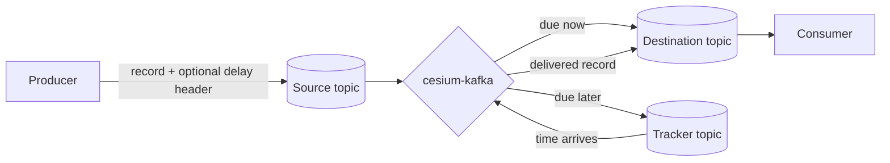
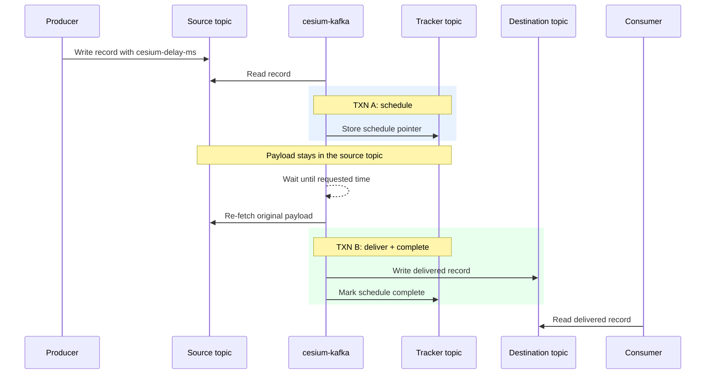
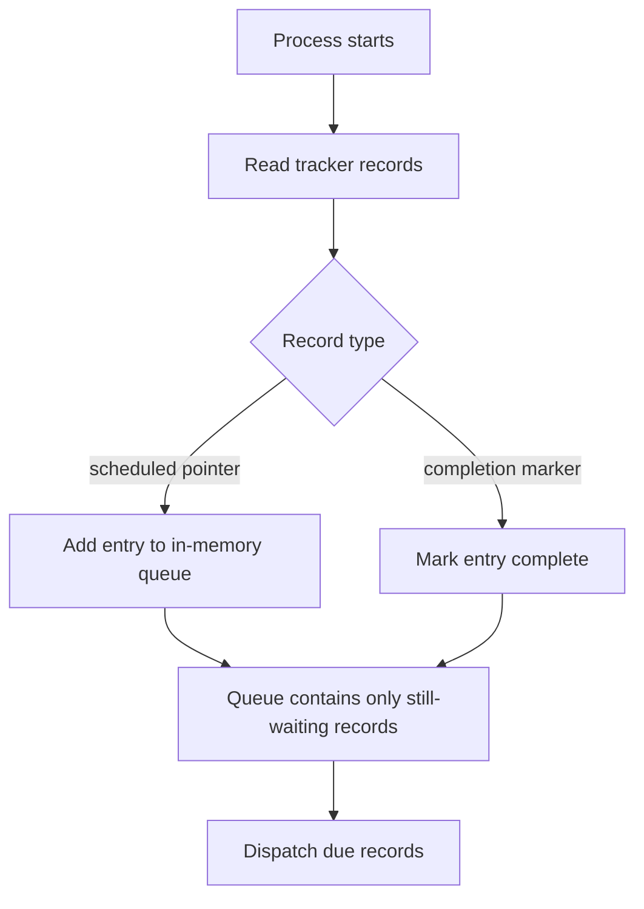
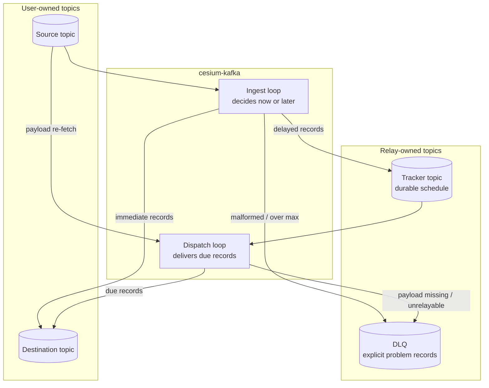
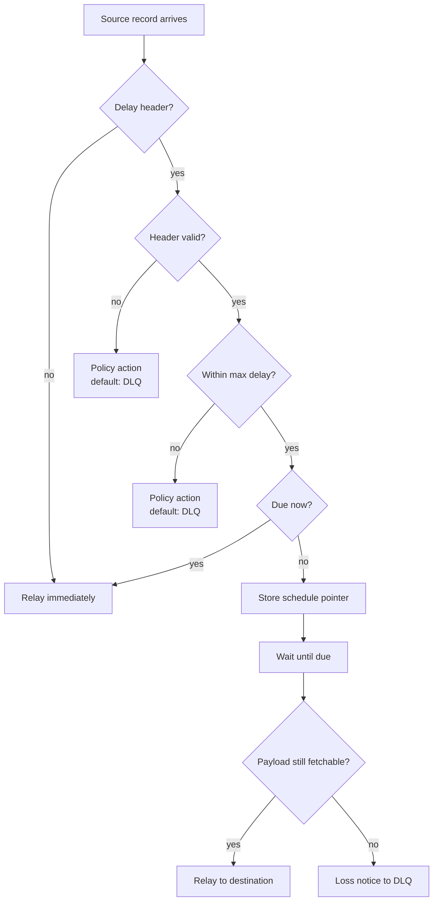

# cesium-kafka overview

*Audience: technical readers evaluating cesium-kafka who do not need to understand Kafka internals
first.* This guide explains what the relay does, where it fits, and what operational promises matter.
For the deep architecture and correctness details, see [architecture.md](architecture.md) and
[delivery-semantics.md](delivery-semantics.md).

---

## 1. What problem this solves

Kafka normally delivers records as soon as they are written. That is a good fit for event streams,
but many business workflows need a record to become visible later:

- send a reminder 30 minutes after signup
- retry a failed workflow step after a cooling-off period
- release a notification at a scheduled time
- delay a timeout, escalation, or follow-up action without adding a separate scheduler service

cesium-kafka adds that scheduling layer. Producers still write to Kafka. Consumers still read from
Kafka. The relay sits between a **source** topic and a **destination** topic and makes records appear
on the destination when they are due.

The producer asks for delayed delivery by adding one header:

| Header | Meaning |
|---|---|
| `cesium-delay-ms` | Deliver this many milliseconds after the source record timestamp |
| `cesium-deliver-at` | Deliver at this absolute UTC epoch-millis time |

Records with no delay header, or records whose requested time is already due, move through
immediately.

---

## 2. How it runs

Docker is only used by the demo and as a convenient packaging option. cesium-kafka is a Java
application and can run anywhere a suitable JVM can reach Kafka:

- in Docker or Kubernetes
- as a standalone process on a VM or bare-metal server
- under a service manager such as systemd
- from the Gradle-built distribution archives or install directory

The supported v1 product surface is the runnable app, not an embedded Java library API. That means
the recommended production shape is to run cesium-kafka as its own process or service and configure
it with YAML, environment variables, and system properties.

The engine code is Java and is structured internally as reusable modules, but its programmatic API is
not a stable public embedding contract in v1. The stable extension point is the scheduler store SPI,
used when implementing an alternative store. For application teams, the normal integration point is
Kafka itself: produce to the source topic with a delay header, then consume from the destination
topic.

---

## 3. The main actors

The relay has a few named parts that show up in the diagrams:

| Actor | What it is | Why it matters |
|---|---|---|
| Producer | Your application writing records | Adds a delay header when a record should arrive later |
| Source topic | The Kafka topic producers write to | Holds the original record until cesium-kafka is ready to relay it |
| cesium-kafka | The relay process | Reads source records, schedules delayed ones, and writes due records |
| Destination topic | The Kafka topic consumers read from | Receives records when they are ready for downstream systems |
| Consumer | Your application reading delivered records | Reads from the destination topic, not the source topic |
| Tracker topic | cesium-kafka's internal schedule topic | Remembers which source records are waiting and when they are due |
| DLQ | The dead-letter topic | Receives records or notices that cannot safely go to the destination |

The **tracker topic** is the least obvious actor because it is internal to the relay. It is not a
second copy of your messages. It is cesium-kafka's durable schedule book.

For each delayed record, the tracker records a small pointer:

| Tracker stores | Tracker does not store |
|---|---|
| Source partition | Full payload |
| Source offset | Application-specific record value |
| Requested delivery time | A duplicate copy of every header |

That pointer is enough for cesium-kafka to find the original record later. When the requested time
arrives, the dispatch side of the relay re-fetches the payload from the source topic and writes it to
the destination topic.

The tracker topic is needed for three practical reasons:

- **Durability:** if the relay restarts, the waiting schedule is still in Kafka.
- **Coordination:** one part of the relay can record "this message is waiting" while another part
  later delivers due messages.
- **Recovery:** after a crash, deploy, or Kafka rebalance, a new relay instance can rebuild its
  in-memory schedule from the tracker instead of losing delayed work.

Completed records are marked complete in the tracker, so the relay can distinguish "still waiting"
from "already delivered" during recovery.

The tracker does not wake itself up or deliver records by itself. cesium-kafka keeps an in-memory
view of the tracker ordered by delivery time; when a record becomes due, the relay uses the tracker
pointer to fetch and deliver the original source record.

In the default configuration, cesium-kafka creates the tracker topic for you if it is missing. The
default name is `cesium.<application-id>.tracker`, and the tracker partition count must match the
source topic partition count. Production deployments can instead pre-create the tracker topic and set
`route.tracker.bootstrap: FAIL`; in that mode, cesium-kafka validates the existing topic and fails
fast if important settings are wrong. See [configuration.md](configuration.md) for the exact keys.

---

## 4. Relay at a glance



The important idea: cesium-kafka does not ask the producer or consumer to change their payload
format. The source record key, value, and non-cesium headers are preserved. cesium-kafka consumes
from the source, waits when needed, and produces to the destination.

---

## 5. What happens to a delayed message



The transaction labels in the diagram mean:

- **TXN A:** the tracker schedule pointer and source progress commit together.
- **TXN B:** the destination write and tracker completion marker commit together.

While a delayed message waits, cesium-kafka stores only a lightweight pointer: source partition,
source offset, and requested delivery time. The payload remains in the source topic and is fetched
again when the record is ready to deliver.

After delivery, cesium-kafka writes a completion marker to the tracker. The destination write and the
completion marker are committed together, so recovery does not have to infer whether delivery
happened from timing or memory state.

That design matters for scale. Millions of delayed records do not require millions of copied payloads
inside the relay. The source topic remains the durable payload store; the tracker topic is the
durable schedule book.

---

## 6. The in-memory delay queue

The default scheduler implementation is called `kafka-tracker`. It has two parts:

- an **in-memory delay queue** inside the running cesium-kafka process
- the **tracker topic** in Kafka, which is the durable source of truth used to rebuild that queue

The in-memory queue is what makes dispatch fast. It is ordered by delivery time, so the relay can ask
"what is due now?" without scanning the source topic or loading full payloads into memory.

Each waiting entry is intentionally small:

| Queue entry contains | Queue entry does not contain |
|---|---|
| Source partition | Payload bytes |
| Source offset | Application object |
| Requested delivery time | Full source record copy |
| Tracker position used for recovery | Destination record copy |

That is why the default implementation can scale to large pending counts: memory grows with small
pointers, not with the size of user payloads.

The scheduler store is also pluggable. The default `kafka-tracker` store is the supported v1 store
and is exactly-once when destination consumers use `read_committed`. The public store SPI allows
other implementations, such as database-backed stores, but their delivery guarantees depend on the
store archetype they implement. See [store-spi.md](store-spi.md) for implementer details.

### Source retention is part of the contract

The pointer-only design means delayed payloads must still exist in the source topic when they become
due. For a 30-minute delay, that is usually easy. For a months-long or year-long delay, it becomes an
explicit platform requirement: the source topic must retain records for at least the maximum delay,
plus operational margin.

If the source payload is gone at dispatch time, cesium-kafka still knows the message was scheduled,
but it cannot reconstruct the payload from the tracker or in-memory queue. That case follows the
configured unfetchable-payload policy, usually a DLQ loss notice.

An alternative scheduler store can persist the schedule in a database or another system, but the
current scheduler-store SPI still deals in source pointers: source partition, source offset, and
delivery time. A design that also copies and owns payload bytes for long-term storage would be a
different relay mode or future SPI extension, not just a different implementation of the current
schedule store. Today, long-delay deployments should either retain the source topic long enough or
store an application-level payload reference in the source record that will still be valid when the
record is delivered.

### Recovery after restart

On restart, the in-memory queue starts empty. cesium-kafka rebuilds it from the tracker topic:



In plain terms, the tracker says "this source record was scheduled" and later "this source record was
completed." Replaying those facts reconstructs the current waiting set. If a record was already
delivered, its completion marker prevents it from being treated as pending again.

### Why recovery remains idempotent

The default store uses the source topic position as the identity of a delayed record: source
partition plus source offset. Retrying the same source record therefore points at the same logical
work item.

The safety story is:

- When ingest schedules a delayed record, the source offset advancement and tracker schedule pointer
  are committed together. If ingest crashes before that commit, the schedule is not visible and the
  source record is read again. If it commits, the tracker has the durable schedule.
- When dispatch delivers a due record, the destination write and tracker completion marker are
  committed together. If dispatch crashes before that commit, normal `read_committed` consumers do
  not see the aborted destination write and the record remains pending. If it commits, consumers see
  the destination write and recovery sees the completion marker.
- If the relay cannot tell whether a dispatch commit completed, it does not guess from memory. It
  drops the affected in-memory queue state and rebuilds from the tracker, which is the durable truth.

That is the high-level reason the in-memory queue can be both fast and recoverable: memory is only a
cache of pending work; Kafka stores the schedule and completion facts needed to reconstruct it.

---

## 7. Component map



| Component | Plain-language role |
|---|---|
| Source topic | Where applications submit records for relay |
| Destination topic | Where consumers read records after cesium-kafka releases them |
| Tracker topic | cesium-kafka's internal schedule book; it records what is waiting and what is complete |
| DLQ | A clear place for records that cannot be safely relayed |
| Ingest loop | Reads source records and decides whether each one is due now or later |
| Dispatch loop | Watches the schedule and delivers records when they are due |

The tracker and DLQ are part of making failures explicit. A record is not silently discarded because
its header is malformed, its delay is outside policy, or its original payload is no longer fetchable.
It follows a configured policy path.

---

## 8. The decision path



This is the manager-level view of the behavior. The deeper docs explain the transaction mechanics
that make the relay safe during crashes, rebalances, and retries.

---

## 9. Guarantees, without the proof

cesium-kafka is designed around a few practical guarantees:

- **Records are delivered at or after the requested time.** Delivery is not intentionally early.
  Small amounts of lateness are normal in distributed systems and are measured operationally.
- **Exactly-once delivery is defined for `read_committed` destination consumers.** Consumers that
  read uncommitted Kafka records can see aborted writes and may report false duplicates.
- **Payloads are not copied into the scheduler.** The relay stores pointers while records wait and
  re-fetches payloads from the source topic at delivery time.
- **Restart and rebalance recovery comes from Kafka state.** Pending schedules are durable in the
  tracker topic, and the in-memory schedule can be rebuilt.
- **Problem records follow explicit paths.** Malformed headers, over-policy delays, missing payloads,
  and permanently unrelayable records are retried, dead-lettered, degraded, or failed according to
  documented policy. Silent terminal states are avoided.

The exact correctness contract is in [delivery-semantics.md](delivery-semantics.md).

---

## 10. What producers and consumers need to know

### Producers

Producers write to the source topic and add one delay header when they want delayed delivery.

```text
cesium-delay-ms: 30000
```

or:

```text
cesium-deliver-at: 1767225600000
```

The key, value, and application headers do not need to use a cesium-specific format.

### Consumers

Consumers read from the destination topic, not the source topic. To observe exactly-once delivery,
destination consumers must use:

```properties
isolation.level=read_committed
```

A consumer using `read_uncommitted` is reading Kafka's internal aborted writes too. That mode is not
the correct way to verify relay delivery.

---

## 11. What operators need to know

The high-level operating model is:

- The source topic must retain payloads long enough for the maximum configured delay.
- The tracker topic is internal relay state and must be protected from unrelated writers.
- The DLQ should be monitored because it means records are not reaching the normal destination.
- Health and metrics expose readiness, pending entries, delayed delivery behavior, replay progress,
  degraded states, and retention risk.
- A deployment should bootstrap topics, offsets, ACLs, and retention settings deliberately rather
  than relying on Kafka defaults.

Start with [configuration.md](configuration.md) for setup and [operations.md](operations.md) for
production operation.

---

## 12. Where to go next

| If you want to know... | Read |
|---|---|
| How to run and configure it | [configuration.md](configuration.md) |
| How to operate it in production | [operations.md](operations.md) |
| The producer and consumer contract | [header-protocol.md](header-protocol.md) |
| How the architecture works internally | [architecture.md](architecture.md) |
| The exact delivery guarantee and its conditions | [delivery-semantics.md](delivery-semantics.md) |
| Performance and sizing data | [performance.md](performance.md) |
| The full implementation design | [design.md](design.md) |
