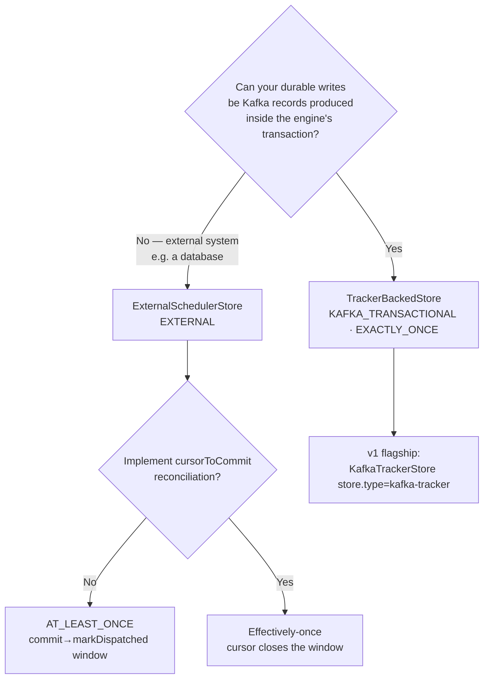

# Scheduler store SPI — implementer's guide

*Audience: an engineer implementing a scheduler store against the cesium-kafka SPI.* The store SPI
(`cesium-kafka-api`) and its contract-test kit (`cesium-kafka-store-testkit`) are the **stable,
published surface** for store implementers — **semver-stable from 1.0**, evolving additively. (The
runnable app is the supported v1 product; the engine's programmatic API is internal-until-1.x; the
SPI + testkit are what you build against.) This guide explains the boundary, how to choose and
implement an archetype, the ordering and cursor contracts that keep delivery correct, the correctness
checklist, and how to prove your store with the kit.

For the guarantees a store must preserve, see [`delivery-semantics.md`](delivery-semantics.md); for
the architecture, [`architecture.md`](architecture.md); for the full design,
[`design.md` §4](design.md#4-store-spi-module-cesium-kafka-api-package-eventscesiumkafkaapistore). All
types below live in package `com.jucius.cesium.kafka.api.store`.

---

## 1. The boundary: what the engine owns vs what the store owns

**The engine owns** consumer groups and ownership, transactions and fencing (invariants I1–I9),
dispatch timing, policies, and the replay barrier gate. It owns every Kafka client. **Your store
must not construct its own Kafka clients to write scheduler state.**

**The store owns** the durable recording of scheduler-state mutations, recovery enumeration, the
in-memory time index, and (for the tracker archetype) the per-partition recovery cursor — offset and
sidecar metadata — that the engine commits as the group-B offset.

Two design forces shape the API:

1. **A store must either enlist its writes in the engine's Kafka transaction (exactly-once) or
   explicitly opt out with ordered out-of-band writes — and the engine must know which**, so it can
   orchestrate correctly. Hence the root interface is **`sealed`** with two `non-sealed` archetypes,
   wired by an exhaustive Java 21 `switch`. You implement exactly one archetype.
2. **Hot-path types must not box.** Batches are primitive-accessor views (`DueBatch`); the thread
   contract is explicit so the v1 store needs no locking.

---

## 2. Pick an archetype



- **`TrackerBackedStore`** — your durable mutations are encoded as **bytes** that the engine produces
  with its own transactional producer, inside the ingest/dispatch transactions, on the tracker topic.
  Scheduler state, destination writes, and consumer offsets commit or abort atomically ⇒
  **exactly-once.** This is the archetype the flagship `KafkaTrackerStore` (and most stores backed by
  a Kafka topic) implement.
- **`ExternalSchedulerStore`** — your durable writes go to an external system (e.g. a relational
  database) outside Kafka's transactions. Correctness rests on **ordering contracts** ⇒
  **at-least-once** baseline, upgradeable to **effectively-once** via `cursorToCommit`. v1 ships the
  SPI fixed but no external implementation; `coordination()` must be `FOLLOW_INGEST_GROUP`
  (`STORE_MANAGED` DB-lease ownership is reserved for a later release and rejected at startup).

The engine reads your declared archetype + `capabilities()` and wires the matching dispatch loop:

```java
DispatchLoop loop = switch (store) {
    case TrackerBackedStore t     -> new TrackerDispatchLoop(t, kafka, cfg);
    case ExternalSchedulerStore e -> new ExternalDispatchLoop(e, kafka, cfg);
};
```

---

## 3. The SPI types

### 3.1 Lifecycle and hot path — `SchedulerStore`

The sealed root. Lifecycle order is `configure → capabilities → validate → start → (partition
callbacks / hot path)* → close`. **Thread confinement:** lifecycle methods run on the engine's
startup thread; partition callbacks and **every hot-path method are confined to the single dispatch
thread that owns the affected partitions** — a conforming engine never calls them concurrently, so
you need no locking on these paths.

```java
public sealed interface SchedulerStore extends AutoCloseable
        permits TrackerBackedStore, ExternalSchedulerStore {

    void configure(StoreContext context);     // route identity, typed config, clock, metrics, epochs
    StoreCapabilities capabilities();          // constant; consistent with the archetype
    void validate();                           // MUST fail fast; the engine refuses to start otherwise
    void start();

    // Partition lifecycle — O(1) bookkeeping only; idempotent and incremental (cooperative/KIP-848).
    void onPartitionsAssigned(Set<Integer> partitions);
    void onPartitionsRevoked(Set<Integer> partitions);   // drop state in O(1); never flush, never write
    void onPartitionsLost(Set<Integer> partitions);      // drop state; assume a new owner is live

    // Hot path (dispatch thread only).
    DueBatch pollDue(long nowMs, int maxBatch); // never blocks; empty while recovering (I4);
                                                // skips penalty-boxed source partitions
    long nextDeadlineMs();                       // Long.MAX_VALUE when nothing pending; honors penalties
    void penalizeSourcePartition(int sourcePartition, long notBeforeMs);  // default; §7 fetch isolation
    long pendingCount(int partition);

    // Engine-transaction lifecycle for an in-flight batch.
    void onBatchCommitted(DueBatch batch);       // finalize: completed, cursors, frees
    void onBatchAborted(DueBatch batch);         // restore to pending — NEVER called after in-doubt (I9)
    void maintenance();                          // amortized housekeeping; bound work per call
    void close();                                // idempotent; never throws checked exceptions
}
```

Two subtleties worth internalizing:

- **`onBatchCommitted` / `onBatchAborted` may receive sub-batch views.** Under the §7 byte budget
  (truncate-and-carry-over) or a transient fetch exclusion, the transaction settles only a *subset*
  of the drained batch; the engine commits that subset as one view and restores the carry-over via
  the other. Views reference entries by `(sourcePartition, sourceOffset)`. Across the views of one
  drained batch, **every drained entry is resolved exactly once.**
- **After an in-doubt commit, neither callback fires (I9).** The engine drops the affected partitions
  and re-recovers. Your committed-batch effects must therefore be recoverable **purely from durable
  state** — never depend on `onBatchCommitted` having run.

### 3.2 The primitive batch view — `DueBatch`

```java
public interface DueBatch {
    int size();
    int sourcePartition(int i);
    long sourceOffset(int i);
    long dispatchAtMs(int i);
    long trackerOffset(int i);          // the per-entry recovery position; -1 for external stores
    default boolean clamped(int i) { ... } // the CLAMP-policy marker, carried to dispatch-time relay
}
```

Backed by parallel `long[]` arrays — iterating a 10,000-entry batch allocates nothing per entry.

### 3.3 Shared value types

| Type | Shape | Notes |
|---|---|---|
| `ScheduledRef` | `(int sourcePartition, long sourceOffset, long dispatchAtMs, boolean clamped)` | The pointer — 20 bytes of real state plus the CLAMP marker. `(sourcePartition, sourceOffset)` is the durable identity. A 3-arg constructor defaults `clamped=false`. |
| `StoreCapabilities` | `(TransactionAffinity, DispatchGuarantee, boolean requiresTrackerTopic, boolean supportsCancellation)` | `TransactionAffinity ∈ {KAFKA_TRANSACTIONAL, EXTERNAL}`; `DispatchGuarantee ∈ {EXACTLY_ONCE, AT_LEAST_ONCE}`. Must be consistent with the archetype. |
| `CompletionReason` | `DISPATCHED · PAYLOAD_MISSING_DLQ · DROPPED · REJECTED` | Why an entry settled; carried on the completion record header. |
| `StoreContext` | `route() · config() · clock() · meterRegistry() · epoch(int)` | Your only window into the engine. Use `clock()` for all time decisions (tests drive virtual time). |
| `RouteDescriptor` | `applicationId, clusterId, sourceTopic(+Id), destinationTopic(+Id), trackerTopic(+Id), dlqTopic, partitionCount` | Topic **ids** are included because names survive recreation but ids do not — bind them into persisted identity. |
| `OwnershipEpoch` | `(int groupGenerationId, String memberId)` | For external store-side fencing (compare-and-swap on the epoch). |
| `ConfigView` | typed getters (`getString/Int/Long/Duration/Boolean`, defaulting + throwing variants) + `keys()` | Read-only view of `store.properties`. Validate every key in `validate()`; reject unknown keys via `keys()`. |

---

## 4. Implementing `TrackerBackedStore`

You own the tracker wire format; the engine produces your bytes and feeds you the tracker stream.

```java
public non-sealed interface TrackerBackedStore extends SchedulerStore {

    // Ingest side (ingest thread): encode the durable ADD. Engine sends it inside the ingest txn,
    // on the tracker partition == ScheduledRef.sourcePartition(). Must preserve clamped().
    TrackerRecordData encodeSchedule(ScheduledRef ref);

    // Dispatch side: completion tombstones (value == null) sent inside the dispatch txn. Reason
    // rides in a header (headers survive tombstoning). Engine groups by reason and calls once per
    // group; a completion must be derivable from (sourcePartition, sourceOffset) ALONE.
    List<TrackerRecordData> encodeCompletions(DueBatch dispatched, CompletionReason reason);

    // Recovery: decode the sidecar and SEED the index, then the engine streams [cursor, barrier).
    void beginRecovery(int partition, TrackerCursor committed, long barrierOffset);

    // Apply one tracker record (replay and live share this path). Engine calls the headers variant.
    void onTrackerRecord(int partition, long trackerOffset, byte[] key, byte @Nullable [] value);
    default void onTrackerRecord(int p, long off, byte[] key, byte @Nullable [] value, Headers h) {
        onTrackerRecord(p, off, key, value);   // override when you enforce header-dependent validation
    }

    // Report the consumer position — promotion rides on THIS, not on delivered records (see §5).
    default void onTrackerPosition(int partition, long position) {}

    boolean isRecovering(int partition);       // flip ACTIVE when position reaches the barrier
    TrackerCursor committedCursor(int partition, DueBatch inFlight); // I5; computed as-if inFlight done
}
```

### Apply the replay rules (I7)

- **R1 (ADD, `value != null`):** insert the entry. An anomalous **duplicate ADD** for an
  already-pending source offset updates `dispatchAtMs` **only** and **keeps the original tracker ADD
  offset** — increasing it could carry the cursor past other pending entries (I5); warn via metric.
- **R2 (COMPLETE, `value == null`):** remove the entry if present; **silently no-op if absent** —
  expected when the ADD lies below the cursor and outside the sidecar, the pair was asymmetrically
  compacted, or the record is your own completion echo. A tombstone applies regardless of whether its
  reason constant is one you recognize (skipping would re-dispatch a completed key — a duplicate).
- Records failing wire-format validation are **counted and skipped** — never applied, never crash
  the loop.

### 5. Tracker offsets are not dense — promote on the reported position

Every cesium tracker write is transactional (I1), so transaction control records (commit/abort
markers) and the records of aborted transactions occupy offsets a `read_committed` consumer never
delivers through `onTrackerRecord`. **Never assume consecutive `trackerOffset` values, and never
derive your replay position from delivered records alone.** The offsets immediately below the barrier
are almost always the previous transaction's commit marker — undelivered — so a store that waits for a
*delivered* record at the barrier wedges an idle partition in RECOVERING forever (the I4 gate never
lifts: `pollDue` empty, `nextDeadlineMs` = `MAX_VALUE`, no wakeup).

The engine closes the gap with **`onTrackerPosition`**, reporting `consumer.position(partition)` after
every poll that may have moved it. Treat the reported position as a high-water mark (combine with your
record-derived position via `max`), promote the shard ACTIVE when it reaches the barrier, and use it
as the live position of an all-encoded cursor. The contract kit models control-record gaps and
**fails a store that ignores this hook** (`trailingCommitMarkersBelowTheBarrierNeverWedgeRecovery`).

---

## 6. The cursor/sidecar contract

`committedCursor(partition, inFlight)` returns the `TrackerCursor(long offset, String metadata)` the
engine commits via `sendOffsetsToTransaction` — the one durable completion-fact channel that shares
Kafka's transactional atomicity. It is computed **as if `inFlight` were already complete** (sound,
because the batch's tombstones commit atomically with this cursor).

**Invariant I5 — must hold at every commit:**

1. The offset is **monotonic** per partition (the engine also guards this).
2. Every pending entry **either** has `trackerAddOffset ≥ offset` **or** is encoded in the sidecar
   (`metadata`).
3. A violation must surface as **metric + log**, never as a corrupted commit.

Compute it greedily: encode the oldest pending entries into the sidecar (with their **original**
tracker ADD offsets and clamp bits, plus identity material `{clusterId, sourceTopicId,
trackerTopicId}`) up to the validated budget. If all fit, `offset = position` (the live read
position). On overflow, `offset = trackerAddOffset` of the first non-encoded pending entry (the
min-pending fallback). On `beginRecovery`, decode the sidecar and **seed** the pinned entries in
arrival order *before* the engine streams `[offset, barrier)` — preserving arrival-log sortedness.

**Two traps the contract kit specifically targets:**

- **Carry-over.** When `inFlight` is a *strict subset* of the last drained batch (truncate-and-carry-
  over), a drained entry **not** in `inFlight` is still pending durable truth at commit time — encode
  it into the sidecar or let it bound the overflow cut, exactly like any pending entry. Deriving the
  as-if-complete set from your in-flight state instead of the `inFlight` parameter **durably loses the
  carry-over on the first crash after the commit.** (`truncatedDispatchCommitPreservesCarryOverEntriesAcrossACrash`.)
- **Foreign identity.** A cursor committed against a different cluster / recreated topic must be
  **refused** at `beginRecovery`, not replayed into. (`recoveryFailsFastOnAForeignIdentityCursor`.)

`KafkaTrackerStore`'s sidecar/cursor logic lives in `SidecarCodec` /
`com.jucius.cesium.kafka.store.tracker` if you want a worked reference.

---

## 7. The correctness checklist

Every store must satisfy these ([`design.md` §4.4](design.md#44-correctness-checklist-every-store-must-satisfy-enforced-by-the-testkit));
the contract kit enforces them:

1. **Per-partition recovery cursor** expressible as `(offset, metadata)` committed atomically inside
   the engine's transaction; the metadata blob is versioned, size-bounded, and self-describing
   (identity material included).
2. **Per-entry recovery position** (tracker offset / monotone sequence) so you can compute a sound
   cursor (I5).
3. **Transaction-bound staging:** committed-batch effects durable and recoverable; aborted-batch
   effects invisible to every future recovery; **in-doubt outcomes recoverable purely from durable
   state** (the engine replays rather than restores — I9).
4. **Ownership-epoch hand-off** via `StoreContext.epoch()` for store-side fencing (external stores).
5. **Barrier-aware recovery:** never surface due entries while recovering (I4); reach the barrier even
   when pending volume exceeds backpressure thresholds (pause never applies to recovery).
6. **Idempotent recovery:** recovery may run repeatedly from the same cursor and must converge to the
   same pending set, including sidecar re-seeding.
7. **Startup validation hook** (`validate()`): declare and enforce your own preconditions, including
   memory-budget sizing (worst-case footprint vs configured caps). MUST fail fast.

---

## 8. Proving your store with the contract kit

The kit (`cesium-kafka-store-testkit`, **published**) is the executable specification — JUnit 5
abstract classes you subclass with a factory. `KafkaTrackerStore`'s own tests *are* these contracts
plus impl-specific cases, so the kit is proven by the flagship store first.

### Tracker-backed stores — `TrackerBackedStoreContract`

Subclass it and implement `createStore`; override the hooks your store needs:

```java
class MyTrackerStoreContractTest extends TrackerBackedStoreContract {
    @Override protected TrackerBackedStore createStore(StoreContext ctx) {
        MyTrackerStore store = new MyTrackerStore();
        store.configure(ctx);
        store.validate();
        store.start();
        return store;
    }

    // Optional overrides:
    @Override protected Map<String,String> storeProperties() { ... }      // config your store needs
    @Override protected Optional<Map<String,String>> overflowForcingProperties() { ... } // unlock the
                                                                          // overflow-fallback test
    @Override protected int partitionCount() { return 4; }
    @Override protected byte[] invalidRecordKey() { ... }                  // a wire-format violation
    @Override protected double invalidRecordCount(MeterRegistry r) { ... } // your skip-counter meter
    @Override protected int soakEntryCount() { return 1_000_000; }         // @Tag("soak")
}
```

~30 tests + jqwik properties exercise: encode/decode round-trip via `onTrackerRecord`; due ordering
and dueness; replay idempotence; complete-before-add tolerance; the **cursor invariant** (every
pending entry ≥ cursor offset or in the sidecar; monotone under random interleavings vs a reference
model; sidecar round-trips through `beginRecovery` seeding); overflow-fallback equivalence; the
recovery barrier (`pollDue` empty while recovering); recovery completing when pending exceeds the
backpressure threshold; stage→abort→recover ⇒ unchanged; stage→commit→recover ⇒ converged; the
in-doubt path (drop + re-recover converges, **no restore**); revoke clears / lost ≠ flush;
epoch-fencing rejection; pre-compacted-log scripts; and a `@Tag("soak")` 1 M-entry memory-ceiling
check.

The kit also ships fixtures you can use directly: `FakeStoreContext` (builder with `partitions`,
`clusterId`, `properties`, `route` for modelling a restart of the same route), `TrackerStoreHarness`
(drives schedule / commitDispatch / migrateTo / recover), `MutableClock`, `ArrayDueBatch`, and
`TrackerEventScript` (incl. pre-compacted-log scripts).

### External stores — the `ExternalSchedulerStoreContract`

The external archetype's `ExternalSchedulerStore` interface and its companion
`ExternalSchedulerStoreContract` are both part of the **stable, published SPI surface in 1.0** — the
contract ships in `cesium-kafka-store-testkit` today (design [§11.2](design.md#112-store-spi-contract-kit-cesium-kafka-store-testkit-published)),
even though v1 ships **no production external store implementation** (a documented non-goal). The SPI
is fixed now so the contract cannot drift, and the contract is the executable spec your DB-backed
store is written against. The testkit's own `InMemoryExternalSchedulerStore` reference impl passes it
in both modes.

Subclass it and implement `createStore`; override the cursor hooks only if you implement
reconciliation (the effectively-once upgrade):

```java
class MyExternalStoreContractTest extends ExternalSchedulerStoreContract {
    @Override protected ExternalSchedulerStore createStore(StoreContext ctx) {
        MyExternalStore store = new MyExternalStore();
        store.configure(ctx);
        store.validate();
        store.start();
        return store;
    }

    // Optional overrides:
    @Override protected Map<String,String> storeProperties() { ... }   // config your store needs
    @Override protected int partitionCount() { return 4; }

    // Effectively-once upgrade — override BOTH to unlock the two reconciliation tests:
    @Override protected boolean supportsCursorReconciliation() { return true; }
    @Override protected void deliverReconciliationCursor(
            ExternalSchedulerStore store, int partition, String committedCursor) { ... }
}
```

~16 tests assert: `capabilities()` declares `EXTERNAL` affinity with a `DispatchGuarantee` consistent
with whether reconciliation is implemented (`EXACTLY_ONCE` only when it is); `coordination()` is
declared; `upsertScheduled` is idempotent on `(partition, sourceOffset)`; `scanPending` streams only
the requested partition; `markDispatched` (applied strictly *after* the dispatch commit) excludes
settled rows from `scanPending`; the at-least-once window is durably observable — a commit without
`markDispatched` leaves the row pending, and on plain recovery it reappears and re-dispatches;
`pollDue` returns only due entries in due order with `trackerOffset == -1`; an aborted batch restores
every entry to pending; recovery rebuilds the dispatch index from durable rows; an
assigned-but-unscanned partition contributes nothing and drives no poll timeout; the CLAMP marker
survives the `upsertScheduled` → external store → index → batch round trip and recovery; revoke drops
in-memory state in O(1) while durable rows survive; lost partitions are dropped and their in-flight
work is abandoned to a new owner; and — for a reconciliation-capable store — `cursorToCommit` returns
a non-empty cursor and rows at or below a delivered reconciliation cursor are reconciled as delivered
after a crash (the at-least-once default skips those two via an assumption).

The reference `InMemoryExternalSchedulerStore` and the two passing subclasses —
`InMemoryExternalStoreContractTest` (reconciliation on ⇒ effectively-once) and
`AtLeastOnceExternalStoreContractTest` (reconciliation off ⇒ baseline) — are the worked example to
extend. `coordination()` must be `FOLLOW_INGEST_GROUP`; `STORE_MANAGED` DB-lease ownership is
reserved for a later release and rejected at startup. Build also to the ordering contracts in
§§[5](#5-tracker-offsets-are-not-dense--promote-on-the-reported-position)–[7](#7-the-correctness-checklist)
and the [delivery-semantics archetype table](delivery-semantics.md#10-store-archetype-guarantees).

---

## 9. Packaging and selection

Register a `SchedulerStoreProvider` via `META-INF/services`:

```
# META-INF/services/com.jucius.cesium.kafka.api.store.SchedulerStoreProvider
com.example.MyTrackerStoreProvider
```

```java
public final class MyTrackerStoreProvider implements SchedulerStoreProvider {
    @Override public String typeId() { return "my-tracker"; }  // lowercase-kebab; never change once released
    @Override public SchedulerStore create() { return new MyTrackerStore(); }
}
```

`ServiceLoader` populates a registry keyed by `typeId()`. **Selection is always explicit** — the
engine never auto-selects:

```yaml
store:
  type: my-tracker          # the provider's typeId()
  # type: class:com.example.MyTrackerStore   # FQCN fallback
  properties:               # your store's ConfigView subtree
    ...
```

Duplicate `typeId`s on the classpath **fail startup**, listing the offending jars (the
Kafka-Connect-proven model). The flagship store registers `typeId = "kafka-tracker"` and is selected
with `store.type: kafka-tracker`.

---

## 10. Stability and evolution

`cesium-kafka-api` is **semver-stable from 1.0.** Evolution is **additive** — new optional behaviour
arrives as `default` methods (as `onTrackerPosition`, `DueBatch.clamped`, and `ScheduledRef.clamped`
already did), so existing stores keep compiling and working. **Wire-format versioning belongs to your
store, not to the SPI** — the engine never inspects your bytes. `capabilities()` must stay constant
for an instance's life and honest: a store that cannot participate in the engine's transactions must
say so, so its weaker `DispatchGuarantee` is reported on `/info` rather than discovered in production.

---

## See also

- [`delivery-semantics.md`](delivery-semantics.md) — the invariants and archetype guarantees your
  store must preserve.
- [`architecture.md`](architecture.md) — where the store sits in the engine; the in-memory index.
- [`design.md` §4](design.md#4-store-spi-module-cesium-kafka-api-package-eventscesiumkafkaapistore) —
  the full SPI rationale, the interface sketches, and the correctness checklist.
